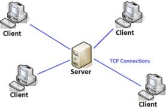
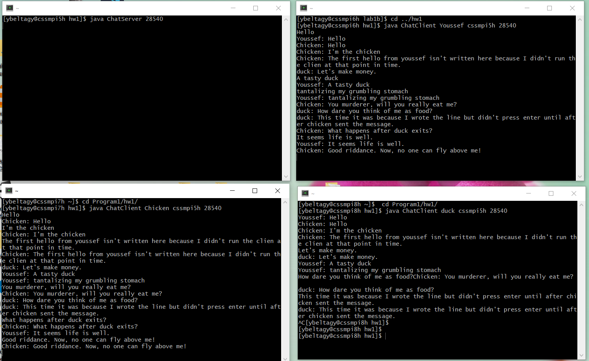
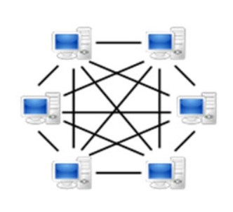
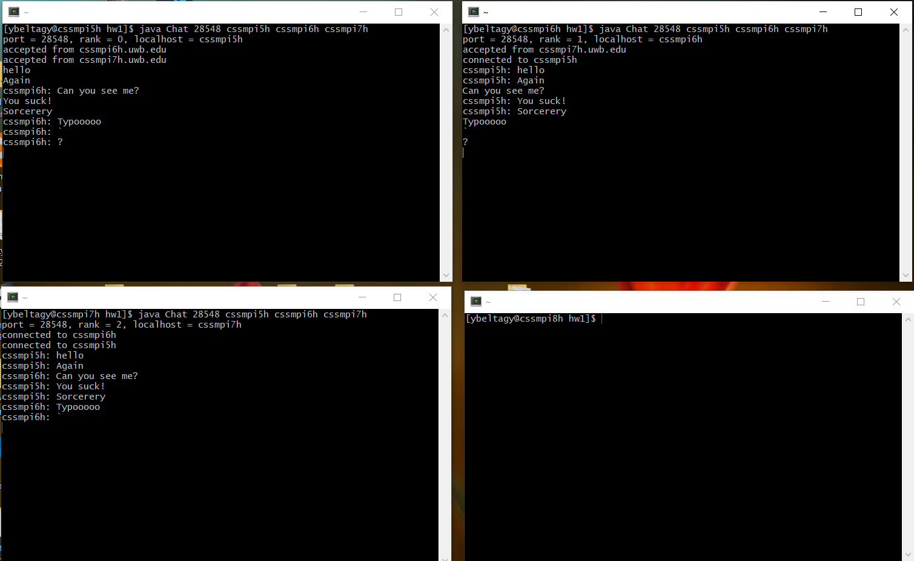
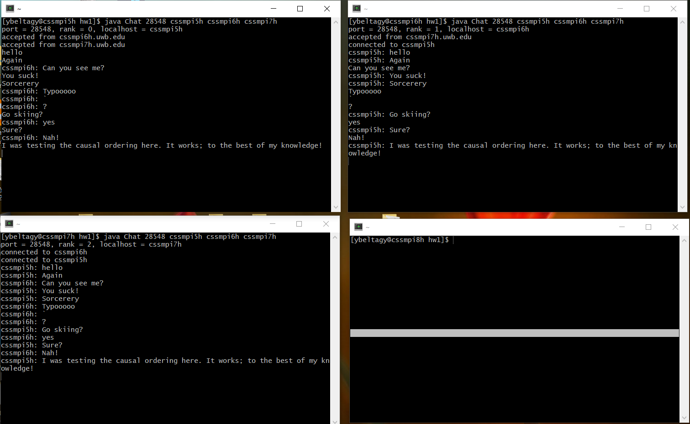

# Program 1 Report

In this program, I implemented a chat server and a peer-to-peer, server-less chatting application. The chat server ensures consistent ordering because of its central server. The peer-to-peer system ensure causal ordering using vector clocks.

## Table of Contents

[TOC]

## Part 1: Central Chat Server

In this program, I implemented a server that allows `ChatClient` objects to communicate. The server remains active all the time and makes connections with as many clients as needed. Clients can start using or discontinue using the server without affecting other clients.



### Central Server Algorithm

1. The server listens for new connections.
   1. If there is a new connection, the server adds it to the end of a connections vector
   2. If there isn't a new connection, the server stops blocking after half a second.
2. The server loops through every connection and checks if it has a message or not.
   1. As long as the connection has a message, the server again loops through all the connections to forward the message to all the clients. This is a worst complexity of `O(M*N^2)` if all the clients send messages concurrently (where `N` is the number of chat client and `M` is the biggest number of messages a single client sent). 
   2. If the server fails to write to a connection, this connection is assumed to have closed and its index is stored in a set to erase the connection later.
3. The server erases all the connections with indices inside the set. The server then goes back to step 1.

### Discussion

The complexity of receiving and transmitting messages using a central server is `O(M*N^2)` if all the clients send messages concurrently (where `N` is the number of chat clients and `M` is the biggest number of messages a single client sent). 

There is an extra overhead of first transmitting the message before it is distributed to all the other clients. This overhead increase the delay time from when the message is sent until it is received on the other side.

The biggest weakness of this algorithm is its reliance on a central server. If the server crashes, gets overloaded, or fails, all of the system will fail. On the other hand, having a centralized server allows clients to connect and disconnect without breaking the system.

Using multiple threads will negate the need for the server to wait half a second between sending and receiving as one thread will focus only on accepting sockets. Using multiple threads will also allow the server to write to multiple clients at the same time, thus improving the overall performance of the system (throughput, wait time, response time, and CPU utilization will all improve).

### Output




### Code

**ChatConnection.java**

```java
/**
 * A connection between a server and a client
 * chating program.
 *
 * @author  Youssef Beltagy
 * @version 4/20/2020
 */

import java.net.*;          // for Socket
import java.io.*;           // for IOException

public class ChatConnection {
    private Socket socket;           // a socket connection to a chat client
    private InputStream rawIn;       // an input stream from the client
    private DataInputStream in;      // a filtered input stream from the client
    private DataOutputStream out;    // a filtered output stream to the client
    public String name;              // The name of the client
    public boolean valid;            // Whether this connection is valid or not

     /**
     * Initializes a connection given a socket.
     * 
     * @param newSocket the socket of the connection
     */
    public ChatConnection(Socket newSocket){
        if(newSocket != null){
            try{
            
                socket = newSocket;
                rawIn = socket.getInputStream();
                in = new DataInputStream(rawIn);
                out = new DataOutputStream(socket.getOutputStream());
                valid = true;
                name = in.readUTF();
    
            }catch(Exception e ) {
                e.printStackTrace( );
            }

        }else{// newSocket is null
            socket = null;
            rawIn = null;
            in = null;
            out = null;
            name = null;
            valid = false;
        }

    }

    /**
     * @return whether the connection has a message or not.
     */
    public boolean hasMessage(){
        try{
            return (rawIn.available() > 0);
        }catch(Exception e ) {
            return false;
        }
    }

    /**
     * Assumes there is a message in the ObjectInputStream
     * 
     * @return reads and returns the message 
     */
    public String getMessage(){
        try{
            return in.readUTF();
        }catch(Exception e ) {
            return null;
        }

    }

    /**
     * Attempts to write to the object output stream.
     * If fails to write, changes valid to false to signify
     * that the connection is no longer valid.
     * 
     * @return a boolean that represents whether the writing operation
     *          was successful or not.
     */
    public boolean writeMessage(String message){
        try{
            out.writeUTF(message);
            return true;
        }catch(Exception e ) {
            valid = false;
            return false;
        }
    }

}
```

**ChatSever.java**

```java

/**
 * ChatServer.java
 * A central chat server.
 *
 * @author  Youssef Beltagy
 * @version 4/20/2020
 */

import java.net.*;          // for Socket
import java.util.*;         // for Vector
import java.io.*;           // for IOException

public class ChatServer {

    public static void main( String args[] ) {
        // Check # args.
        if ( args.length != 1) {
            System.err.println( "Syntax: java ChatClient <port>" );
            System.exit( 1 );
        }
    
        // convert args[0] into an integer that will be used as port.
        int port = Integer.parseInt( args[0] );

        // A vector of all the connections
        Vector<ChatConnection> connections = new Vector<ChatConnection>();
    
        // instantiate the main body of ChatServer application.
        try {
            ServerSocket svr = new ServerSocket(port);
            svr.setSoTimeout(500);  // set the timeout
            
            while ( true ) {
                Socket newClient;
                try{
                    newClient = svr.accept();
                } catch(SocketTimeoutException te){
                    newClient = null;
                }

                // Add a new conecction if newClient is not null
                if(newClient != null){
                    connections.add(new ChatConnection(newClient));
                }

                Set<Integer> toDelete = new HashSet<Integer>();
                 

                //loop through all connections.
                for(int i = 0; i < connections.size(); i++){

                    // while there is a message in the current connection,
                    while(connections.get(i).hasMessage()){
                        
                        // read the message and loop through all other connections
                        String message = connections.get(i).name + ": "
                                     + connections.get(i).getMessage();
                        for(int j = 0; j < connections.size(); j++){

                            
                            connections.get(j).writeMessage(message);
                            

                            // if you fail to write to a connection,
                            // then assume it is bad. Store its indices in a set.
                            if(connections.get(j).valid == false){
                                toDelete.add(j);
                            }

                        }
                    }
                }

                // Delete all indices in the set
                for(Integer cur : toDelete){
                    connections.remove(cur.intValue());
                }

            }
    
        } catch( Exception e ) {
            e.printStackTrace( );
        }
    }

}
```

**ChatClient.java**
```java
/**
 * A chat client for the server-client chat application.
 * 
 * Forwards console input to server and prints server messages to the console.
 * 
 */

import java.net.*;
import java.io.*;

public class ChatClient {
	private Socket socket;
	private InputStream rawIn;
	private DataInputStream in;
	private DataOutputStream out;
	private BufferedReader stdin;

	public ChatClient(String name, String server, int port) {

		try {

			socket = new Socket(server, port);
			rawIn = socket.getInputStream();

			in = new DataInputStream(rawIn);
			out = new DataOutputStream(socket.getOutputStream());
			stdin = new BufferedReader(new InputStreamReader(System.in));

			out.writeUTF(name);
			while (true) {
				
				// forward user input to server
				if (stdin.ready()) {
					String str = stdin.readLine();

					if (str == null)
						break;
					out.writeUTF(str);
				}

				// Print Messages from the server
				if (rawIn.available() > 0) {
					String str = in.readUTF();
					System.out.println(str);
				}
			}
			

			socket.close();
		} catch (Exception e) {
			e.printStackTrace();
		}
	}

	public static void main(String args[]) {
		if (args.length != 3) {
			System.err.println("Syntax: java ChatClient <your name> " +
					"<server ip name> <port>");
			System.exit(1);
		}

		int port = Integer.parseInt(args[2]);

		new ChatClient(args[0], args[1], port);
	}
}
```


## Part 2: Peer-to-Peer Chat Application

In this program, I built a peer to peer chat application which enforces causal ordering using a vector clock.



### Vector Clock Algorithm

1. `Chat` objects establish sockets between them.
   1. Each `Chat` acts as a server to the `Chat` objects which follow it, but as a client to the chat objects which precede it.
   2. If there are `N` computing nodes (or `chat` objects), there is `N*(N-1)/2` connections.
   3. The connections allow bidirectional communication.
   4. Since each `Chat` object will run on a separate computer, each `Chat` object is a process.
   5. Each `Chat` object's vector clock is initialized to an array of zeros. The size of the array is the number of `Chat` objects.
2. If the user typed something on the keyboard, the program updates the vector clock and constructs a `MessageData` object. 
   1. The `MessageData` is constructed with the message, a clone of the vector clock, and the rank of the sender.
   2. Using `ObjectOutputStream` and `ObjectInputStream`, the `MessageData` object is serialized and sent to all the other peers using a for-loop.
   3. If nothing was typed on the keyboard, step 2 is skipped. 
3. The program loops through all the other peers and checks if they sent messages.
   1. If there are messages, the program adds them to a vector of messages.
4. The program loops through the vector of messages and uses the vector clock algorithm to find the next message in causal order. 
   1. If the program finds the next message, step 4 is repeated again.
   2. If the program doesn't find the next message, the program goes back to step 2.

Let's name the local vector clock as Vl and the vector clock in the message as Vm. The causal ordering algorithm's core idea is if Vl(i) < Vm(i), then Vl(i) is the cause of Vm(i) and should thus come before it.

So one requirement for a message to be printed is for a sender i, Vm(i) == Vl(i) + 1. This would mean that this `chat` object is the just behind the one from the sender i. The second requirement is that for all indices j, where j != i, Vm(j) <= Vl(j). This means that this `Chat ` object has received all messages which come before the new received message from any other peer than i.

Before sending a message, the vector clock element corresponding to this object is incremented. And after receiving a messages, the vector clock element corresponding to the sender is incremented.

### Discussion

This algorithm doesn't require a server, so there is less delay. However, this algorithm has a critical flaw: if even one peer disconnects, the whole system fails because the vector clock algorithm will no longer function.

Each message needs a vector clock sent with it. This increases in an `O(N)` (`N` is the number of `chat` objects) which can be very problematic if the number of peers gets bigger. This limitation is one of the biggest weaknesses of the vector clock algorithm.

A possible optimization for ordering the messages would be to store them in a pritority queue instead of a normal vector. This will improve the efficiency of deciding the order of the messages from `O(N^2)` to `O(NlogN)` where `N` is the number of messages which are in the vector. However, it is unclear how exactly the priority can be decided. It will clearly depend on how bigger the sender element is in the message vector compared to the local vector, but what about the other elements? After thinking about it, it is trickier than it seems.

Furthermore, it is unlikely that the vector of messages will grow enough that using a priority queue will make a significant difference. At least not without a network failure.

### Output





### Part2 Code

**MessageData.java**

```java
/**
 * A serializable object that stores information for every message
 * to use a vector clock for causal sorting.
 *
 * @author  Youssef Beltagy
 * @version 4/20/2020
 */

import java.io.Serializable;

public class MessageData implements Serializable {

    public static final long serialVersionUID = 42L;

    public int[] vClock = null; // vector clock
    public String message = null; // the message to be sent
    public int senderRank = -1; // the rank of the sender

    public MessageData(String newMessage, int[] newVClock, int newSenderRank){
        this.vClock = newVClock;
        this.message = newMessage;
        this.senderRank = newSenderRank;
    }

}
```

**Chat.java**

```java
/**
 *  A distributed peer to peer chat application that receives and multicasts messages.
 * Implements vector clock for causal ordering.
 *
 * @author 	Youssef Beltagy
 * @version 4/20/2020
 */

import java.net.*;  // ServerSocket, Socket
import java.io.*;   // InputStream, ObjectInputStream, ObjectOutputStream
import java.util.*; // Vector

public class Chat {

    // Each element i of the follwoing arrays represent a chat member[i]
    private Socket[] sockets = null;             // connection to i
    private InputStream[] indata = null;         // used to check data from i
    private ObjectInputStream[] inputs = null;   // a message from i
	private ObjectOutputStream[] outputs = null; // a message to ij
	private int[] vClock = null;				 // vector clock for causal ordering
	private Vector<MessageData> messages = null; // Waiting messages

    /**
     * Is the main body of the Chat application. This constructor establishes
     * a socket to each remote chat member, broadcasts a local user's message
     * to all the remote chat members, and receive a message from each of them.
     *
     * @param port  IP port used to connect to a remote node as well as to
     *              accept a connection from a remote node.
     * @param rank  this local node's rank (one of 0 through to #members - 1)
     * @param hosts a list of all computing nodes that participate in chatting
     */
    public Chat( int port, int rank, String[] hosts ) throws IOException {
	// print out my port, rank and local hostname
	System.out.println( "port = " + port + ", rank = " + rank +
			    ", localhost = " + hosts[rank] );

	// create sockets, inputs, outputs, vector clock, and vector of messages
	sockets = new Socket[hosts.length];
	indata = new InputStream[hosts.length];
	inputs = new ObjectInputStream[hosts.length];
	outputs = new ObjectOutputStream[hosts.length];
	vClock = new int[hosts.length];
	messages = new Vector<MessageData>();


	// establish a complete network
	ServerSocket server = new ServerSocket( port );
	for ( int i = hosts.length - 1; i >= 0; i-- ) {

	    if ( i > rank ) {
		// accept a connection from others with a higher rank
		Socket socket = server.accept( );
		String src_host = socket.getInetAddress( ).getHostName( );

		// find this source host's rank
		for ( int j = 0; j < hosts.length; j++ )
		    if ( src_host.startsWith( hosts[j] ) ) {
			// j is this source host's rank
			System.out.println( "accepted from " + src_host );

			// store this source host j's connection, input stream
			// and object intput/output streams.
			sockets[j] = socket;
			indata[j]= socket.getInputStream( );
			inputs[j] = 
			    new ObjectInputStream( indata[j] );
			outputs[j] = 
			    new ObjectOutputStream( socket.getOutputStream( ));
		    }
	    }
	    if ( i < rank ) {
		// establish a connection to others with a lower rank
		sockets[i] = new Socket( hosts[i], port );
		System.out.println( "connected to " + hosts[i] );

		// store this destination host j's connection, input stream
		// and object intput/output streams.
		outputs[i] 
		    = new ObjectOutputStream( sockets[i].getOutputStream( ) );
		indata[i] = sockets[i].getInputStream( );
		inputs[i] 
		    = new ObjectInputStream( indata[i] );
	    }
	}

	for ( int j = 0; j < hosts.length; j++ ){
		vClock[j] = 0; // initialize vector clock to zeros
	}
		   

	// create a keyboard stream
	BufferedReader keyboard
	    = new BufferedReader( new InputStreamReader( System.in ) );

	// now goes into a chat
	while ( true ) {
	    // read a message from keyboard and broadcast it to all the others.
	    if ( keyboard.ready( ) ) {
		// since keyboard is ready, read one line.
			String message = keyboard.readLine( );
			if ( message == null ) {
				// keyboard was closed by "^d"
				break; // terminate the program
			}
			
			vClock[rank] = vClock[rank] + 1;

			// broadcast a message to each of the chat members.
			for ( int i = 0; i < hosts.length; i++ ){
				if ( i != rank ) {
					// of course I should not send a message to myself
		
					MessageData tempMessage = new MessageData(hosts[rank]+ ": " + message, vClock.clone(), rank);
					outputs[i].writeObject(tempMessage);
					outputs[i].flush(); // make sure the message was sent
				}
			}

	    }

	    // read a message from each of the chat members
	    for ( int i = 0; i < hosts.length; i++ ) {
		// to intentionally create a misordered message deliveray, 
		// let's slow down the chat member #2.
		try {
		    if ( rank == 2 )
			Thread.currentThread( ).sleep( 5000 ); // sleep 5 sec.
		} catch ( InterruptedException e ) {}

		// check if chat member #i has something
		if ( i != rank && indata[i].available( ) > 0 ) {
		    // read a message from chat member #i and add it the the vector of messages
		    try {

				MessageData inputMessage = ( MessageData) inputs[i].readObject( );
				messages.add(inputMessage);
			
		    } catch ( ClassNotFoundException e ) {}
		}
		}

		// loop through the message and use compareVectors to find the 
		// next message to print in the correct order.
		// Uses the vector clock algorithm
		boolean loopAgain = true;
		while(loopAgain){
			loopAgain = false;
			
			// If you couldn't print any message, then the while loop 
			// will end.
			for(int k = 0; k < messages.size(); k++){

				// If you could print a message, delete the current message
				// from the vector of messages, exit the for loop, 
				// and restart the while loop
				if(compareVectors(messages.get(k))){

					vClock[messages.get(k).senderRank]++;
					System.out.println(messages.get(k).message);
					loopAgain = true;
					messages.remove(k);
					break;

				}
			}
		}

	}
    }

    /**
     * Is the main function that verifies the correctness of its arguments and
     * starts the application.
     *
     * @param args receives <port> <ip1> <ip2> ... where port is an IP port
     *             to establish a TCP connection and ip1, ip2, .... are a
     *             list of all computing nodes that participate in a chat.
     */
    public static void main( String[] args ) {

	// verify #args.
	if ( args.length < 2 ) {
	    System.err.println( "Syntax: java Chat <port> <ip1> <ip2> ..." );
	    System.exit( -1 );
	}

	// retrieve the port
	int port = 0;
	try {
	    port = Integer.parseInt( args[0] );
	} catch ( NumberFormatException e ) {
	    e.printStackTrace( );
	    System.exit( -1 );
	}
	if ( port <= 5000 ) {
	    System.err.println( "port should be 5001 or larger" );
	    System.exit( -1 );
	}

	// retireve my local hostname
	String localhost = null;
	try {
	    localhost = InetAddress.getLocalHost( ).getHostName( );
	} catch ( UnknownHostException e ) {
	    e.printStackTrace( );
	    System.exit( -1 );
	}

	// store a list of computing nodes in hosts[] and check my rank
	int rank = -1;
	String[] hosts = new String[args.length - 1];
	for ( int i = 0; i < args.length - 1; i++ ) {
	    hosts[i] = args[i + 1];
	    if ( localhost.startsWith( hosts[i] ) ) 
		// found myself in the i-th member of hosts
		rank = i;
	}

	// now start the Chat application
	try {
	    new Chat( port, rank, hosts );
	} catch ( IOException e ) {
	    e.printStackTrace( );
	    System.exit( -1 );
	}
	}
	
	/*
	* Uses the causal ordering algorithm to determine if the message should be printed
	*
	* @param messageData The message that is to be printed
	* @return true if the message should be printed
	*/
	public boolean compareVectors(MessageData messageData){
		if(vClock.length != (messageData.vClock).length){
			return false;
		}

		for(int i = 0; i < vClock.length; i++){

			if(i != messageData.senderRank){
				//if messageData.vClock[i] > vClock[i] return false
				if( !(messageData.vClock[i] <= vClock[i]) ) return false; 
			}else if(i == messageData.senderRank){ // the second if is not necessary, but just for clarity.
				if(messageData.vClock[i] != vClock[i] + 1) return false;
			}
			
		}

		return true;
	}

}
```

