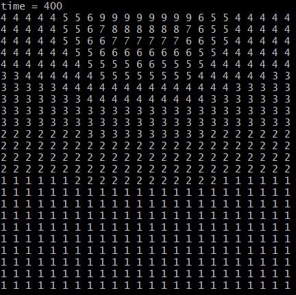
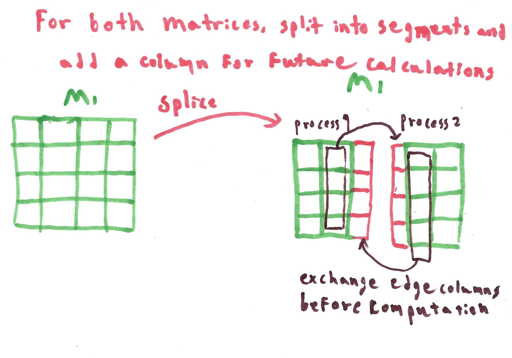
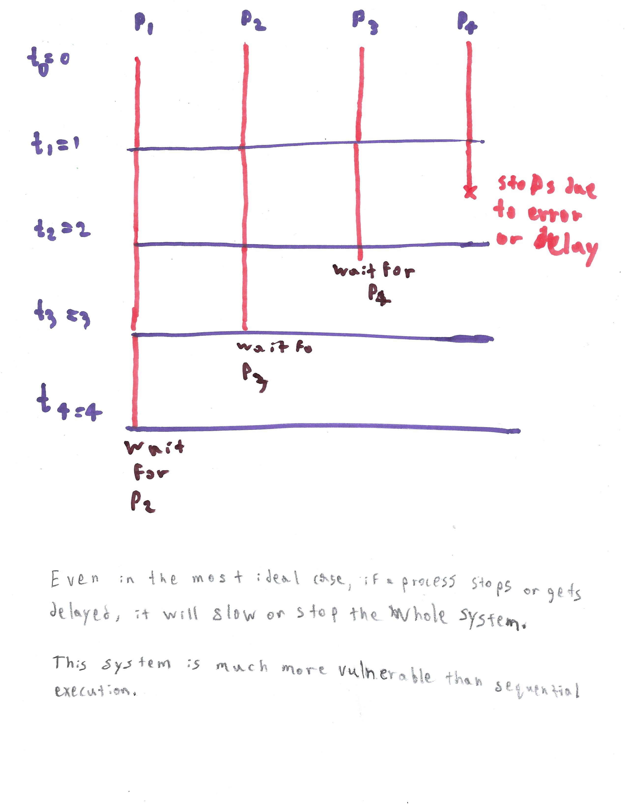

# Program 2's Report

In this program, I parallelized a simulation of the thermal conductance of heat from the top of a metal sheet using Euler's algorithm. I used an MPI tool to initialize multiple processes and share data between them. The metal sheet is simulated with a 2D array where metal atoms are represented as matrix elements. Temperature is represented as an integer between `0` and `9` when printing, but has values between `0.0` and `19.0` during runtime (the bigger the value, the higher the temperature).



## Table of Contents

[TOC]

## Algorithm

Note: I implemented the optimized version that stores only the necessary columns and not the whole matrix. I heard there is extra-credit to be made. 

The simulation is based on time. Euler's algorithm is iterative. Euler's algorithm is used for `T` times (`T` is given as a program argument) to simulate the temperature of the metal at time `T`. In each iteration, Euler's algorithm uses the values of the current particle and 4 adjacent ones to calculate the new temperature of a particle . This necessitates using two arrays at any point in time: one array is the new temperature and the other is the previous temperature that is used to calculate the new one. The sequential program loops over every pixel to calculate its new value for every time iteration.


To parallelize this algorithm, I divided the matrix into columns and assigned a sets of contiguous columns to multiple processes. While the idea is simple, implementing it is tricky. Euler's algorithm requires four adjacent temperatures to calculate the current pixel's new temperature. This is problematic when we divide the Matrix because now at the boundaries of each set of columns, there are no adjacent columns. The adjacent columns are processed in an entirely different process.

I used Interprocess  communication to overcome this problem. I used Open MPI to initialize the processes and communicate between them. At the beginning of the program, each process is allocated a contiguous block of columns. Then, before the processes start computing the matrix, each process sends its edge columns to its neighboring process. The edge column fulfills the four adjacent pixel requirements.



MPI uses sockets, so it can lead to deadlocks if two processes try to send to each other at the same time. To avoid this problem, I ensured that even ranked processes send before receiving and odd ranked processes receive before sending.

Here is the sequential execution of the program:

1. The program validates the arguments and exits if the arguments are invalid.
2. The main process is cloned with `MPI.init()` and the arguments are processed.
3. Each process is allocated by its rank (SIMD) a portion of the matrix.
4. For `T` times, execute the following
   1. Preprocess the top, bottom, left, and right edges of the whole matrix.
   2. Each process shares its edge columns with its neighboring processes.
   3. Print the matrix if the user requested
      1. To print, each process other than the parent process (rank 0) should send a copy to the parent process.
      2. Nested for loops are used to print
   4. Each process uses Euler's algorithm to calculate its columns' temperatures.

## Runtime output

```
[ybeltagy@cssmpi1h Program2]$ mpirun -n 1 java Heat2DPAdvanced 4000 400 360 0
Elapsed time = 13261
[ybeltagy@cssmpi1h Program2]$ mpirun -n 2 java Heat2DPAdvanced 4000 400 360 0
Elapsed time = 11288
[ybeltagy@cssmpi1h Program2]$ mpirun -n 3 java Heat2DPAdvanced 4000 400 360 0
Elapsed time = 12872
[ybeltagy@cssmpi1h Program2]$ mpirun -n 4 java Heat2DPAdvanced 4000 400 360 0
Elapsed time = 10161
[ybeltagy@cssmpi1h Program2]$ mpirun -n 5 java Heat2DPAdvanced 4000 400 360 0
Elapsed time = 8071
[ybeltagy@cssmpi1h Program2]$ mpirun -n 6 java Heat2DPAdvanced 4000 400 360 0
Elapsed time = 10232
[ybeltagy@cssmpi1h Program2]$ mpirun -n 7 java Heat2DPAdvanced 4000 400 360 0
Elapsed time = 9584
[ybeltagy@cssmpi1h Program2]$ mpirun -n 10 java Heat2DPAdvanced 4000 400 360 0
Elapsed time = 7384
[ybeltagy@cssmpi1h Program2]$ mpirun -n 20 java Heat2DPAdvanced 4000 400 360 0
Elapsed time = 7862
[ybeltagy@cssmpi1h Program2]$ mpirun -n 15 java Heat2DPAdvanced 4000 400 360 0
Elapsed time = 8337
[ybeltagy@cssmpi1h Program2]$ mpirun -n 1 java Heat2DPAdvanced 4000 400 360 0
Elapsed time = 13275
```

The runtime decreases, but not always. I assume this is because of the extra computation and communication overhead I added to parallelize the program. It might also be related to the fact that I'm testing these in the last minutes, so the lab machines may be overloaded right now.

## Discussion

Let's define some variables:

`N` is the length of the Matrix. The matrix is a square Matrix, meaning it has `NxN` elements.

`M` is the number of processes.

`T` is the simulation time

Note: Because I implemented the program such that each process only stores the necessary columns, my program will fail if `N < 2M`. However, it is unreasonable to use this many processes and solving this issue will be extremely difficult and meaningless.

The sequential program's runtime complexity is `O(TN^2)` to loop through the matrix `T` times. The parallelized program's runtime complexity is `O(TN^2)` as well. The parallelized program is faster because it uses multiple processors to compute multiple parts of the matrix at the same time. However, the parallelized program has a communication overhead between the processes. The parallelized program has an extra complexity of `O(2TN(M-1))` of communication. As this uses the network, it is really slow. The parallelized program is less efficient but faster because it uses more resources.

The sequential program has memory complexity of `O(2N^2)`. The parallelized program's memory complexity depends on whether each process just stores its allocated columns `O(2N^2)` or a copy of the whole array `O(2MN^2)`. Even if each process just stores its allocated columns, more memory will be needed to store the edge columns of the neighboring processes (extra memory complexity of `O(2N(M-1))`).

The program can be made even faster with negligible overhead if multiple threads are used in each process. If the computing nodes have multiple cores or GPUs, using threads will significantly improve performance without communication overhead.

Since the processes exchange data, the processes must be in sync. Even if they are out of sync, at most they will be out of sync by `M-1` iterations. Just like a chain is as strong as its weakest link, the overall system performance is restricted by the slowest computing node. The faster computing nodes will finish earlier but be blocked until the slowest process catches up. To utilize this system to its utmost, the computing nodes should be as symmetrical as possible.

Lastly, even after the last time the matrix is printed, the program calculates a new temperature. This is redundant. But since it was in the sequential version, I left it as is.



## Code

```java
// Author: Youssef Beltagy
// Last Edited: 5/8/2020 --> 4/12/2022

// Description: Heat conduction simulation using euler's equation.
// Read the report for more details.

import java.util.Date;
import mpi.*;

public class Heat2DPAdvanced {
	private static double a = 1.0; // heat speed
	private static double dt = 1.0; // time quantum
	private static double dd = 2.0; // change in system

	private static double[] z = null; // The matrix representing heat

	private static int size = 100; // length of one side of the matrix
	private static int max_time = 1; // max execution iterations
	private static int heat_time = 1; // num of iterations to heat
	private static int interval = 0; // print at every interval
	private static double r = 1; // heat transfer coefficient

	private static int myrank = 0; // This process's rank
	private static int nprocs = 1; // number of processes
	private static int tag = 0; // tag to use mpi send and receive

	private static int[] offCols = { 0 }; // array of offsets for every process
	private static int[] numCols = { 100 }; // array of number of cols for every process

	public static void main(String[] args) throws MPIException {

		// verify arguments
		if (args.length != 4) {

			System.out.println("usage: " +
					"java Heat2DAdvanced size max_time heat_time interval");

			System.exit(-1);
		}

		// initialize MPI
		MPI.Init(args);

		// Read the program arguments and set the data variables
		setup(args);

		// start a timer
		Date startTime = new Date();

		// compute the matrix
		compute();

		// finish the timer and print the execution time
		if (myrank == 0) {

			Date endTime = new Date();
			System.out.println("Elapsed time = " +
					(endTime.getTime() - startTime.getTime()));
		}

		// finalize MPI
		MPI.Finalize();

	}

	// Description: initializes the matrix and calculates the elements of
	// offCols and numCols
	// Preconditions: There are four arguments and MPI.init() was called
	// Postconditions: The Matrix is initialized and ready for simulation.
	public static void setup(String[] args) throws MPIException {

		size = Integer.parseInt(args[0]);
		max_time = Integer.parseInt(args[1]);
		heat_time = Integer.parseInt(args[2]);
		interval = Integer.parseInt(args[3]);
		r = a * dt / (dd * dd);

		myrank = MPI.COMM_WORLD.Rank();
		nprocs = MPI.COMM_WORLD.Size();
		tag = 0;

		offCols = new int[nprocs];
		numCols = new int[nprocs];

		int stripe = size / nprocs;
		int remainder = size % nprocs;

		for (int i = 0; i < nprocs; i++) {
			numCols[i] = stripe + ((i < remainder) ? 1 : 0);
			offCols[i] = stripe * i + ((i < remainder) ? i : remainder);
		}

		// create a space
		if (myrank == 0) {

			z = new double[2 * size * size];

		} else if (myrank == nprocs - 1) {

			// add an auxiliary column
			z = new double[2 * size * (numCols[myrank] + 1)];

		} else {

			// add two auxiliary columns. One on each side
			z = new double[2 * size * (numCols[myrank] + 2)];
		}

		for (int i = 0; i < z.length; i++) {
			// neither hot nor cold.
			z[i] = 0;
		}

	}

	// Description: gets the offset of an array element, given its
	// coordinates. Considers the differnt sizes of arrays
	// for different processes.
	// Preconditions: The sizes ans offsets of the sub-matrices are known
	// Postconditions: given the coordinates of a point inside the whole matrix,
	// will return its offset inside this process.
	public static int pos(int p, int x, int y) {

		if (myrank == 0) {
			return p * size * size + x * size + y;
		}

		if (myrank == nprocs - 1) {
			return p * size * (numCols[myrank] + 1) + (x - offCols[myrank] + 1) * size + y;
		}

		return p * size * (numCols[myrank] + 2) + (x - offCols[myrank] + 1) * size + y;

	}

	// Description: Shares all the sub-matrices with the parent process (rank 0)
	// then prints the matrix inside the parent process
	// Preconditions: The matrix and processes are initialized
	// Postconditions: rank 0 contains all the information inside the other ranks.
	// The matrix is printed to the console.
	public static void printMatrix(int t) throws MPIException {

		if(myrank != 0) return;

		int p = t % 2;
		
		System.out.println("time = " + t);

		for (int y = 0; y < size; y++) {
			for (int x = 0; x < size; x++)
				System.out.print((int) (Math.floor(z[pos(p, x, y)] / 2)) + " ");

			System.out.println();
		}

		System.out.println();

	}

	// Description: Shares all the sub-matrices with the parent process (rank 0)
	// Preconditions: The matrix and processes are initialized
	// Postconditions: rank 0 contains all the information inside the other ranks.
	public static void shareMatrix(int p) throws MPIException {
		if (nprocs < 2)
			return;

		if (myrank == 0) {

			for (int i = 1; i < nprocs; i++) {
				MPI.COMM_WORLD.Recv(z, p * size * size + offCols[i] * size,
						numCols[i] * size, MPI.DOUBLE, i, tag);
			}

		} else {

			if (myrank == nprocs - 1) {
				MPI.COMM_WORLD.Send(z, p * (numCols[myrank] + 1) * size + size,
						numCols[myrank] * size, MPI.DOUBLE, 0, tag);
			} else {
				MPI.COMM_WORLD.Send(z, p * (numCols[myrank] + 2) * size + size,
						numCols[myrank] * size, MPI.DOUBLE, 0, tag);
			}

		}

	}

	// Description: Shares the edge columns between the processes
	// Preconditions: the mpi processes and the matrix are initialized
	// Postconitions: the edges are shared between processes
	public static void shareEdges(int p) throws MPIException {

		if (nprocs < 2)
			return; // Don't share if there is only one process.

		// To avoid deadlocks:
		// If the process is even, send then receive.
		// If the pcocess is odd, receive then send.

		// The first and last ranks communicate with only one process.
		// Other ranks communicate with two processes.
		if (myrank == 0) {

			// Send the right most column of rank 0
			MPI.COMM_WORLD.Send(z, p * size * size + (numCols[myrank] - 1) * size,
					size, MPI.DOUBLE, myrank + 1, tag);

			// Assign the leftmost column of rank 1 next to rank 0's columns
			MPI.COMM_WORLD.Recv(z, p * size * size + numCols[myrank] * size,
					size, MPI.DOUBLE, myrank + 1, tag);

		} else if (myrank == nprocs - 1) {

			// If it is even
			if (myrank % 2 == 0) {

				// send the left most column
				MPI.COMM_WORLD.Send(z, p * size * (numCols[myrank] + 1) + size,
						size, MPI.DOUBLE, myrank - 1, tag);

				// Assign the rightmost column of the previous rank into the auxiliary column
				MPI.COMM_WORLD.Recv(z, p * size * (numCols[myrank] + 1),
						size, MPI.DOUBLE, myrank - 1, tag);

			} else { // Do the same but in opposite order

				MPI.COMM_WORLD.Recv(z, p * size * (numCols[myrank] + 1),
						size, MPI.DOUBLE, myrank - 1, tag);

				MPI.COMM_WORLD.Send(z, p * size * (numCols[myrank] + 1) + size,
						size, MPI.DOUBLE, myrank - 1, tag);

			}

		} else {

			if (myrank % 2 == 0) {

				// send rht rightmost column to the next rank
				MPI.COMM_WORLD.Send(z, p * size * (numCols[myrank] + 2) + numCols[myrank] * size,
						size, MPI.DOUBLE, myrank + 1, tag);

				// send the leftmost column to the previous rank
				MPI.COMM_WORLD.Send(z, p * size * (numCols[myrank] + 2) + size,
						size, MPI.DOUBLE, myrank - 1, tag);

				// receive the leftmost column of the next rank into the auxiliary column
				MPI.COMM_WORLD.Recv(z, p * size * (numCols[myrank] + 2) + (numCols[myrank] + 1) * size,
						size, MPI.DOUBLE, myrank + 1, tag);

				// receive the rightmost column of the previous rank into the left auxiliary
				// column
				MPI.COMM_WORLD.Recv(z, p * size * (numCols[myrank] + 2),
						size, MPI.DOUBLE, myrank - 1, tag);

			} else { // do the same but in opposite order

				MPI.COMM_WORLD.Recv(z, p * size * (numCols[myrank] + 2),
						size, MPI.DOUBLE, myrank - 1, tag);

				MPI.COMM_WORLD.Recv(z, p * size * (numCols[myrank] + 2) + (numCols[myrank] + 1) * size,
						size, MPI.DOUBLE, myrank + 1, tag);

				MPI.COMM_WORLD.Send(z, p * size * (numCols[myrank] + 2) + size,
						size, MPI.DOUBLE, myrank - 1, tag);

				MPI.COMM_WORLD.Send(z, p * size * (numCols[myrank] + 2) + numCols[myrank] * size,
						size, MPI.DOUBLE, myrank + 1, tag);

			}

		}

	}

	// Description: The heat simulation. The loop that runs euler's equation.
	// Precondition: The matrix and mpi process are initialized
	// Postconditions: the simulation is done and printed to the console
	public static void compute() throws MPIException {

		// simulate heat diffusion
		for (int t = 0; t < max_time; t++) {
			int p = t % 2; // p = 0 or 1: indicates the phase

			// two left-most columns are made identical
			if (myrank == 0) {
				for (int y = 0; y < size; y++) {
					z[pos(p, 0, y)] = z[pos(p, 1, y)];
				}
			}

			// right most columns are made identical
			if (myrank == nprocs - 1) {
				for (int y = 0; y < size; y++) {
					z[pos(p, size - 1, y)] = z[pos(p, size - 2, y)];
				}
			}

			// Get the starting and ending position for every stripe
			int initialX = offCols[myrank];
			int maxX = offCols[myrank] + numCols[myrank];

			// two upper and lower rows are made identical
			for (int x = initialX; x < maxX; x++) {
				z[pos(p, x, 0)] = z[pos(p, x, 1)];
				z[pos(p, x, size - 1)] = z[pos(p, x, size - 2)];
			}

			// keep heating the top as long as t < heat_time
			// Could be made more efficient with a bunch of if-statements
			// but I don't feel it a good investment of my time.
			if (t < heat_time) {
				for (int x = size / 3; x < size / 3 * 2; x++)
					if (x >= initialX && x < maxX)
						z[pos(p, x, 0)] = 19.0; // heat
			}

			// Synchronize the processes
			shareEdges(p);

			// display intermediate results
			if (interval != 0 && (t % interval == 0 || t == max_time - 1)) {
				shareMatrix(p);
				printMatrix(t);
			}

			// perform forward Euler method
			int p2 = (p + 1) % 2;
			initialX = (myrank == 0) ? 1 : offCols[myrank];
			maxX = (myrank == nprocs - 1) ? size - 1 : offCols[myrank] + numCols[myrank];
			for (int x = initialX; x < maxX; x++) {

				for (int y = 1; y < size - 1; y++) {

					z[pos(p2, x, y)] = z[pos(p, x, y)] +
							r * (z[pos(p, x + 1, y)] - 2 * z[pos(p, x, y)] + z[pos(p, x - 1, y)]) +
							r * (z[pos(p, x, y + 1)] - 2 * z[pos(p, x, y)] + z[pos(p, x, y - 1)]);

				}

			}

		} // end of simulation

	}
}
```

## Behavioral output

I ran these two test scripts and got the same output (I commented out the line that prints the execution time).

**runAdvanced.sh**

```shell
rm *.txt
rm Heat2D.class
rm Heat2DPAdvanced.class
rm Heat2DPBasic.class
javac Heat2D.java
javac Heat2DPAdvanced.java
javac Heat2DPBasic.java
java Heat2D 20 100 70 1 > o0.txt
mpirun -n 1 java Heat2DPAdvanced 20 100 70 1 > o1.txt
mpirun -n 2 java Heat2DPAdvanced 20 100 70 1 > o2.txt
mpirun -n 3 java Heat2DPAdvanced 20 100 70 1 > o3.txt
mpirun -n 4 java Heat2DPAdvanced 20 100 70 1 > o4.txt
mpirun -n 5 java Heat2DPAdvanced 20 100 70 1 > o5.txt


echo "o0 vs o1"
diff -s o0.txt o1.txt


echo ; echo ; echo 


echo "o0 vs o2"
diff -s o0.txt o2.txt 


echo ; echo ; echo 


echo "o0 vs o3"
diff -s o0.txt o3.txt


echo ; echo ; echo 


echo "o0 vs o4"
diff -s o0.txt o4.txt


echo ; echo ; echo 


echo "o0 vs o5"
diff -s o0.txt o5.txt


echo ; echo ; echo 


echo "o1 vs o5"
diff -s o1.txt o5.txt


echo ; echo ; echo 


echo "Test finished"

echo ; echo ; echo 

```

**runAdvancedExtended.sh**

```shell
rm *.txt
rm Heat2D.class
rm Heat2DPAdvanced.class
rm Heat2DPBasic.class
javac Heat2D.java
javac Heat2DPAdvanced.java
javac Heat2DPBasic.java
java Heat2D 1000 1000 700 100 > o0.txt
mpirun -n 1 java Heat2DPAdvanced 1000 1000 700 100 > o1.txt
mpirun -n 2 java Heat2DPAdvanced 1000 1000 700 100 > o2.txt
mpirun -n 3 java Heat2DPAdvanced 1000 1000 700 100 > o3.txt
mpirun -n 4 java Heat2DPAdvanced 1000 1000 700 100 > o4.txt
mpirun -n 5 java Heat2DPAdvanced 1000 1000 700 100 > o5.txt


echo "o0 vs o1"
diff -s o0.txt o1.txt


echo ; echo ; echo 


echo "o0 vs o2"
diff -s o0.txt o2.txt 


echo ; echo ; echo 


echo "o0 vs o3"
diff -s o0.txt o3.txt


echo ; echo ; echo 


echo "o0 vs o4"
diff -s o0.txt o4.txt


echo ; echo ; echo 


echo "o0 vs o5"
diff -s o0.txt o5.txt


echo ; echo ; echo 


echo "o1 vs o5"
diff -s o1.txt o5.txt


echo ; echo ; echo 


echo "Test finished"

echo ; echo ; echo 

```


**Behavioral output**

```
[ybeltagy@cssmpi1h Program2]$ ./runAdvanced.sh
o0 vs o1
Files o0.txt and o1.txt are identical


o0 vs o2
Files o0.txt and o2.txt are identical


o0 vs o3
Files o0.txt and o3.txt are identical


o0 vs o4
Files o0.txt and o4.txt are identical


o0 vs o5
Files o0.txt and o5.txt are identical

```


