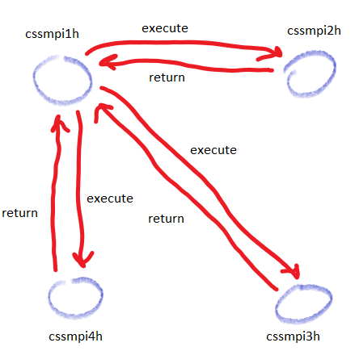
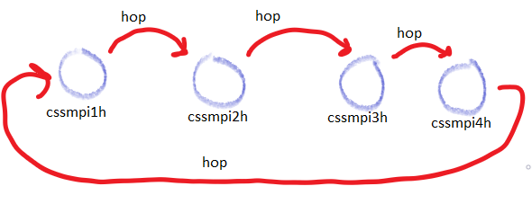

# Program 3 (RMI & Mobile Agents)

In this program I implemented a Remote Method Invocation (**RMI**) client and a mobile agent (built upon UWAgent) and compared their execution time for processing the same tasks.

## Algorithms

The programs should take as an argument a list of servers and commands to execute. Both of the client and the mobile agent start by parsing the program. The client stores the data in static members so it can be accessed in the main. Since there is only one client object in the program, using static members does not cause issues. The UnixAgent stores the data in private data members so it can be serialized to other places.

### UnixClient -- An RMI client

After parsing the input, the client simply loops through all the servers. For every server, the client loops through all the commands and calls the server's execute method for each of these commands. The algorithm is as follows:

1. call setup with args
2. for every server
   1. for every command
      1. call the current server's execute with the current command
3. print the output if requested



### UnixAgent -- A mobile Agent

After parsing the input, the init method is called. The init method has the agent hop to the next place, calling the run method. The run method calls all the commands inside this place and updates the String array that contains the output. The run method has the agent hop to the next agent. If the next agent is the owner of the program, the program terminates. The algorithm is as follows:

1. call setup with args
2. hop to the next place, calling run
3. inside run
   1. if this is the owner go to step 3-2. Else, go to step 3-3.
   2. execute the commands and add their output to an output array data member. Hop to the next place, calling run.
   3. print the output and exit the program.



## Results

Here are the results with their analysis.

### UnixClient

#### Test1

| #nodes | 4 Commands | 12 Commands |
| ------ | ---------- | ----------- |
| 1      | 200        | 253         |
| 2      | 244        | 5350        |
| 3      | 268        | 365         |

#### Test2

| #nodes | grep |
| ------ | ---- |
| 1      | 247  |
| 2      | 363  |
| 3      | 5467 |

#### Test3

| #nodes | cat   |
| ------ | ----- |
| 1      | 6556  |
| 2      | 13193 |
| 3      | 9342  |

Clearly, as the number of commands increases, the processes take longer. However, there are exceptions which take too long to run (5000+). I tested the program numerous times. I think the problem is related to the network, I'm assuming 5 seconds is a timeout interval. When a message is not received correctly, it is resent after 5 seconds.

I think the runtime is linear with respect to the number of commands (assuming all commands are similar like repeating the same commands thrice). But the y-intercept is not zero. It is around the range 100 - 200. This means that simply using an RMI has tens of milliseconds of delay. This is a huge limitation on RMI.

The cat command is the slowest one as it actually downloads a file before passing it into a pipe.

### Unix Agent

#### Test1

| #nodes | 4 Commands | 12 Commands |
| ------ | ---------- | ----------- |
| 1      | 60         | 88          |
| 2      | 100        | 152         |
| 3      | 126        | 224         |

#### Test2

| #nodes | grep |
| ------ | ---- |
| 1      | 118  |
| 2      | 204  |
| 3      | 331  |

I had a lot of 5000+ runtimes, but this time I retested until I got rid of those outliers. Mobile agents are overall faster. I believe the reason is that they eliminate a significant portion of the overhead communication. Because now, instead of calling an RMI four times and dealing with all the error checking for messages for every RMI, an agent is sent once. 

Once an agent is sent, it will execute all its commands, store the outputs, and returns to its owner.

Agents have a flaw, however. They accumulate data as they move around. If the agents hops in this order `cssmpi1h -> cssmpi2h -> cssmpi3h -> cssmpi4h->cssmpi1h`, all the output from cssmpi2h goes to cssmpi3h. Then all the output from both cssmpi2h and cssmpi3h goes to cssmpi4h. Clearly, this is a drawback because it requires more bandwidth as the number of places increases.

I expect RMI to be faster if the number of servers is big but there are only few commands to run because then the data won't have to go through all the servers. Mobile Agents would be better if there are a lot of operations to run but few servers because the network will only be used to transfer the agent instead of for every method call.

Mobile agents are less robust as well. If any of the servers crashes while it has the agent, all the information will be lost. With RMI, if a server fails, then the client will only lose the information of that server.

## Code

### UnixClient

```java
//An experiment to see the execution speed of RMI

import java.io.*;   // for output stream
import java.rmi.*;  // for rmi
import java.util.*; // for vector
import java.net.*;  // inetaddr

public class UnixClient {

private static boolean print = false;
private static int port;
private static int nServers;
private static String[] servers;
private static int nCommands;
private static String[] commands;
private static String[][][] output;

// parses arguments and executes RMI
public static void main( String args[] ) {

    setup(args); // Read program arguments

    // start a timer
    Date startTime = new Date( );

    try {
        // for every server
        for(int s = 0; s < nServers; s++){

            ServerInterface serverObject =  ( ServerInterface )
            Naming.lookup( "rmi://" + servers[s] + ":" + port + "/unixserver" );

            // call all of the commands
            for(int c = 0; c < nCommands; c++){

                Vector vec = serverObject.execute(commands[c]);
                
                Object[] objArray = vec.toArray(); 
  
                // Convert Object[] to String[] 
                output[s][c] = Arrays.copyOf(objArray, objArray.length, String[].class); 

            }

        }
    }
    catch ( Exception e ) {
        e.printStackTrace( );
        System.exit( -1 );
    }

    Date endTime = new Date( );

    if(print) printOutput();
    else{
        int count = 0;
        for(int i = 0; i < nServers; i++){
            for(int j = 0; j < nCommands; j++){
                count += output[i][j].length;
            }
        }
        System.out.println("Count: " + count);
    }
            
    System.err.println("Execution Time: " + (endTime.getTime() - startTime.getTime()) );
    System.out.println("Execution Time: " + (endTime.getTime() - startTime.getTime()) );
    // prints to err to avoid getting caught in the pipe
}

//Description: reads input arguments assuming they are valid
public static void setup(String[] args){

    try {
        // Assume the input is valid
        int offset = 0;
        
        print = args[0].equals("P"); offset++;

        port = Integer.parseInt(args[offset]); offset++;

        if ( port < 5001 || port > 65535 ){
            throw new Exception( );
        }

        nServers = Integer.parseInt(args[offset]); offset++;

        if ( nServers <= 0 ){
            throw new Exception( );
        }

        servers = new String[nServers];
        for(int i = 0; i < nServers; i++){
            servers[i] = args[offset]; offset++;
        }

        nCommands = Integer.parseInt(args[offset]); offset++;

        if ( nCommands <= 0 ){
            throw new Exception( );
        }

        commands = new String[nCommands];
        for(int i = 0; i < nCommands; i++){ // leave the last command
            commands[i] = args[offset]; offset++;

            if(i == nCommands -1){
                for(; offset < args.length; offset++){
                    commands[i] += " " + args[offset];
                }
            }
        }

        output = new String[nServers][nCommands][1];

        System.out.println("print: " + print);
        System.out.println("nServers: " + nServers);
        printArray(servers);
        System.out.println();
        System.out.println("nCommands: " + nCommands);
        printArray(commands);
        System.out.println();
        

    } catch ( Exception e ) {
        System.err.println( "Arguments are incorrect" );
        System.exit( -1 );
    }

}

// Description: prints the output of the client
public static void printOutput(){

    for(int s = 0; s < nServers; s++){
        System.out.println("---------------------------------------------------");
        System.out.println(servers[s]);

        for(int c = 0; c < nCommands; c++){
            System.out.println("| " + servers[s] + " " + commands[c]);
            
            for(int i = 0; i < output[s][c].length; i++){
                System.out.println("| | " + output[s][c][i]);
            }

            System.out.println("| | ");
            System.out.println("| | count: " + output[s][c].length);
            System.out.println();

        }

        System.out.println();
        System.out.println();

    }

}

// prints an array
public static void printArray(String[] arr){
    System.out.print("{");
    for(int i = 0; i < arr.length; i++){
        System.out.print(arr[i]);
        if(i < arr.length -1) System.out.print(", ");
    }
    System.out.print("}");
}

}

```

### UnixAgent

```java
// An experiment to see the execution speed of mobile agents

import java.io.*;
import java.util.*;
import java.net.InetAddress;

import UWAgent.*;

public class UnixAgent extends UWAgent implements Serializable{

private boolean print = false;
private int nNodes;
private String[] nodes;
private int nCommands;
private String[] commands;
private String[][][] output;
private String destination = null;
private int me;

private String[] args = null;

// for the timer
private Date startTime;

// constructors call setup.
public UnixAgent( String[] args ) {
    this.args = args;
}

public UnixAgent( ) { 
    this.args = null;
}

public void init( ) {

    setup(args);
    args = null;

    startTime = new Date( );
    me = 1 % nodes.length;
    hop( nodes[me], "run", null );
}

// Processes all the commands for this server and calls the next server
public void run() {
    if(me != 0){

        // call all of the commands
        for(int c = 0; c < nCommands; c++){

            Vector vec = this.execute(commands[c]);
            
            Object[] objArray = vec.toArray(); 

            // Convert Object[] to String[] 
            output[me - 1][c] = Arrays.copyOf(objArray, objArray.length, String[].class); 

        }

        me += 1;
        me %= nodes.length;
        hop(nodes[me], "run", null);

    } else {

        Date endTime = new Date( );

        if(print) printOutput();
        else{
            int count = 0;
            for(int i = 0; i < nNodes; i++){
                for(int j = 0; j < nCommands; j++){
                    count += output[i][j].length;
                }
            }
            System.out.println("Count: " + count);
        }
                
        System.out.println("Execution Time: " + (endTime.getTime() - startTime.getTime()) );
        System.err.println("Execution Time: " + (endTime.getTime() - startTime.getTime()) );
    }
}

//Description: reads input arguments assuming they are valid
public void setup(String[] args){

    try {
        // Assume the input is valid
        int offset = 0;
        
        print = args[0].equals("P"); offset++;

        nNodes = Integer.parseInt(args[offset]); offset++;

        if ( nNodes <= 0 ){
            throw new Exception( );
        }

        nodes = new String[nNodes + 1]; // add the host to the list of nodes
        
        {
            InetAddress inetaddr = InetAddress.getLocalHost( );
            nodes[0] = inetaddr.getHostName( );
        }

        for(int i = 1; i < nNodes + 1; i++){
            nodes[i] = args[offset]; offset++;
        }

        nCommands = Integer.parseInt(args[offset]); offset++;

        if ( nCommands <= 0 ){
            throw new Exception( );
        }

        commands = new String[nCommands];
        for(int i = 0; i < nCommands; i++){ // leave the last command
            commands[i] = args[offset]; offset++;

            if(i == nCommands -1){
                for(; offset < args.length; offset++){
                    commands[i] += " " + args[offset];
                }
            }
        }

        me = 0;

        output = new String[nNodes][nCommands][1];

        // print arguments
        System.out.println("print: " + print);
        System.out.println("nNodes: " + nNodes);
        printArray(nodes);
        System.out.println();
        System.out.println("nCommands: " + nCommands);
        printArray(commands);
        System.out.println();

    } catch ( Exception e ) {
        System.err.println( "Arguments are incorrect" );
        System.exit( -1 );
    }

}

// executes a command and returns its ouput in a vector of lines
public Vector execute( String command ) {
	Vector<String> outVec = new Vector<String>( );
	String line;
	try {
	    Runtime runtime = Runtime.getRuntime( );
	    Process process = runtime.exec( command );
	    InputStream input = process.getInputStream();
	    BufferedReader bufferedInput
		= new BufferedReader( new InputStreamReader( input ) );
	    while ( ( line = bufferedInput.readLine( ) ) != null ) {
		    outVec.addElement( line );
	    }
	} catch ( IOException e ) {
	    e.printStackTrace( );
	    return outVec;
	}
	return outVec;
}

// Description: prints the output of the client
public void printOutput(){

    for(int n = 0; n < nNodes; n++){
        System.out.println("---------------------------------------------------");
        System.out.println(nodes[n + 1]);

        for(int c = 0; c < nCommands; c++){
            System.out.println("| " + nodes[n + 1] + " " + commands[c]);
            
            for(int i = 0; i < output[n][c].length; i++){
                System.out.println("| | " + output[n][c][i]);
            }

            System.out.println("| | ");
            System.out.println("| | count: " + output[n][c].length);
            System.out.println();

        }

        System.out.println();
        System.out.println();

    }

}

// prints an array
public void printArray(String[] arr){
    System.out.print("{");
    for(int i = 0; i < arr.length; i++){
        System.out.print(arr[i]);
        if(i < arr.length -1) System.out.print(", ");
    }
    System.out.print("}");
}

}

```

## Output

Here is the output for reference.

### UnixClient

#### Standard Error output (to get execution time)

```shell
[ybeltagy@cssmpi1h rmi]$ ./run.sh
Execution Time: 200
Execution Time: 244
Execution Time: 268
Execution Time: 253
Execution Time: 5350
Execution Time: 365
Execution Time: 247
Execution Time: 363
Execution Time: 5467
Execution Time: 6556
Execution Time: 13193
Execution Time: 9342
```

#### Test1

```shell
print: true
nServers: 1
{cssmpi2h}
nCommands: 4
{who, ls, ps, df}
---------------------------------------------------
cssmpi2h
| cssmpi2h who
| | ybeltagy pts/2        2020-05-23 22:13 (10.102.97.58)
| | lllloyd  pts/3        2020-05-14 22:25 (cssmpi1h.uwb.edu)
| | 
| | count: 2

| cssmpi2h ls
| | output1.txt
| | output2.txt
| | output3.txt
| | result.txt
| | run.sh
| | ServerInterface.class
| | ServerInterface.java
| | test.txt
| | UnixClient.class
| | UnixClient.java
| | UnixServer.class
| | UnixServer.java
| | 
| | count: 12

| cssmpi2h ps
| |    PID TTY          TIME CMD
| |  71804 pts/2    00:00:00 bash
| |  84280 pts/2    00:00:01 rmiregistry
| |  84316 pts/2    00:00:13 java
| |  84755 pts/2    00:00:00 ps
| | 
| | count: 5

| cssmpi2h df
| | Filesystem                       1K-blocks      Used  Available Use% Mounted on
| | devtmpfs                           8103488         0    8103488   0% /dev
| | tmpfs                              8115084         0    8115084   0% /dev/shm
| | tmpfs                              8115084     17016    8098068   1% /run
| | tmpfs                              8115084         0    8115084   0% /sys/fs/cgroup
| | /dev/mapper/centos_cent07c-root   52403200   5081520   47321680  10% /
| | /dev/sda2                          1038336    226580     811756  22% /boot
| | /dev/sda1                           204580     11288     193292   6% /boot/efi
| | /dev/mapper/centos_cent07c-home   42888744     33208   42855536   1% /home
| | neometis.uwb.edu:/DATA/apps     2113646592 884767744 1121487872  45% /usr/apps
| | neometis.uwb.edu:/DATA/CSSDIV   2113646592 884767744 1121487872  45% /CSSDIV
| | cssnfs4.uwb.edu:/data/classes   1048064000 268483584  779580416  26% /classes
| | cssnfs4.uwb.edu:/data/NETID     1048064000 268483584  779580416  26% /home/NETID
| | tmpfs                              1623020         0    1623020   0% /run/user/1023734
| | tmpfs                              1623020         0    1623020   0% /run/user/811432
| | tmpfs                              1623020         0    1623020   0% /run/user/820779
| | tmpfs                              1623020         0    1623020   0% /run/user/304839
| | tmpfs                              1623020         0    1623020   0% /run/user/933789
| | 
| | count: 18


Execution Time: 200
print: true
nServers: 2
{cssmpi2h, cssmpi3h}
nCommands: 4
{who, ls, ps, df}
---------------------------------------------------
cssmpi2h
| cssmpi2h who
| | ybeltagy pts/2        2020-05-23 22:13 (10.102.97.58)
| | lllloyd  pts/3        2020-05-14 22:25 (cssmpi1h.uwb.edu)
| | 
| | count: 2

| cssmpi2h ls
| | output1.txt
| | output2.txt
| | output3.txt
| | result.txt
| | run.sh
| | ServerInterface.class
| | ServerInterface.java
| | test.txt
| | UnixClient.class
| | UnixClient.java
| | UnixServer.class
| | UnixServer.java
| | 
| | count: 12

| cssmpi2h ps
| |    PID TTY          TIME CMD
| |  71804 pts/2    00:00:00 bash
| |  84280 pts/2    00:00:01 rmiregistry
| |  84316 pts/2    00:00:13 java
| |  84759 pts/2    00:00:00 ps
| | 
| | count: 5

| cssmpi2h df
| | Filesystem                       1K-blocks      Used  Available Use% Mounted on
| | devtmpfs                           8103488         0    8103488   0% /dev
| | tmpfs                              8115084         0    8115084   0% /dev/shm
| | tmpfs                              8115084     17016    8098068   1% /run
| | tmpfs                              8115084         0    8115084   0% /sys/fs/cgroup
| | /dev/mapper/centos_cent07c-root   52403200   5081520   47321680  10% /
| | /dev/sda2                          1038336    226580     811756  22% /boot
| | /dev/sda1                           204580     11288     193292   6% /boot/efi
| | /dev/mapper/centos_cent07c-home   42888744     33208   42855536   1% /home
| | neometis.uwb.edu:/DATA/apps     2113646592 884767744 1121487872  45% /usr/apps
| | neometis.uwb.edu:/DATA/CSSDIV   2113646592 884767744 1121487872  45% /CSSDIV
| | cssnfs4.uwb.edu:/data/classes   1048064000 268483584  779580416  26% /classes
| | cssnfs4.uwb.edu:/data/NETID     1048064000 268483584  779580416  26% /home/NETID
| | tmpfs                              1623020         0    1623020   0% /run/user/1023734
| | tmpfs                              1623020         0    1623020   0% /run/user/811432
| | tmpfs                              1623020         0    1623020   0% /run/user/820779
| | tmpfs                              1623020         0    1623020   0% /run/user/304839
| | tmpfs                              1623020         0    1623020   0% /run/user/933789
| | 
| | count: 18


---------------------------------------------------
cssmpi3h
| cssmpi3h who
| | ybeltagy pts/1        2020-05-23 22:08 (10.102.97.58)
| | lllloyd  pts/2        2020-05-14 22:25 (cssmpi1h.uwb.edu)
| | 
| | count: 2

| cssmpi3h ls
| | output1.txt
| | output2.txt
| | output3.txt
| | result.txt
| | run.sh
| | ServerInterface.class
| | ServerInterface.java
| | test.txt
| | UnixClient.class
| | UnixClient.java
| | UnixServer.class
| | UnixServer.java
| | 
| | count: 12

| cssmpi3h ps
| |    PID TTY          TIME CMD
| |  56558 pts/1    00:00:00 bash
| |  63246 pts/1    00:00:06 rmiregistry
| |  63316 pts/1    00:00:25 java
| |  69543 pts/1    00:00:00 ps
| | 
| | count: 5

| cssmpi3h df
| | Filesystem                       1K-blocks      Used  Available Use% Mounted on
| | devtmpfs                           8103492         0    8103492   0% /dev
| | tmpfs                              8115088         0    8115088   0% /dev/shm
| | tmpfs                              8115088     16848    8098240   1% /run
| | tmpfs                              8115088         0    8115088   0% /sys/fs/cgroup
| | /dev/mapper/centos_cent07c-root   52403200   5055636   47347564  10% /
| | /dev/sda2                          1038336    226576     811760  22% /boot
| | /dev/sda1                           204580     11288     193292   6% /boot/efi
| | /dev/mapper/centos_cent07c-home   42888744     33052   42855692   1% /home
| | neometis.uwb.edu:/DATA/apps     2113646592 884767744 1121487872  45% /usr/apps
| | neometis.uwb.edu:/DATA/CSSDIV   2113646592 884767744 1121487872  45% /CSSDIV
| | cssnfs4.uwb.edu:/data/classes   1048064000 268483584  779580416  26% /classes
| | cssnfs4.uwb.edu:/data/NETID     1048064000 268483584  779580416  26% /home/NETID
| | tmpfs                              1623020         0    1623020   0% /run/user/820779
| | tmpfs                              1623020         0    1623020   0% /run/user/933789
| | 
| | count: 15


Execution Time: 244
print: true
nServers: 3
{cssmpi2h, cssmpi3h, cssmpi4h}
nCommands: 4
{who, ls, ps, df}
---------------------------------------------------
cssmpi2h
| cssmpi2h who
| | ybeltagy pts/2        2020-05-23 22:13 (10.102.97.58)
| | lllloyd  pts/3        2020-05-14 22:25 (cssmpi1h.uwb.edu)
| | 
| | count: 2

| cssmpi2h ls
| | output1.txt
| | output2.txt
| | output3.txt
| | result.txt
| | run.sh
| | ServerInterface.class
| | ServerInterface.java
| | test.txt
| | UnixClient.class
| | UnixClient.java
| | UnixServer.class
| | UnixServer.java
| | 
| | count: 12

| cssmpi2h ps
| |    PID TTY          TIME CMD
| |  71804 pts/2    00:00:00 bash
| |  84280 pts/2    00:00:01 rmiregistry
| |  84316 pts/2    00:00:13 java
| |  84763 pts/2    00:00:00 ps
| | 
| | count: 5

| cssmpi2h df
| | Filesystem                       1K-blocks      Used  Available Use% Mounted on
| | devtmpfs                           8103488         0    8103488   0% /dev
| | tmpfs                              8115084         0    8115084   0% /dev/shm
| | tmpfs                              8115084     17016    8098068   1% /run
| | tmpfs                              8115084         0    8115084   0% /sys/fs/cgroup
| | /dev/mapper/centos_cent07c-root   52403200   5081520   47321680  10% /
| | /dev/sda2                          1038336    226580     811756  22% /boot
| | /dev/sda1                           204580     11288     193292   6% /boot/efi
| | /dev/mapper/centos_cent07c-home   42888744     33208   42855536   1% /home
| | neometis.uwb.edu:/DATA/apps     2113646592 884767744 1121487872  45% /usr/apps
| | neometis.uwb.edu:/DATA/CSSDIV   2113646592 884767744 1121487872  45% /CSSDIV
| | cssnfs4.uwb.edu:/data/classes   1048064000 268483584  779580416  26% /classes
| | cssnfs4.uwb.edu:/data/NETID     1048064000 268483584  779580416  26% /home/NETID
| | tmpfs                              1623020         0    1623020   0% /run/user/1023734
| | tmpfs                              1623020         0    1623020   0% /run/user/811432
| | tmpfs                              1623020         0    1623020   0% /run/user/820779
| | tmpfs                              1623020         0    1623020   0% /run/user/304839
| | tmpfs                              1623020         0    1623020   0% /run/user/933789
| | 
| | count: 18


---------------------------------------------------
cssmpi3h
| cssmpi3h who
| | ybeltagy pts/1        2020-05-23 22:08 (10.102.97.58)
| | lllloyd  pts/2        2020-05-14 22:25 (cssmpi1h.uwb.edu)
| | 
| | count: 2

| cssmpi3h ls
| | output1.txt
| | output2.txt
| | output3.txt
| | result.txt
| | run.sh
| | ServerInterface.class
| | ServerInterface.java
| | test.txt
| | UnixClient.class
| | UnixClient.java
| | UnixServer.class
| | UnixServer.java
| | 
| | count: 12

| cssmpi3h ps
| |    PID TTY          TIME CMD
| |  56558 pts/1    00:00:00 bash
| |  63246 pts/1    00:00:06 rmiregistry
| |  63316 pts/1    00:00:25 java
| |  69549 pts/1    00:00:00 ps
| | 
| | count: 5

| cssmpi3h df
| | Filesystem                       1K-blocks      Used  Available Use% Mounted on
| | devtmpfs                           8103492         0    8103492   0% /dev
| | tmpfs                              8115088         0    8115088   0% /dev/shm
| | tmpfs                              8115088     16848    8098240   1% /run
| | tmpfs                              8115088         0    8115088   0% /sys/fs/cgroup
| | /dev/mapper/centos_cent07c-root   52403200   5055636   47347564  10% /
| | /dev/sda2                          1038336    226576     811760  22% /boot
| | /dev/sda1                           204580     11288     193292   6% /boot/efi
| | /dev/mapper/centos_cent07c-home   42888744     33052   42855692   1% /home
| | neometis.uwb.edu:/DATA/apps     2113646592 884767744 1121487872  45% /usr/apps
| | neometis.uwb.edu:/DATA/CSSDIV   2113646592 884767744 1121487872  45% /CSSDIV
| | cssnfs4.uwb.edu:/data/classes   1048064000 268483584  779580416  26% /classes
| | cssnfs4.uwb.edu:/data/NETID     1048064000 268483584  779580416  26% /home/NETID
| | tmpfs                              1623020         0    1623020   0% /run/user/820779
| | tmpfs                              1623020         0    1623020   0% /run/user/933789
| | 
| | count: 15


---------------------------------------------------
cssmpi4h
| cssmpi4h who
| | ybeltagy pts/1        2020-05-23 22:08 (10.102.97.58)
| | 
| | count: 1

| cssmpi4h ls
| | output1.txt
| | output2.txt
| | output3.txt
| | result.txt
| | run.sh
| | ServerInterface.class
| | ServerInterface.java
| | test.txt
| | UnixClient.class
| | UnixClient.java
| | UnixServer.class
| | UnixServer.java
| | 
| | count: 12

| cssmpi4h ps
| |    PID TTY          TIME CMD
| |  86595 pts/1    00:00:00 bash
| |  93130 pts/1    00:00:05 rmiregistry
| |  93220 pts/1    00:00:15 java
| |  99323 pts/1    00:00:00 ps
| | 
| | count: 5

| cssmpi4h df
| | Filesystem                       1K-blocks      Used  Available Use% Mounted on
| | devtmpfs                           8103488         0    8103488   0% /dev
| | tmpfs                              8115084         0    8115084   0% /dev/shm
| | tmpfs                              8115084     16796    8098288   1% /run
| | tmpfs                              8115084         0    8115084   0% /sys/fs/cgroup
| | /dev/mapper/centos_cent07c-root   52403200   5053980   47349220  10% /
| | /dev/sda2                          1038336    226576     811760  22% /boot
| | /dev/sda1                           204580     11288     193292   6% /boot/efi
| | /dev/mapper/centos_cent07c-home   42888744     33052   42855692   1% /home
| | cssnfs4.uwb.edu:/data/NETID     1048064000 268483584  779580416  26% /home/NETID
| | neometis.uwb.edu:/DATA/CSSDIV   2113646592 884767744 1121487872  45% /CSSDIV
| | neometis.uwb.edu:/DATA/apps     2113646592 884767744 1121487872  45% /usr/apps
| | cssnfs4.uwb.edu:/data/classes   1048064000 268483584  779580416  26% /classes
| | tmpfs                              1623020         0    1623020   0% /run/user/933789
| | 
| | count: 14


Execution Time: 268
print: true
nServers: 1
{cssmpi2h}
nCommands: 12
{who, ls, ps, df, who, ls, ps, df, who, ls, ps, df}
---------------------------------------------------
cssmpi2h
| cssmpi2h who
| | ybeltagy pts/2        2020-05-23 22:13 (10.102.97.58)
| | lllloyd  pts/3        2020-05-14 22:25 (cssmpi1h.uwb.edu)
| | 
| | count: 2

| cssmpi2h ls
| | output1.txt
| | output2.txt
| | output3.txt
| | result.txt
| | run.sh
| | ServerInterface.class
| | ServerInterface.java
| | test.txt
| | UnixClient.class
| | UnixClient.java
| | UnixServer.class
| | UnixServer.java
| | 
| | count: 12

| cssmpi2h ps
| |    PID TTY          TIME CMD
| |  71804 pts/2    00:00:00 bash
| |  84280 pts/2    00:00:01 rmiregistry
| |  84316 pts/2    00:00:13 java
| |  84769 pts/2    00:00:00 ps
| | 
| | count: 5

| cssmpi2h df
| | Filesystem                       1K-blocks      Used  Available Use% Mounted on
| | devtmpfs                           8103488         0    8103488   0% /dev
| | tmpfs                              8115084         0    8115084   0% /dev/shm
| | tmpfs                              8115084     17016    8098068   1% /run
| | tmpfs                              8115084         0    8115084   0% /sys/fs/cgroup
| | /dev/mapper/centos_cent07c-root   52403200   5081520   47321680  10% /
| | /dev/sda2                          1038336    226580     811756  22% /boot
| | /dev/sda1                           204580     11288     193292   6% /boot/efi
| | /dev/mapper/centos_cent07c-home   42888744     33208   42855536   1% /home
| | neometis.uwb.edu:/DATA/apps     2113646592 884767744 1121487872  45% /usr/apps
| | neometis.uwb.edu:/DATA/CSSDIV   2113646592 884767744 1121487872  45% /CSSDIV
| | cssnfs4.uwb.edu:/data/classes   1048064000 268483584  779580416  26% /classes
| | cssnfs4.uwb.edu:/data/NETID     1048064000 268483584  779580416  26% /home/NETID
| | tmpfs                              1623020         0    1623020   0% /run/user/1023734
| | tmpfs                              1623020         0    1623020   0% /run/user/811432
| | tmpfs                              1623020         0    1623020   0% /run/user/820779
| | tmpfs                              1623020         0    1623020   0% /run/user/304839
| | tmpfs                              1623020         0    1623020   0% /run/user/933789
| | 
| | count: 18

| cssmpi2h who
| | ybeltagy pts/2        2020-05-23 22:13 (10.102.97.58)
| | lllloyd  pts/3        2020-05-14 22:25 (cssmpi1h.uwb.edu)
| | 
| | count: 2

| cssmpi2h ls
| | output1.txt
| | output2.txt
| | output3.txt
| | result.txt
| | run.sh
| | ServerInterface.class
| | ServerInterface.java
| | test.txt
| | UnixClient.class
| | UnixClient.java
| | UnixServer.class
| | UnixServer.java
| | 
| | count: 12

| cssmpi2h ps
| |    PID TTY          TIME CMD
| |  71804 pts/2    00:00:00 bash
| |  84280 pts/2    00:00:01 rmiregistry
| |  84316 pts/2    00:00:13 java
| |  84773 pts/2    00:00:00 ps
| | 
| | count: 5

| cssmpi2h df
| | Filesystem                       1K-blocks      Used  Available Use% Mounted on
| | devtmpfs                           8103488         0    8103488   0% /dev
| | tmpfs                              8115084         0    8115084   0% /dev/shm
| | tmpfs                              8115084     17016    8098068   1% /run
| | tmpfs                              8115084         0    8115084   0% /sys/fs/cgroup
| | /dev/mapper/centos_cent07c-root   52403200   5081520   47321680  10% /
| | /dev/sda2                          1038336    226580     811756  22% /boot
| | /dev/sda1                           204580     11288     193292   6% /boot/efi
| | /dev/mapper/centos_cent07c-home   42888744     33208   42855536   1% /home
| | neometis.uwb.edu:/DATA/apps     2113646592 884767744 1121487872  45% /usr/apps
| | neometis.uwb.edu:/DATA/CSSDIV   2113646592 884767744 1121487872  45% /CSSDIV
| | cssnfs4.uwb.edu:/data/classes   1048064000 268483584  779580416  26% /classes
| | cssnfs4.uwb.edu:/data/NETID     1048064000 268483584  779580416  26% /home/NETID
| | tmpfs                              1623020         0    1623020   0% /run/user/1023734
| | tmpfs                              1623020         0    1623020   0% /run/user/811432
| | tmpfs                              1623020         0    1623020   0% /run/user/820779
| | tmpfs                              1623020         0    1623020   0% /run/user/304839
| | tmpfs                              1623020         0    1623020   0% /run/user/933789
| | 
| | count: 18

| cssmpi2h who
| | ybeltagy pts/2        2020-05-23 22:13 (10.102.97.58)
| | lllloyd  pts/3        2020-05-14 22:25 (cssmpi1h.uwb.edu)
| | 
| | count: 2

| cssmpi2h ls
| | output1.txt
| | output2.txt
| | output3.txt
| | result.txt
| | run.sh
| | ServerInterface.class
| | ServerInterface.java
| | test.txt
| | UnixClient.class
| | UnixClient.java
| | UnixServer.class
| | UnixServer.java
| | 
| | count: 12

| cssmpi2h ps
| |    PID TTY          TIME CMD
| |  71804 pts/2    00:00:00 bash
| |  84280 pts/2    00:00:01 rmiregistry
| |  84316 pts/2    00:00:13 java
| |  84777 pts/2    00:00:00 ps
| | 
| | count: 5

| cssmpi2h df
| | Filesystem                       1K-blocks      Used  Available Use% Mounted on
| | devtmpfs                           8103488         0    8103488   0% /dev
| | tmpfs                              8115084         0    8115084   0% /dev/shm
| | tmpfs                              8115084     17016    8098068   1% /run
| | tmpfs                              8115084         0    8115084   0% /sys/fs/cgroup
| | /dev/mapper/centos_cent07c-root   52403200   5081520   47321680  10% /
| | /dev/sda2                          1038336    226580     811756  22% /boot
| | /dev/sda1                           204580     11288     193292   6% /boot/efi
| | /dev/mapper/centos_cent07c-home   42888744     33208   42855536   1% /home
| | neometis.uwb.edu:/DATA/apps     2113646592 884767744 1121487872  45% /usr/apps
| | neometis.uwb.edu:/DATA/CSSDIV   2113646592 884767744 1121487872  45% /CSSDIV
| | cssnfs4.uwb.edu:/data/classes   1048064000 268483584  779580416  26% /classes
| | cssnfs4.uwb.edu:/data/NETID     1048064000 268483584  779580416  26% /home/NETID
| | tmpfs                              1623020         0    1623020   0% /run/user/1023734
| | tmpfs                              1623020         0    1623020   0% /run/user/811432
| | tmpfs                              1623020         0    1623020   0% /run/user/820779
| | tmpfs                              1623020         0    1623020   0% /run/user/304839
| | tmpfs                              1623020         0    1623020   0% /run/user/933789
| | 
| | count: 18


Execution Time: 253
print: true
nServers: 2
{cssmpi2h, cssmpi3h}
nCommands: 12
{who, ls, ps, df, who, ls, ps, df, who, ls, ps, df}
---------------------------------------------------
cssmpi2h
| cssmpi2h who
| | ybeltagy pts/2        2020-05-23 22:13 (10.102.97.58)
| | lllloyd  pts/3        2020-05-14 22:25 (cssmpi1h.uwb.edu)
| | 
| | count: 2

| cssmpi2h ls
| | output1.txt
| | output2.txt
| | output3.txt
| | result.txt
| | run.sh
| | ServerInterface.class
| | ServerInterface.java
| | test.txt
| | UnixClient.class
| | UnixClient.java
| | UnixServer.class
| | UnixServer.java
| | 
| | count: 12

| cssmpi2h ps
| |    PID TTY          TIME CMD
| |  71804 pts/2    00:00:00 bash
| |  84280 pts/2    00:00:01 rmiregistry
| |  84316 pts/2    00:00:13 java
| |  84781 pts/2    00:00:00 ps
| | 
| | count: 5

| cssmpi2h df
| | Filesystem                       1K-blocks      Used  Available Use% Mounted on
| | devtmpfs                           8103488         0    8103488   0% /dev
| | tmpfs                              8115084         0    8115084   0% /dev/shm
| | tmpfs                              8115084     17016    8098068   1% /run
| | tmpfs                              8115084         0    8115084   0% /sys/fs/cgroup
| | /dev/mapper/centos_cent07c-root   52403200   5081520   47321680  10% /
| | /dev/sda2                          1038336    226580     811756  22% /boot
| | /dev/sda1                           204580     11288     193292   6% /boot/efi
| | /dev/mapper/centos_cent07c-home   42888744     33208   42855536   1% /home
| | neometis.uwb.edu:/DATA/apps     2113646592 884767744 1121487872  45% /usr/apps
| | neometis.uwb.edu:/DATA/CSSDIV   2113646592 884767744 1121487872  45% /CSSDIV
| | cssnfs4.uwb.edu:/data/classes   1048064000 268483584  779580416  26% /classes
| | cssnfs4.uwb.edu:/data/NETID     1048064000 268483584  779580416  26% /home/NETID
| | tmpfs                              1623020         0    1623020   0% /run/user/1023734
| | tmpfs                              1623020         0    1623020   0% /run/user/811432
| | tmpfs                              1623020         0    1623020   0% /run/user/820779
| | tmpfs                              1623020         0    1623020   0% /run/user/304839
| | tmpfs                              1623020         0    1623020   0% /run/user/933789
| | 
| | count: 18

| cssmpi2h who
| | ybeltagy pts/2        2020-05-23 22:13 (10.102.97.58)
| | lllloyd  pts/3        2020-05-14 22:25 (cssmpi1h.uwb.edu)
| | 
| | count: 2

| cssmpi2h ls
| | output1.txt
| | output2.txt
| | output3.txt
| | result.txt
| | run.sh
| | ServerInterface.class
| | ServerInterface.java
| | test.txt
| | UnixClient.class
| | UnixClient.java
| | UnixServer.class
| | UnixServer.java
| | 
| | count: 12

| cssmpi2h ps
| |    PID TTY          TIME CMD
| |  71804 pts/2    00:00:00 bash
| |  84280 pts/2    00:00:01 rmiregistry
| |  84316 pts/2    00:00:13 java
| |  84785 pts/2    00:00:00 ps
| | 
| | count: 5

| cssmpi2h df
| | Filesystem                       1K-blocks      Used  Available Use% Mounted on
| | devtmpfs                           8103488         0    8103488   0% /dev
| | tmpfs                              8115084         0    8115084   0% /dev/shm
| | tmpfs                              8115084     17016    8098068   1% /run
| | tmpfs                              8115084         0    8115084   0% /sys/fs/cgroup
| | /dev/mapper/centos_cent07c-root   52403200   5081520   47321680  10% /
| | /dev/sda2                          1038336    226580     811756  22% /boot
| | /dev/sda1                           204580     11288     193292   6% /boot/efi
| | /dev/mapper/centos_cent07c-home   42888744     33208   42855536   1% /home
| | neometis.uwb.edu:/DATA/apps     2113646592 884767744 1121487872  45% /usr/apps
| | neometis.uwb.edu:/DATA/CSSDIV   2113646592 884767744 1121487872  45% /CSSDIV
| | cssnfs4.uwb.edu:/data/classes   1048064000 268483584  779580416  26% /classes
| | cssnfs4.uwb.edu:/data/NETID     1048064000 268483584  779580416  26% /home/NETID
| | tmpfs                              1623020         0    1623020   0% /run/user/1023734
| | tmpfs                              1623020         0    1623020   0% /run/user/811432
| | tmpfs                              1623020         0    1623020   0% /run/user/820779
| | tmpfs                              1623020         0    1623020   0% /run/user/304839
| | tmpfs                              1623020         0    1623020   0% /run/user/933789
| | 
| | count: 18

| cssmpi2h who
| | ybeltagy pts/2        2020-05-23 22:13 (10.102.97.58)
| | lllloyd  pts/3        2020-05-14 22:25 (cssmpi1h.uwb.edu)
| | 
| | count: 2

| cssmpi2h ls
| | output1.txt
| | output2.txt
| | output3.txt
| | result.txt
| | run.sh
| | ServerInterface.class
| | ServerInterface.java
| | test.txt
| | UnixClient.class
| | UnixClient.java
| | UnixServer.class
| | UnixServer.java
| | 
| | count: 12

| cssmpi2h ps
| |    PID TTY          TIME CMD
| |  71804 pts/2    00:00:00 bash
| |  84280 pts/2    00:00:01 rmiregistry
| |  84316 pts/2    00:00:13 java
| |  84789 pts/2    00:00:00 ps
| | 
| | count: 5

| cssmpi2h df
| | Filesystem                       1K-blocks      Used  Available Use% Mounted on
| | devtmpfs                           8103488         0    8103488   0% /dev
| | tmpfs                              8115084         0    8115084   0% /dev/shm
| | tmpfs                              8115084     17016    8098068   1% /run
| | tmpfs                              8115084         0    8115084   0% /sys/fs/cgroup
| | /dev/mapper/centos_cent07c-root   52403200   5081520   47321680  10% /
| | /dev/sda2                          1038336    226580     811756  22% /boot
| | /dev/sda1                           204580     11288     193292   6% /boot/efi
| | /dev/mapper/centos_cent07c-home   42888744     33208   42855536   1% /home
| | neometis.uwb.edu:/DATA/apps     2113646592 884767744 1121487872  45% /usr/apps
| | neometis.uwb.edu:/DATA/CSSDIV   2113646592 884767744 1121487872  45% /CSSDIV
| | cssnfs4.uwb.edu:/data/classes   1048064000 268483584  779580416  26% /classes
| | cssnfs4.uwb.edu:/data/NETID     1048064000 268483584  779580416  26% /home/NETID
| | tmpfs                              1623020         0    1623020   0% /run/user/1023734
| | tmpfs                              1623020         0    1623020   0% /run/user/811432
| | tmpfs                              1623020         0    1623020   0% /run/user/820779
| | tmpfs                              1623020         0    1623020   0% /run/user/304839
| | tmpfs                              1623020         0    1623020   0% /run/user/933789
| | 
| | count: 18


---------------------------------------------------
cssmpi3h
| cssmpi3h who
| | ybeltagy pts/1        2020-05-23 22:08 (10.102.97.58)
| | lllloyd  pts/2        2020-05-14 22:25 (cssmpi1h.uwb.edu)
| | 
| | count: 2

| cssmpi3h ls
| | output1.txt
| | output2.txt
| | output3.txt
| | result.txt
| | run.sh
| | ServerInterface.class
| | ServerInterface.java
| | test.txt
| | UnixClient.class
| | UnixClient.java
| | UnixServer.class
| | UnixServer.java
| | 
| | count: 12

| cssmpi3h ps
| |    PID TTY          TIME CMD
| |  56558 pts/1    00:00:00 bash
| |  63246 pts/1    00:00:06 rmiregistry
| |  63316 pts/1    00:00:25 java
| |  69562 pts/1    00:00:00 ps
| | 
| | count: 5

| cssmpi3h df
| | Filesystem                       1K-blocks      Used  Available Use% Mounted on
| | devtmpfs                           8103492         0    8103492   0% /dev
| | tmpfs                              8115088         0    8115088   0% /dev/shm
| | tmpfs                              8115088     16848    8098240   1% /run
| | tmpfs                              8115088         0    8115088   0% /sys/fs/cgroup
| | /dev/mapper/centos_cent07c-root   52403200   5055636   47347564  10% /
| | /dev/sda2                          1038336    226576     811760  22% /boot
| | /dev/sda1                           204580     11288     193292   6% /boot/efi
| | /dev/mapper/centos_cent07c-home   42888744     33052   42855692   1% /home
| | neometis.uwb.edu:/DATA/apps     2113646592 884767744 1121487872  45% /usr/apps
| | neometis.uwb.edu:/DATA/CSSDIV   2113646592 884767744 1121487872  45% /CSSDIV
| | cssnfs4.uwb.edu:/data/classes   1048064000 268483584  779580416  26% /classes
| | cssnfs4.uwb.edu:/data/NETID     1048064000 268483584  779580416  26% /home/NETID
| | tmpfs                              1623020         0    1623020   0% /run/user/820779
| | tmpfs                              1623020         0    1623020   0% /run/user/933789
| | 
| | count: 15

| cssmpi3h who
| | ybeltagy pts/1        2020-05-23 22:08 (10.102.97.58)
| | lllloyd  pts/2        2020-05-14 22:25 (cssmpi1h.uwb.edu)
| | 
| | count: 2

| cssmpi3h ls
| | output1.txt
| | output2.txt
| | output3.txt
| | result.txt
| | run.sh
| | ServerInterface.class
| | ServerInterface.java
| | test.txt
| | UnixClient.class
| | UnixClient.java
| | UnixServer.class
| | UnixServer.java
| | 
| | count: 12

| cssmpi3h ps
| |    PID TTY          TIME CMD
| |  56558 pts/1    00:00:00 bash
| |  63246 pts/1    00:00:06 rmiregistry
| |  63316 pts/1    00:00:25 java
| |  69566 pts/1    00:00:00 ps
| | 
| | count: 5

| cssmpi3h df
| | Filesystem                       1K-blocks      Used  Available Use% Mounted on
| | devtmpfs                           8103492         0    8103492   0% /dev
| | tmpfs                              8115088         0    8115088   0% /dev/shm
| | tmpfs                              8115088     16848    8098240   1% /run
| | tmpfs                              8115088         0    8115088   0% /sys/fs/cgroup
| | /dev/mapper/centos_cent07c-root   52403200   5055636   47347564  10% /
| | /dev/sda2                          1038336    226576     811760  22% /boot
| | /dev/sda1                           204580     11288     193292   6% /boot/efi
| | /dev/mapper/centos_cent07c-home   42888744     33052   42855692   1% /home
| | neometis.uwb.edu:/DATA/apps     2113646592 884767744 1121487872  45% /usr/apps
| | neometis.uwb.edu:/DATA/CSSDIV   2113646592 884767744 1121487872  45% /CSSDIV
| | cssnfs4.uwb.edu:/data/classes   1048064000 268483584  779580416  26% /classes
| | cssnfs4.uwb.edu:/data/NETID     1048064000 268483584  779580416  26% /home/NETID
| | tmpfs                              1623020         0    1623020   0% /run/user/820779
| | tmpfs                              1623020         0    1623020   0% /run/user/933789
| | 
| | count: 15

| cssmpi3h who
| | ybeltagy pts/1        2020-05-23 22:08 (10.102.97.58)
| | lllloyd  pts/2        2020-05-14 22:25 (cssmpi1h.uwb.edu)
| | 
| | count: 2

| cssmpi3h ls
| | output1.txt
| | output2.txt
| | output3.txt
| | result.txt
| | run.sh
| | ServerInterface.class
| | ServerInterface.java
| | test.txt
| | UnixClient.class
| | UnixClient.java
| | UnixServer.class
| | UnixServer.java
| | 
| | count: 12

| cssmpi3h ps
| |    PID TTY          TIME CMD
| |  56558 pts/1    00:00:00 bash
| |  63246 pts/1    00:00:06 rmiregistry
| |  63316 pts/1    00:00:25 java
| |  69570 pts/1    00:00:00 ps
| | 
| | count: 5

| cssmpi3h df
| | Filesystem                       1K-blocks      Used  Available Use% Mounted on
| | devtmpfs                           8103492         0    8103492   0% /dev
| | tmpfs                              8115088         0    8115088   0% /dev/shm
| | tmpfs                              8115088     16848    8098240   1% /run
| | tmpfs                              8115088         0    8115088   0% /sys/fs/cgroup
| | /dev/mapper/centos_cent07c-root   52403200   5055636   47347564  10% /
| | /dev/sda2                          1038336    226576     811760  22% /boot
| | /dev/sda1                           204580     11288     193292   6% /boot/efi
| | /dev/mapper/centos_cent07c-home   42888744     33052   42855692   1% /home
| | neometis.uwb.edu:/DATA/apps     2113646592 884767744 1121487872  45% /usr/apps
| | neometis.uwb.edu:/DATA/CSSDIV   2113646592 884767744 1121487872  45% /CSSDIV
| | cssnfs4.uwb.edu:/data/classes   1048064000 268483584  779580416  26% /classes
| | cssnfs4.uwb.edu:/data/NETID     1048064000 268483584  779580416  26% /home/NETID
| | tmpfs                              1623020         0    1623020   0% /run/user/820779
| | tmpfs                              1623020         0    1623020   0% /run/user/933789
| | 
| | count: 15


Execution Time: 5350
print: true
nServers: 3
{cssmpi2h, cssmpi3h, cssmpi4h}
nCommands: 12
{who, ls, ps, df, who, ls, ps, df, who, ls, ps, df}
---------------------------------------------------
cssmpi2h
| cssmpi2h who
| | ybeltagy pts/2        2020-05-23 22:13 (10.102.97.58)
| | lllloyd  pts/3        2020-05-14 22:25 (cssmpi1h.uwb.edu)
| | 
| | count: 2

| cssmpi2h ls
| | output1.txt
| | output2.txt
| | output3.txt
| | result.txt
| | run.sh
| | ServerInterface.class
| | ServerInterface.java
| | test.txt
| | UnixClient.class
| | UnixClient.java
| | UnixServer.class
| | UnixServer.java
| | 
| | count: 12

| cssmpi2h ps
| |    PID TTY          TIME CMD
| |  71804 pts/2    00:00:00 bash
| |  84280 pts/2    00:00:01 rmiregistry
| |  84316 pts/2    00:00:13 java
| |  84801 pts/2    00:00:00 ps
| | 
| | count: 5

| cssmpi2h df
| | Filesystem                       1K-blocks      Used  Available Use% Mounted on
| | devtmpfs                           8103488         0    8103488   0% /dev
| | tmpfs                              8115084         0    8115084   0% /dev/shm
| | tmpfs                              8115084     17016    8098068   1% /run
| | tmpfs                              8115084         0    8115084   0% /sys/fs/cgroup
| | /dev/mapper/centos_cent07c-root   52403200   5081520   47321680  10% /
| | /dev/sda2                          1038336    226580     811756  22% /boot
| | /dev/sda1                           204580     11288     193292   6% /boot/efi
| | /dev/mapper/centos_cent07c-home   42888744     33208   42855536   1% /home
| | neometis.uwb.edu:/DATA/apps     2113646592 884767744 1121487872  45% /usr/apps
| | neometis.uwb.edu:/DATA/CSSDIV   2113646592 884767744 1121487872  45% /CSSDIV
| | cssnfs4.uwb.edu:/data/classes   1048064000 268483584  779580416  26% /classes
| | cssnfs4.uwb.edu:/data/NETID     1048064000 268483584  779580416  26% /home/NETID
| | tmpfs                              1623020         0    1623020   0% /run/user/1023734
| | tmpfs                              1623020         0    1623020   0% /run/user/811432
| | tmpfs                              1623020         0    1623020   0% /run/user/820779
| | tmpfs                              1623020         0    1623020   0% /run/user/304839
| | tmpfs                              1623020         0    1623020   0% /run/user/933789
| | 
| | count: 18

| cssmpi2h who
| | ybeltagy pts/2        2020-05-23 22:13 (10.102.97.58)
| | lllloyd  pts/3        2020-05-14 22:25 (cssmpi1h.uwb.edu)
| | 
| | count: 2

| cssmpi2h ls
| | output1.txt
| | output2.txt
| | output3.txt
| | result.txt
| | run.sh
| | ServerInterface.class
| | ServerInterface.java
| | test.txt
| | UnixClient.class
| | UnixClient.java
| | UnixServer.class
| | UnixServer.java
| | 
| | count: 12

| cssmpi2h ps
| |    PID TTY          TIME CMD
| |  71804 pts/2    00:00:00 bash
| |  84280 pts/2    00:00:01 rmiregistry
| |  84316 pts/2    00:00:13 java
| |  84805 pts/2    00:00:00 ps
| | 
| | count: 5

| cssmpi2h df
| | Filesystem                       1K-blocks      Used  Available Use% Mounted on
| | devtmpfs                           8103488         0    8103488   0% /dev
| | tmpfs                              8115084         0    8115084   0% /dev/shm
| | tmpfs                              8115084     17016    8098068   1% /run
| | tmpfs                              8115084         0    8115084   0% /sys/fs/cgroup
| | /dev/mapper/centos_cent07c-root   52403200   5081520   47321680  10% /
| | /dev/sda2                          1038336    226580     811756  22% /boot
| | /dev/sda1                           204580     11288     193292   6% /boot/efi
| | /dev/mapper/centos_cent07c-home   42888744     33208   42855536   1% /home
| | neometis.uwb.edu:/DATA/apps     2113646592 884767744 1121487872  45% /usr/apps
| | neometis.uwb.edu:/DATA/CSSDIV   2113646592 884767744 1121487872  45% /CSSDIV
| | cssnfs4.uwb.edu:/data/classes   1048064000 268483584  779580416  26% /classes
| | cssnfs4.uwb.edu:/data/NETID     1048064000 268483584  779580416  26% /home/NETID
| | tmpfs                              1623020         0    1623020   0% /run/user/1023734
| | tmpfs                              1623020         0    1623020   0% /run/user/811432
| | tmpfs                              1623020         0    1623020   0% /run/user/820779
| | tmpfs                              1623020         0    1623020   0% /run/user/304839
| | tmpfs                              1623020         0    1623020   0% /run/user/933789
| | 
| | count: 18

| cssmpi2h who
| | ybeltagy pts/2        2020-05-23 22:13 (10.102.97.58)
| | lllloyd  pts/3        2020-05-14 22:25 (cssmpi1h.uwb.edu)
| | 
| | count: 2

| cssmpi2h ls
| | output1.txt
| | output2.txt
| | output3.txt
| | result.txt
| | run.sh
| | ServerInterface.class
| | ServerInterface.java
| | test.txt
| | UnixClient.class
| | UnixClient.java
| | UnixServer.class
| | UnixServer.java
| | 
| | count: 12

| cssmpi2h ps
| |    PID TTY          TIME CMD
| |  71804 pts/2    00:00:00 bash
| |  84280 pts/2    00:00:01 rmiregistry
| |  84316 pts/2    00:00:13 java
| |  84809 pts/2    00:00:00 ps
| | 
| | count: 5

| cssmpi2h df
| | Filesystem                       1K-blocks      Used  Available Use% Mounted on
| | devtmpfs                           8103488         0    8103488   0% /dev
| | tmpfs                              8115084         0    8115084   0% /dev/shm
| | tmpfs                              8115084     17016    8098068   1% /run
| | tmpfs                              8115084         0    8115084   0% /sys/fs/cgroup
| | /dev/mapper/centos_cent07c-root   52403200   5081520   47321680  10% /
| | /dev/sda2                          1038336    226580     811756  22% /boot
| | /dev/sda1                           204580     11288     193292   6% /boot/efi
| | /dev/mapper/centos_cent07c-home   42888744     33208   42855536   1% /home
| | neometis.uwb.edu:/DATA/apps     2113646592 884767744 1121487872  45% /usr/apps
| | neometis.uwb.edu:/DATA/CSSDIV   2113646592 884767744 1121487872  45% /CSSDIV
| | cssnfs4.uwb.edu:/data/classes   1048064000 268483584  779580416  26% /classes
| | cssnfs4.uwb.edu:/data/NETID     1048064000 268483584  779580416  26% /home/NETID
| | tmpfs                              1623020         0    1623020   0% /run/user/1023734
| | tmpfs                              1623020         0    1623020   0% /run/user/811432
| | tmpfs                              1623020         0    1623020   0% /run/user/820779
| | tmpfs                              1623020         0    1623020   0% /run/user/304839
| | tmpfs                              1623020         0    1623020   0% /run/user/933789
| | 
| | count: 18


---------------------------------------------------
cssmpi3h
| cssmpi3h who
| | ybeltagy pts/1        2020-05-23 22:08 (10.102.97.58)
| | lllloyd  pts/2        2020-05-14 22:25 (cssmpi1h.uwb.edu)
| | 
| | count: 2

| cssmpi3h ls
| | output1.txt
| | output2.txt
| | output3.txt
| | result.txt
| | run.sh
| | ServerInterface.class
| | ServerInterface.java
| | test.txt
| | UnixClient.class
| | UnixClient.java
| | UnixServer.class
| | UnixServer.java
| | 
| | count: 12

| cssmpi3h ps
| |    PID TTY          TIME CMD
| |  56558 pts/1    00:00:00 bash
| |  63246 pts/1    00:00:06 rmiregistry
| |  63316 pts/1    00:00:25 java
| |  69576 pts/1    00:00:00 ps
| | 
| | count: 5

| cssmpi3h df
| | Filesystem                       1K-blocks      Used  Available Use% Mounted on
| | devtmpfs                           8103492         0    8103492   0% /dev
| | tmpfs                              8115088         0    8115088   0% /dev/shm
| | tmpfs                              8115088     16848    8098240   1% /run
| | tmpfs                              8115088         0    8115088   0% /sys/fs/cgroup
| | /dev/mapper/centos_cent07c-root   52403200   5055636   47347564  10% /
| | /dev/sda2                          1038336    226576     811760  22% /boot
| | /dev/sda1                           204580     11288     193292   6% /boot/efi
| | /dev/mapper/centos_cent07c-home   42888744     33052   42855692   1% /home
| | neometis.uwb.edu:/DATA/apps     2113646592 884767744 1121487872  45% /usr/apps
| | neometis.uwb.edu:/DATA/CSSDIV   2113646592 884767744 1121487872  45% /CSSDIV
| | cssnfs4.uwb.edu:/data/classes   1048064000 268483584  779580416  26% /classes
| | cssnfs4.uwb.edu:/data/NETID     1048064000 268483584  779580416  26% /home/NETID
| | tmpfs                              1623020         0    1623020   0% /run/user/820779
| | tmpfs                              1623020         0    1623020   0% /run/user/933789
| | 
| | count: 15

| cssmpi3h who
| | ybeltagy pts/1        2020-05-23 22:08 (10.102.97.58)
| | lllloyd  pts/2        2020-05-14 22:25 (cssmpi1h.uwb.edu)
| | 
| | count: 2

| cssmpi3h ls
| | output1.txt
| | output2.txt
| | output3.txt
| | result.txt
| | run.sh
| | ServerInterface.class
| | ServerInterface.java
| | test.txt
| | UnixClient.class
| | UnixClient.java
| | UnixServer.class
| | UnixServer.java
| | 
| | count: 12

| cssmpi3h ps
| |    PID TTY          TIME CMD
| |  56558 pts/1    00:00:00 bash
| |  63246 pts/1    00:00:06 rmiregistry
| |  63316 pts/1    00:00:25 java
| |  69580 pts/1    00:00:00 ps
| | 
| | count: 5

| cssmpi3h df
| | Filesystem                       1K-blocks      Used  Available Use% Mounted on
| | devtmpfs                           8103492         0    8103492   0% /dev
| | tmpfs                              8115088         0    8115088   0% /dev/shm
| | tmpfs                              8115088     16848    8098240   1% /run
| | tmpfs                              8115088         0    8115088   0% /sys/fs/cgroup
| | /dev/mapper/centos_cent07c-root   52403200   5055636   47347564  10% /
| | /dev/sda2                          1038336    226576     811760  22% /boot
| | /dev/sda1                           204580     11288     193292   6% /boot/efi
| | /dev/mapper/centos_cent07c-home   42888744     33052   42855692   1% /home
| | neometis.uwb.edu:/DATA/apps     2113646592 884767744 1121487872  45% /usr/apps
| | neometis.uwb.edu:/DATA/CSSDIV   2113646592 884767744 1121487872  45% /CSSDIV
| | cssnfs4.uwb.edu:/data/classes   1048064000 268483584  779580416  26% /classes
| | cssnfs4.uwb.edu:/data/NETID     1048064000 268483584  779580416  26% /home/NETID
| | tmpfs                              1623020         0    1623020   0% /run/user/820779
| | tmpfs                              1623020         0    1623020   0% /run/user/933789
| | 
| | count: 15

| cssmpi3h who
| | ybeltagy pts/1        2020-05-23 22:08 (10.102.97.58)
| | lllloyd  pts/2        2020-05-14 22:25 (cssmpi1h.uwb.edu)
| | 
| | count: 2

| cssmpi3h ls
| | output1.txt
| | output2.txt
| | output3.txt
| | result.txt
| | run.sh
| | ServerInterface.class
| | ServerInterface.java
| | test.txt
| | UnixClient.class
| | UnixClient.java
| | UnixServer.class
| | UnixServer.java
| | 
| | count: 12

| cssmpi3h ps
| |    PID TTY          TIME CMD
| |  56558 pts/1    00:00:00 bash
| |  63246 pts/1    00:00:06 rmiregistry
| |  63316 pts/1    00:00:25 java
| |  69584 pts/1    00:00:00 ps
| | 
| | count: 5

| cssmpi3h df
| | Filesystem                       1K-blocks      Used  Available Use% Mounted on
| | devtmpfs                           8103492         0    8103492   0% /dev
| | tmpfs                              8115088         0    8115088   0% /dev/shm
| | tmpfs                              8115088     16848    8098240   1% /run
| | tmpfs                              8115088         0    8115088   0% /sys/fs/cgroup
| | /dev/mapper/centos_cent07c-root   52403200   5055636   47347564  10% /
| | /dev/sda2                          1038336    226576     811760  22% /boot
| | /dev/sda1                           204580     11288     193292   6% /boot/efi
| | /dev/mapper/centos_cent07c-home   42888744     33052   42855692   1% /home
| | neometis.uwb.edu:/DATA/apps     2113646592 884767744 1121487872  45% /usr/apps
| | neometis.uwb.edu:/DATA/CSSDIV   2113646592 884767744 1121487872  45% /CSSDIV
| | cssnfs4.uwb.edu:/data/classes   1048064000 268483584  779580416  26% /classes
| | cssnfs4.uwb.edu:/data/NETID     1048064000 268483584  779580416  26% /home/NETID
| | tmpfs                              1623020         0    1623020   0% /run/user/820779
| | tmpfs                              1623020         0    1623020   0% /run/user/933789
| | 
| | count: 15


---------------------------------------------------
cssmpi4h
| cssmpi4h who
| | ybeltagy pts/1        2020-05-23 22:08 (10.102.97.58)
| | 
| | count: 1

| cssmpi4h ls
| | output1.txt
| | output2.txt
| | output3.txt
| | result.txt
| | run.sh
| | ServerInterface.class
| | ServerInterface.java
| | test.txt
| | UnixClient.class
| | UnixClient.java
| | UnixServer.class
| | UnixServer.java
| | 
| | count: 12

| cssmpi4h ps
| |    PID TTY          TIME CMD
| |  86595 pts/1    00:00:00 bash
| |  93130 pts/1    00:00:05 rmiregistry
| |  93220 pts/1    00:00:15 java
| |  99337 pts/1    00:00:00 ps
| | 
| | count: 5

| cssmpi4h df
| | Filesystem                       1K-blocks      Used  Available Use% Mounted on
| | devtmpfs                           8103488         0    8103488   0% /dev
| | tmpfs                              8115084         0    8115084   0% /dev/shm
| | tmpfs                              8115084     16796    8098288   1% /run
| | tmpfs                              8115084         0    8115084   0% /sys/fs/cgroup
| | /dev/mapper/centos_cent07c-root   52403200   5053980   47349220  10% /
| | /dev/sda2                          1038336    226576     811760  22% /boot
| | /dev/sda1                           204580     11288     193292   6% /boot/efi
| | /dev/mapper/centos_cent07c-home   42888744     33052   42855692   1% /home
| | cssnfs4.uwb.edu:/data/NETID     1048064000 268483584  779580416  26% /home/NETID
| | neometis.uwb.edu:/DATA/CSSDIV   2113646592 884767744 1121487872  45% /CSSDIV
| | neometis.uwb.edu:/DATA/apps     2113646592 884767744 1121487872  45% /usr/apps
| | cssnfs4.uwb.edu:/data/classes   1048064000 268483584  779580416  26% /classes
| | tmpfs                              1623020         0    1623020   0% /run/user/933789
| | 
| | count: 14

| cssmpi4h who
| | ybeltagy pts/1        2020-05-23 22:08 (10.102.97.58)
| | 
| | count: 1

| cssmpi4h ls
| | output1.txt
| | output2.txt
| | output3.txt
| | result.txt
| | run.sh
| | ServerInterface.class
| | ServerInterface.java
| | test.txt
| | UnixClient.class
| | UnixClient.java
| | UnixServer.class
| | UnixServer.java
| | 
| | count: 12

| cssmpi4h ps
| |    PID TTY          TIME CMD
| |  86595 pts/1    00:00:00 bash
| |  93130 pts/1    00:00:05 rmiregistry
| |  93220 pts/1    00:00:15 java
| |  99341 pts/1    00:00:00 ps
| | 
| | count: 5

| cssmpi4h df
| | Filesystem                       1K-blocks      Used  Available Use% Mounted on
| | devtmpfs                           8103488         0    8103488   0% /dev
| | tmpfs                              8115084         0    8115084   0% /dev/shm
| | tmpfs                              8115084     16796    8098288   1% /run
| | tmpfs                              8115084         0    8115084   0% /sys/fs/cgroup
| | /dev/mapper/centos_cent07c-root   52403200   5053980   47349220  10% /
| | /dev/sda2                          1038336    226576     811760  22% /boot
| | /dev/sda1                           204580     11288     193292   6% /boot/efi
| | /dev/mapper/centos_cent07c-home   42888744     33052   42855692   1% /home
| | cssnfs4.uwb.edu:/data/NETID     1048064000 268483584  779580416  26% /home/NETID
| | neometis.uwb.edu:/DATA/CSSDIV   2113646592 884767744 1121487872  45% /CSSDIV
| | neometis.uwb.edu:/DATA/apps     2113646592 884767744 1121487872  45% /usr/apps
| | cssnfs4.uwb.edu:/data/classes   1048064000 268483584  779580416  26% /classes
| | tmpfs                              1623020         0    1623020   0% /run/user/933789
| | 
| | count: 14

| cssmpi4h who
| | ybeltagy pts/1        2020-05-23 22:08 (10.102.97.58)
| | 
| | count: 1

| cssmpi4h ls
| | output1.txt
| | output2.txt
| | output3.txt
| | result.txt
| | run.sh
| | ServerInterface.class
| | ServerInterface.java
| | test.txt
| | UnixClient.class
| | UnixClient.java
| | UnixServer.class
| | UnixServer.java
| | 
| | count: 12

| cssmpi4h ps
| |    PID TTY          TIME CMD
| |  86595 pts/1    00:00:00 bash
| |  93130 pts/1    00:00:05 rmiregistry
| |  93220 pts/1    00:00:15 java
| |  99345 pts/1    00:00:00 ps
| | 
| | count: 5

| cssmpi4h df
| | Filesystem                       1K-blocks      Used  Available Use% Mounted on
| | devtmpfs                           8103488         0    8103488   0% /dev
| | tmpfs                              8115084         0    8115084   0% /dev/shm
| | tmpfs                              8115084     16796    8098288   1% /run
| | tmpfs                              8115084         0    8115084   0% /sys/fs/cgroup
| | /dev/mapper/centos_cent07c-root   52403200   5053980   47349220  10% /
| | /dev/sda2                          1038336    226576     811760  22% /boot
| | /dev/sda1                           204580     11288     193292   6% /boot/efi
| | /dev/mapper/centos_cent07c-home   42888744     33052   42855692   1% /home
| | cssnfs4.uwb.edu:/data/NETID     1048064000 268483584  779580416  26% /home/NETID
| | neometis.uwb.edu:/DATA/CSSDIV   2113646592 884767744 1121487872  45% /CSSDIV
| | neometis.uwb.edu:/DATA/apps     2113646592 884767744 1121487872  45% /usr/apps
| | cssnfs4.uwb.edu:/data/classes   1048064000 268483584  779580416  26% /classes
| | tmpfs                              1623020         0    1623020   0% /run/user/933789
| | 
| | count: 14


Execution Time: 365

```


#### Test2 

```'
print: false
nServers: 1
{cssmpi2h}
nCommands: 1
{grep -o 123 ../files/text1.txt}
Count: 359
Execution Time: 247
print: false
nServers: 2
{cssmpi2h, cssmpi3h}
nCommands: 1
{grep -o 123 ../files/text1.txt}
Count: 718
Execution Time: 363
print: false
nServers: 3
{cssmpi2h, cssmpi3h, cssmpi4h}
nCommands: 1
{grep -o 123 ../files/text1.txt}
Count: 1077
Execution Time: 5467

```


#### Test3

This is just the count because the execution time goes through the pipes. To see the execution time, check the standard error output.

```
359
718
1077

```


### UnixAgent

#### Text1

```
[ybeltagy@cssmpi1h uwagent]$ java -cp UWAgent.jar:. UWAgent.UWInject -p 28540 localhost UnixAgent P 1 cssmpi2h 4 who ls ps df
[ybeltagy@cssmpi1h uwagent]$ print: true
nNodes: 1
{cssmpi1h.uwb.edu, cssmpi2h}
nCommands: 4
{who, ls, ps, df}
---------------------------------------------------
cssmpi2h
| cssmpi2h who
| | ybeltagy pts/2        2020-05-23 22:13 (10.102.97.58)
| | lllloyd  pts/3        2020-05-14 22:25 (cssmpi1h.uwb.edu)
| |
| | count: 2

| cssmpi2h ls
| | AnAgent.class
| | AnAgent.java
| | compile.sh
| | MyAgent.class
| | output1.txt
| | output2.txt
| | output.txt
| | readme.txt
| | runAgent.sh
| | runTest.sh
| | runUnixAgent.sh
| | runUWPlace.sh
| | runWhoAgent.sh
| | UnixAgent.class
| | UnixAgent.java
| | UWAgent
| | UWAgent.jar
| | UWAgentUserManual.pdf
| |
| | count: 18

| cssmpi2h ps
| |    PID TTY          TIME CMD
| |  71804 pts/2    00:00:00 bash
| |  85821 pts/2    00:00:00 runUWPlace.sh
| |  85822 pts/2    00:00:01 java
| |  86496 pts/2    00:00:00 ps
| |
| | count: 5

| cssmpi2h df
| | Filesystem                       1K-blocks      Used  Available Use% Mounted on
| | devtmpfs                           8103488         0    8103488   0% /dev
| | tmpfs                              8115084         0    8115084   0% /dev/shm
| | tmpfs                              8115084     17016    8098068   1% /run
| | tmpfs                              8115084         0    8115084   0% /sys/fs/cgroup
| | /dev/mapper/centos_cent07c-root   52403200   5081488   47321712  10% /
| | /dev/sda2                          1038336    226580     811756  22% /boot
| | /dev/sda1                           204580     11288     193292   6% /boot/efi
| | /dev/mapper/centos_cent07c-home   42888744     33208   42855536   1% /home
| | neometis.uwb.edu:/DATA/apps     2113646592 884767744 1121487872  45% /usr/apps
| | neometis.uwb.edu:/DATA/CSSDIV   2113646592 884767744 1121487872  45% /CSSDIV
| | cssnfs4.uwb.edu:/data/classes   1048064000 268483584  779580416  26% /classes
| | cssnfs4.uwb.edu:/data/NETID     1048064000 268483584  779580416  26% /home/NETID
| | tmpfs                              1623020         0    1623020   0% /run/user/1023734
| | tmpfs                              1623020         0    1623020   0% /run/user/811432
| | tmpfs                              1623020         0    1623020   0% /run/user/820779
| | tmpfs                              1623020         0    1623020   0% /run/user/304839
| | tmpfs                              1623020         0    1623020   0% /run/user/933789
| |
| | count: 18


Execution Time: 60
Execution Time: 60
#: UnixAgent 0 exiting; sending exit message to parent (id -1)
#: UnixAgent 0 exiting; sending exit message to parent (id -1)


[ybeltagy@cssmpi1h uwagent]$ java -cp UWAgent.jar:. UWAgent.UWInject -p 28540 localhost UnixAgent P 2 cssmpi2h cssmpi3h 4 who ls ps df
[ybeltagy@cssmpi1h uwagent]$ print: true
nNodes: 2
{cssmpi1h.uwb.edu, cssmpi2h, cssmpi3h}
nCommands: 4
{who, ls, ps, df}
---------------------------------------------------
cssmpi2h
| cssmpi2h who
| | ybeltagy pts/2        2020-05-23 22:13 (10.102.97.58)
| | lllloyd  pts/3        2020-05-14 22:25 (cssmpi1h.uwb.edu)
| |
| | count: 2

| cssmpi2h ls
| | AnAgent.class
| | AnAgent.java
| | compile.sh
| | MyAgent.class
| | output1.txt
| | output2.txt
| | output.txt
| | readme.txt
| | runAgent.sh
| | runTest.sh
| | runUnixAgent.sh
| | runUWPlace.sh
| | runWhoAgent.sh
| | UnixAgent.class
| | UnixAgent.java
| | UWAgent
| | UWAgent.jar
| | UWAgentUserManual.pdf
| |
| | count: 18

| cssmpi2h ps
| |    PID TTY          TIME CMD
| |  71804 pts/2    00:00:00 bash
| |  85821 pts/2    00:00:00 runUWPlace.sh
| |  85822 pts/2    00:00:01 java
| |  86536 pts/2    00:00:00 ps
| |
| | count: 5

| cssmpi2h df
| | Filesystem                       1K-blocks      Used  Available Use% Mounted on
| | devtmpfs                           8103488         0    8103488   0% /dev
| | tmpfs                              8115084         0    8115084   0% /dev/shm
| | tmpfs                              8115084     17016    8098068   1% /run
| | tmpfs                              8115084         0    8115084   0% /sys/fs/cgroup
| | /dev/mapper/centos_cent07c-root   52403200   5081488   47321712  10% /
| | /dev/sda2                          1038336    226580     811756  22% /boot
| | /dev/sda1                           204580     11288     193292   6% /boot/efi
| | /dev/mapper/centos_cent07c-home   42888744     33208   42855536   1% /home
| | neometis.uwb.edu:/DATA/apps     2113646592 884767744 1121487872  45% /usr/apps
| | neometis.uwb.edu:/DATA/CSSDIV   2113646592 884767744 1121487872  45% /CSSDIV
| | cssnfs4.uwb.edu:/data/classes   1048064000 268483584  779580416  26% /classes
| | cssnfs4.uwb.edu:/data/NETID     1048064000 268483584  779580416  26% /home/NETID
| | tmpfs                              1623020         0    1623020   0% /run/user/1023734
| | tmpfs                              1623020         0    1623020   0% /run/user/811432
| | tmpfs                              1623020         0    1623020   0% /run/user/820779
| | tmpfs                              1623020         0    1623020   0% /run/user/304839
| | tmpfs                              1623020         0    1623020   0% /run/user/933789
| |
| | count: 18


---------------------------------------------------
cssmpi3h
| cssmpi3h who
| | ybeltagy pts/0        2020-05-24 00:21 (10.102.97.58)
| | ybeltagy pts/1        2020-05-23 22:08 (10.102.97.58)
| | lllloyd  pts/2        2020-05-14 22:25 (cssmpi1h.uwb.edu)
| |
| | count: 3

| cssmpi3h ls
| | AnAgent.class
| | AnAgent.java
| | compile.sh
| | MyAgent.class
| | output1.txt
| | output2.txt
| | output.txt
| | readme.txt
| | runAgent.sh
| | runTest.sh
| | runUnixAgent.sh
| | runUWPlace.sh
| | runWhoAgent.sh
| | UnixAgent.class
| | UnixAgent.java
| | UWAgent
| | UWAgent.jar
| | UWAgentUserManual.pdf
| |
| | count: 18

| cssmpi3h ps
| |    PID TTY          TIME CMD
| |  70078 pts/0    00:00:00 bash
| |  70840 pts/0    00:00:00 runUWPlace.sh
| |  70841 pts/0    00:00:00 java
| |  71326 pts/0    00:00:00 ps
| |
| | count: 5

| cssmpi3h df
| | Filesystem                       1K-blocks      Used  Available Use% Mounted on
| | devtmpfs                           8103492         0    8103492   0% /dev
| | tmpfs                              8115088         0    8115088   0% /dev/shm
| | tmpfs                              8115088     16880    8098208   1% /run
| | tmpfs                              8115088         0    8115088   0% /sys/fs/cgroup
| | /dev/mapper/centos_cent07c-root   52403200   5055644   47347556  10% /
| | /dev/sda2                          1038336    226576     811760  22% /boot
| | /dev/sda1                           204580     11288     193292   6% /boot/efi
| | /dev/mapper/centos_cent07c-home   42888744     33052   42855692   1% /home
| | neometis.uwb.edu:/DATA/apps     2113646592 884767744 1121487872  45% /usr/apps
| | neometis.uwb.edu:/DATA/CSSDIV   2113646592 884767744 1121487872  45% /CSSDIV
| | cssnfs4.uwb.edu:/data/classes   1048064000 268483584  779580416  26% /classes
| | cssnfs4.uwb.edu:/data/NETID     1048064000 268483584  779580416  26% /home/NETID
| | tmpfs                              1623020         0    1623020   0% /run/user/820779
| | tmpfs                              1623020         0    1623020   0% /run/user/933789
| |
| | count: 15


Execution Time: 100
Execution Time: 100
#: UnixAgent 0 exiting; sending exit message to parent (id -1)
#: UnixAgent 0 exiting; sending exit message to parent (id -1)

[ybeltagy@cssmpi1h uwagent]$ java -cp UWAgent.jar:. UWAgent.UWInject -p 28540 localhost UnixAgent P 3 cssmpi2h cssmpi3h cssmpi4h 4 who ls ps
 df
[ybeltagy@cssmpi1h uwagent]$ print: true
nNodes: 3
{cssmpi1h.uwb.edu, cssmpi2h, cssmpi3h, cssmpi4h}
nCommands: 4
{who, ls, ps, df}
---------------------------------------------------
cssmpi2h
| cssmpi2h who
| | ybeltagy pts/2        2020-05-23 22:13 (10.102.97.58)
| | lllloyd  pts/3        2020-05-14 22:25 (cssmpi1h.uwb.edu)
| |
| | count: 2

| cssmpi2h ls
| | AnAgent.class
| | AnAgent.java
| | compile.sh
| | MyAgent.class
| | output1.txt
| | output2.txt
| | output.txt
| | readme.txt
| | runAgent.sh
| | runTest.sh
| | runUnixAgent.sh
| | runUWPlace.sh
| | runWhoAgent.sh
| | UnixAgent.class
| | UnixAgent.java
| | UWAgent
| | UWAgent.jar
| | UWAgentUserManual.pdf
| |
| | count: 18

| cssmpi2h ps
| |    PID TTY          TIME CMD
| |  71804 pts/2    00:00:00 bash
| |  85821 pts/2    00:00:00 runUWPlace.sh
| |  85822 pts/2    00:00:02 java
| |  86919 pts/2    00:00:00 ps
| |
| | count: 5

| cssmpi2h df
| | Filesystem                       1K-blocks      Used  Available Use% Mounted on
| | devtmpfs                           8103488         0    8103488   0% /dev
| | tmpfs                              8115084         0    8115084   0% /dev/shm
| | tmpfs                              8115084     17016    8098068   1% /run
| | tmpfs                              8115084         0    8115084   0% /sys/fs/cgroup
| | /dev/mapper/centos_cent07c-root   52403200   5081488   47321712  10% /
| | /dev/sda2                          1038336    226580     811756  22% /boot
| | /dev/sda1                           204580     11288     193292   6% /boot/efi
| | /dev/mapper/centos_cent07c-home   42888744     33208   42855536   1% /home
| | neometis.uwb.edu:/DATA/apps     2113646592 884767744 1121487872  45% /usr/apps
| | neometis.uwb.edu:/DATA/CSSDIV   2113646592 884767744 1121487872  45% /CSSDIV
| | cssnfs4.uwb.edu:/data/classes   1048064000 268483584  779580416  26% /classes
| | cssnfs4.uwb.edu:/data/NETID     1048064000 268483584  779580416  26% /home/NETID
| | tmpfs                              1623020         0    1623020   0% /run/user/1023734
| | tmpfs                              1623020         0    1623020   0% /run/user/811432
| | tmpfs                              1623020         0    1623020   0% /run/user/820779
| | tmpfs                              1623020         0    1623020   0% /run/user/304839
| | tmpfs                              1623020         0    1623020   0% /run/user/933789
| |
| | count: 18


---------------------------------------------------
cssmpi3h
| cssmpi3h who
| | ybeltagy pts/0        2020-05-24 00:21 (10.102.97.58)
| | ybeltagy pts/1        2020-05-23 22:08 (10.102.97.58)
| | lllloyd  pts/2        2020-05-14 22:25 (cssmpi1h.uwb.edu)
| |
| | count: 3

| cssmpi3h ls
| | AnAgent.class
| | AnAgent.java
| | compile.sh
| | MyAgent.class
| | output1.txt
| | output2.txt
| | output.txt
| | readme.txt
| | runAgent.sh
| | runTest.sh
| | runUnixAgent.sh
| | runUWPlace.sh
| | runWhoAgent.sh
| | UnixAgent.class
| | UnixAgent.java
| | UWAgent
| | UWAgent.jar
| | UWAgentUserManual.pdf
| |
| | count: 18

| cssmpi3h ps
| |    PID TTY          TIME CMD
| |  70078 pts/0    00:00:00 bash
| |  70840 pts/0    00:00:00 runUWPlace.sh
| |  70841 pts/0    00:00:01 java
| |  71708 pts/0    00:00:00 ps
| |
| | count: 5

| cssmpi3h df
| | Filesystem                       1K-blocks      Used  Available Use% Mounted on
| | devtmpfs                           8103492         0    8103492   0% /dev
| | tmpfs                              8115088         0    8115088   0% /dev/shm
| | tmpfs                              8115088     16880    8098208   1% /run
| | tmpfs                              8115088         0    8115088   0% /sys/fs/cgroup
| | /dev/mapper/centos_cent07c-root   52403200   5055644   47347556  10% /
| | /dev/sda2                          1038336    226576     811760  22% /boot
| | /dev/sda1                           204580     11288     193292   6% /boot/efi
| | /dev/mapper/centos_cent07c-home   42888744     33052   42855692   1% /home
| | neometis.uwb.edu:/DATA/apps     2113646592 884767744 1121487872  45% /usr/apps
| | neometis.uwb.edu:/DATA/CSSDIV   2113646592 884767744 1121487872  45% /CSSDIV
| | cssnfs4.uwb.edu:/data/classes   1048064000 268483584  779580416  26% /classes
| | cssnfs4.uwb.edu:/data/NETID     1048064000 268483584  779580416  26% /home/NETID
| | tmpfs                              1623020         0    1623020   0% /run/user/820779
| | tmpfs                              1623020         0    1623020   0% /run/user/933789
| |
| | count: 15


---------------------------------------------------
cssmpi4h
| cssmpi4h who
| | ybeltagy pts/0        2020-05-24 00:22 (10.102.97.58)
| | ybeltagy pts/1        2020-05-23 22:08 (10.102.97.58)
| |
| | count: 2

| cssmpi4h ls
| | AnAgent.class
| | AnAgent.java
| | compile.sh
| | MyAgent.class
| | output1.txt
| | output2.txt
| | output.txt
| | readme.txt
| | runAgent.sh
| | runTest.sh
| | runUnixAgent.sh
| | runUWPlace.sh
| | runWhoAgent.sh
| | UnixAgent.class
| | UnixAgent.java
| | UWAgent
| | UWAgent.jar
| | UWAgentUserManual.pdf
| |
| | count: 18

| cssmpi4h ps
| |    PID TTY          TIME CMD
| |  99908 pts/0    00:00:00 bash
| | 100558 pts/0    00:00:00 runUWPlace.sh
| | 100559 pts/0    00:00:01 java
| | 101447 pts/0    00:00:00 ps
| |
| | count: 5

| cssmpi4h df
| | Filesystem                       1K-blocks      Used  Available Use% Mounted on
| | devtmpfs                           8103488         0    8103488   0% /dev
| | tmpfs                              8115084         0    8115084   0% /dev/shm
| | tmpfs                              8115084     16828    8098256   1% /run
| | tmpfs                              8115084         0    8115084   0% /sys/fs/cgroup
| | /dev/mapper/centos_cent07c-root   52403200   5053992   47349208  10% /
| | /dev/sda2                          1038336    226576     811760  22% /boot
| | /dev/sda1                           204580     11288     193292   6% /boot/efi
| | /dev/mapper/centos_cent07c-home   42888744     33052   42855692   1% /home
| | cssnfs4.uwb.edu:/data/NETID     1048064000 268483584  779580416  26% /home/NETID
| | neometis.uwb.edu:/DATA/CSSDIV   2113646592 884767744 1121487872  45% /CSSDIV
| | neometis.uwb.edu:/DATA/apps     2113646592 884767744 1121487872  45% /usr/apps
| | cssnfs4.uwb.edu:/data/classes   1048064000 268483584  779580416  26% /classes
| | tmpfs                              1623020         0    1623020   0% /run/user/933789
| |
| | count: 14


Execution Time: 126
Execution Time: 126
#: UnixAgent 0 exiting; sending exit message to parent (id -1)
#: UnixAgent 0 exiting; sending exit message to parent (id -1)


[ybeltagy@cssmpi1h uwagent]$ java -cp UWAgent.jar:. UWAgent.UWInject -p 28540 localhost UnixAgent P 1 cssmpi2h 12 who ls ps df who ls ps df
who ls ps df
print: true
nNodes: 1
{cssmpi1h.uwb.edu, cssmpi2h}
nCommands: 12
{who, ls, ps, df, who, ls, ps, df, who, ls, ps, df}
[ybeltagy@cssmpi1h uwagent]$ ---------------------------------------------------
cssmpi2h
| cssmpi2h who
| | ybeltagy pts/2        2020-05-23 22:13 (10.102.97.58)
| | lllloyd  pts/3        2020-05-14 22:25 (cssmpi1h.uwb.edu)
| |
| | count: 2

| cssmpi2h ls
| | AnAgent.class
| | AnAgent.java
| | compile.sh
| | MyAgent.class
| | output1.txt
| | output2.txt
| | output.txt
| | readme.txt
| | runAgent.sh
| | runTest.sh
| | runUnixAgent.sh
| | runUWPlace.sh
| | runWhoAgent.sh
| | UnixAgent.class
| | UnixAgent.java
| | UWAgent
| | UWAgent.jar
| | UWAgentUserManual.pdf
| |
| | count: 18

| cssmpi2h ps
| |    PID TTY          TIME CMD
| |  71804 pts/2    00:00:00 bash
| |  85821 pts/2    00:00:00 runUWPlace.sh
| |  85822 pts/2    00:00:02 java
| |  87066 pts/2    00:00:00 ps
| |
| | count: 5

| cssmpi2h df
| | Filesystem                       1K-blocks      Used  Available Use% Mounted on
| | devtmpfs                           8103488         0    8103488   0% /dev
| | tmpfs                              8115084         0    8115084   0% /dev/shm
| | tmpfs                              8115084     17016    8098068   1% /run
| | tmpfs                              8115084         0    8115084   0% /sys/fs/cgroup
| | /dev/mapper/centos_cent07c-root   52403200   5081488   47321712  10% /
| | /dev/sda2                          1038336    226580     811756  22% /boot
| | /dev/sda1                           204580     11288     193292   6% /boot/efi
| | /dev/mapper/centos_cent07c-home   42888744     33208   42855536   1% /home
| | neometis.uwb.edu:/DATA/apps     2113646592 884767744 1121487872  45% /usr/apps
| | neometis.uwb.edu:/DATA/CSSDIV   2113646592 884767744 1121487872  45% /CSSDIV
| | cssnfs4.uwb.edu:/data/classes   1048064000 268483584  779580416  26% /classes
| | cssnfs4.uwb.edu:/data/NETID     1048064000 268483584  779580416  26% /home/NETID
| | tmpfs                              1623020         0    1623020   0% /run/user/1023734
| | tmpfs                              1623020         0    1623020   0% /run/user/811432
| | tmpfs                              1623020         0    1623020   0% /run/user/820779
| | tmpfs                              1623020         0    1623020   0% /run/user/304839
| | tmpfs                              1623020         0    1623020   0% /run/user/933789
| |
| | count: 18

| cssmpi2h who
| | ybeltagy pts/2        2020-05-23 22:13 (10.102.97.58)
| | lllloyd  pts/3        2020-05-14 22:25 (cssmpi1h.uwb.edu)
| |
| | count: 2

| cssmpi2h ls
| | AnAgent.class
| | AnAgent.java
| | compile.sh
| | MyAgent.class
| | output1.txt
| | output2.txt
| | output.txt
| | readme.txt
| | runAgent.sh
| | runTest.sh
| | runUnixAgent.sh
| | runUWPlace.sh
| | runWhoAgent.sh
| | UnixAgent.class
| | UnixAgent.java
| | UWAgent
| | UWAgent.jar
| | UWAgentUserManual.pdf
| |
| | count: 18

| cssmpi2h ps
| |    PID TTY          TIME CMD
| |  71804 pts/2    00:00:00 bash
| |  85821 pts/2    00:00:00 runUWPlace.sh
| |  85822 pts/2    00:00:02 java
| |  87071 pts/2    00:00:00 ps
| |
| | count: 5

| cssmpi2h df
| | Filesystem                       1K-blocks      Used  Available Use% Mounted on
| | devtmpfs                           8103488         0    8103488   0% /dev
| | tmpfs                              8115084         0    8115084   0% /dev/shm
| | tmpfs                              8115084     17016    8098068   1% /run
| | tmpfs                              8115084         0    8115084   0% /sys/fs/cgroup
| | /dev/mapper/centos_cent07c-root   52403200   5081488   47321712  10% /
| | /dev/sda2                          1038336    226580     811756  22% /boot
| | /dev/sda1                           204580     11288     193292   6% /boot/efi
| | /dev/mapper/centos_cent07c-home   42888744     33208   42855536   1% /home
| | neometis.uwb.edu:/DATA/apps     2113646592 884767744 1121487872  45% /usr/apps
| | neometis.uwb.edu:/DATA/CSSDIV   2113646592 884767744 1121487872  45% /CSSDIV
| | cssnfs4.uwb.edu:/data/classes   1048064000 268483584  779580416  26% /classes
| | cssnfs4.uwb.edu:/data/NETID     1048064000 268483584  779580416  26% /home/NETID
| | tmpfs                              1623020         0    1623020   0% /run/user/1023734
| | tmpfs                              1623020         0    1623020   0% /run/user/811432
| | tmpfs                              1623020         0    1623020   0% /run/user/820779
| | tmpfs                              1623020         0    1623020   0% /run/user/304839
| | tmpfs                              1623020         0    1623020   0% /run/user/933789
| |
| | count: 18

| cssmpi2h who
| | ybeltagy pts/2        2020-05-23 22:13 (10.102.97.58)
| | lllloyd  pts/3        2020-05-14 22:25 (cssmpi1h.uwb.edu)
| |
| | count: 2

| cssmpi2h ls
| | AnAgent.class
| | AnAgent.java
| | compile.sh
| | MyAgent.class
| | output1.txt
| | output2.txt
| | output.txt
| | readme.txt
| | runAgent.sh
| | runTest.sh
| | runUnixAgent.sh
| | runUWPlace.sh
| | runWhoAgent.sh
| | UnixAgent.class
| | UnixAgent.java
| | UWAgent
| | UWAgent.jar
| | UWAgentUserManual.pdf
| |
| | count: 18

| cssmpi2h ps
| |    PID TTY          TIME CMD
| |  71804 pts/2    00:00:00 bash
| |  85821 pts/2    00:00:00 runUWPlace.sh
| |  85822 pts/2    00:00:02 java
| |  87075 pts/2    00:00:00 ps
| |
| | count: 5

| cssmpi2h df
| | Filesystem                       1K-blocks      Used  Available Use% Mounted on
| | devtmpfs                           8103488         0    8103488   0% /dev
| | tmpfs                              8115084         0    8115084   0% /dev/shm
| | tmpfs                              8115084     17016    8098068   1% /run
| | tmpfs                              8115084         0    8115084   0% /sys/fs/cgroup
| | /dev/mapper/centos_cent07c-root   52403200   5081488   47321712  10% /
| | /dev/sda2                          1038336    226580     811756  22% /boot
| | /dev/sda1                           204580     11288     193292   6% /boot/efi
| | /dev/mapper/centos_cent07c-home   42888744     33208   42855536   1% /home
| | neometis.uwb.edu:/DATA/apps     2113646592 884767744 1121487872  45% /usr/apps
| | neometis.uwb.edu:/DATA/CSSDIV   2113646592 884767744 1121487872  45% /CSSDIV
| | cssnfs4.uwb.edu:/data/classes   1048064000 268483584  779580416  26% /classes
| | cssnfs4.uwb.edu:/data/NETID     1048064000 268483584  779580416  26% /home/NETID
| | tmpfs                              1623020         0    1623020   0% /run/user/1023734
| | tmpfs                              1623020         0    1623020   0% /run/user/811432
| | tmpfs                              1623020         0    1623020   0% /run/user/820779
| | tmpfs                              1623020         0    1623020   0% /run/user/304839
| | tmpfs                              1623020         0    1623020   0% /run/user/933789
| |
| | count: 18


Execution Time: 88
Execution Time: 88
#: UnixAgent 0 exiting; sending exit message to parent (id -1)
#: UnixAgent 0 exiting; sending exit message to parent (id -1)


[ybeltagy@cssmpi1h uwagent]$ java -cp UWAgent.jar:. UWAgent.UWInject -p 28540 localhost UnixAgent P 2 cssmpi2h cssmpi3h 12 who ls ps df who
ls ps df who ls ps df
print: true
nNodes: 2
{cssmpi1h.uwb.edu, cssmpi2h, cssmpi3h}
nCommands: 12
{who, ls, ps, df, who, ls, ps, df, who, ls, ps, df}
[ybeltagy@cssmpi1h uwagent]$ ---------------------------------------------------
cssmpi2h
| cssmpi2h who
| | ybeltagy pts/2        2020-05-23 22:13 (10.102.97.58)
| | lllloyd  pts/3        2020-05-14 22:25 (cssmpi1h.uwb.edu)
| |
| | count: 2

| cssmpi2h ls
| | AnAgent.class
| | AnAgent.java
| | compile.sh
| | MyAgent.class
| | output1.txt
| | output2.txt
| | output.txt
| | readme.txt
| | runAgent.sh
| | runTest.sh
| | runUnixAgent.sh
| | runUWPlace.sh
| | runWhoAgent.sh
| | UnixAgent.class
| | UnixAgent.java
| | UWAgent
| | UWAgent.jar
| | UWAgentUserManual.pdf
| |
| | count: 18

| cssmpi2h ps
| |    PID TTY          TIME CMD
| |  71804 pts/2    00:00:00 bash
| |  85821 pts/2    00:00:00 runUWPlace.sh
| |  85822 pts/2    00:00:02 java
| |  87162 pts/2    00:00:00 ps
| |
| | count: 5

| cssmpi2h df
| | Filesystem                       1K-blocks      Used  Available Use% Mounted on
| | devtmpfs                           8103488         0    8103488   0% /dev
| | tmpfs                              8115084         0    8115084   0% /dev/shm
| | tmpfs                              8115084     17016    8098068   1% /run
| | tmpfs                              8115084         0    8115084   0% /sys/fs/cgroup
| | /dev/mapper/centos_cent07c-root   52403200   5081488   47321712  10% /
| | /dev/sda2                          1038336    226580     811756  22% /boot
| | /dev/sda1                           204580     11288     193292   6% /boot/efi
| | /dev/mapper/centos_cent07c-home   42888744     33208   42855536   1% /home
| | neometis.uwb.edu:/DATA/apps     2113646592 884767744 1121487872  45% /usr/apps
| | neometis.uwb.edu:/DATA/CSSDIV   2113646592 884767744 1121487872  45% /CSSDIV
| | cssnfs4.uwb.edu:/data/classes   1048064000 268483584  779580416  26% /classes
| | cssnfs4.uwb.edu:/data/NETID     1048064000 268483584  779580416  26% /home/NETID
| | tmpfs                              1623020         0    1623020   0% /run/user/1023734
| | tmpfs                              1623020         0    1623020   0% /run/user/811432
| | tmpfs                              1623020         0    1623020   0% /run/user/820779
| | tmpfs                              1623020         0    1623020   0% /run/user/304839
| | tmpfs                              1623020         0    1623020   0% /run/user/933789
| |
| | count: 18

| cssmpi2h who
| | ybeltagy pts/2        2020-05-23 22:13 (10.102.97.58)
| | lllloyd  pts/3        2020-05-14 22:25 (cssmpi1h.uwb.edu)
| |
| | count: 2

| cssmpi2h ls
| | AnAgent.class
| | AnAgent.java
| | compile.sh
| | MyAgent.class
| | output1.txt
| | output2.txt
| | output.txt
| | readme.txt
| | runAgent.sh
| | runTest.sh
| | runUnixAgent.sh
| | runUWPlace.sh
| | runWhoAgent.sh
| | UnixAgent.class
| | UnixAgent.java
| | UWAgent
| | UWAgent.jar
| | UWAgentUserManual.pdf
| |
| | count: 18

| cssmpi2h ps
| |    PID TTY          TIME CMD
| |  71804 pts/2    00:00:00 bash
| |  85821 pts/2    00:00:00 runUWPlace.sh
| |  85822 pts/2    00:00:02 java
| |  87166 pts/2    00:00:00 ps
| |
| | count: 5

| cssmpi2h df
| | Filesystem                       1K-blocks      Used  Available Use% Mounted on
| | devtmpfs                           8103488         0    8103488   0% /dev
| | tmpfs                              8115084         0    8115084   0% /dev/shm
| | tmpfs                              8115084     17016    8098068   1% /run
| | tmpfs                              8115084         0    8115084   0% /sys/fs/cgroup
| | /dev/mapper/centos_cent07c-root   52403200   5081488   47321712  10% /
| | /dev/sda2                          1038336    226580     811756  22% /boot
| | /dev/sda1                           204580     11288     193292   6% /boot/efi
| | /dev/mapper/centos_cent07c-home   42888744     33208   42855536   1% /home
| | neometis.uwb.edu:/DATA/apps     2113646592 884767744 1121487872  45% /usr/apps
| | neometis.uwb.edu:/DATA/CSSDIV   2113646592 884767744 1121487872  45% /CSSDIV
| | cssnfs4.uwb.edu:/data/classes   1048064000 268483584  779580416  26% /classes
| | cssnfs4.uwb.edu:/data/NETID     1048064000 268483584  779580416  26% /home/NETID
| | tmpfs                              1623020         0    1623020   0% /run/user/1023734
| | tmpfs                              1623020         0    1623020   0% /run/user/811432
| | tmpfs                              1623020         0    1623020   0% /run/user/820779
| | tmpfs                              1623020         0    1623020   0% /run/user/304839
| | tmpfs                              1623020         0    1623020   0% /run/user/933789
| |
| | count: 18

| cssmpi2h who
| | ybeltagy pts/2        2020-05-23 22:13 (10.102.97.58)
| | lllloyd  pts/3        2020-05-14 22:25 (cssmpi1h.uwb.edu)
| |
| | count: 2

| cssmpi2h ls
| | AnAgent.class
| | AnAgent.java
| | compile.sh
| | MyAgent.class
| | output1.txt
| | output2.txt
| | output.txt
| | readme.txt
| | runAgent.sh
| | runTest.sh
| | runUnixAgent.sh
| | runUWPlace.sh
| | runWhoAgent.sh
| | UnixAgent.class
| | UnixAgent.java
| | UWAgent
| | UWAgent.jar
| | UWAgentUserManual.pdf
| |
| | count: 18

| cssmpi2h ps
| |    PID TTY          TIME CMD
| |  71804 pts/2    00:00:00 bash
| |  85821 pts/2    00:00:00 runUWPlace.sh
| |  85822 pts/2    00:00:02 java
| |  87170 pts/2    00:00:00 ps
| |
| | count: 5

| cssmpi2h df
| | Filesystem                       1K-blocks      Used  Available Use% Mounted on
| | devtmpfs                           8103488         0    8103488   0% /dev
| | tmpfs                              8115084         0    8115084   0% /dev/shm
| | tmpfs                              8115084     17016    8098068   1% /run
| | tmpfs                              8115084         0    8115084   0% /sys/fs/cgroup
| | /dev/mapper/centos_cent07c-root   52403200   5081488   47321712  10% /
| | /dev/sda2                          1038336    226580     811756  22% /boot
| | /dev/sda1                           204580     11288     193292   6% /boot/efi
| | /dev/mapper/centos_cent07c-home   42888744     33208   42855536   1% /home
| | neometis.uwb.edu:/DATA/apps     2113646592 884767744 1121487872  45% /usr/apps
| | neometis.uwb.edu:/DATA/CSSDIV   2113646592 884767744 1121487872  45% /CSSDIV
| | cssnfs4.uwb.edu:/data/classes   1048064000 268483584  779580416  26% /classes
| | cssnfs4.uwb.edu:/data/NETID     1048064000 268483584  779580416  26% /home/NETID
| | tmpfs                              1623020         0    1623020   0% /run/user/1023734
| | tmpfs                              1623020         0    1623020   0% /run/user/811432
| | tmpfs                              1623020         0    1623020   0% /run/user/820779
| | tmpfs                              1623020         0    1623020   0% /run/user/304839
| | tmpfs                              1623020         0    1623020   0% /run/user/933789
| |
| | count: 18


---------------------------------------------------
cssmpi3h
| cssmpi3h who
| | ybeltagy pts/0        2020-05-24 00:21 (10.102.97.58)
| | ybeltagy pts/1        2020-05-23 22:08 (10.102.97.58)
| | lllloyd  pts/2        2020-05-14 22:25 (cssmpi1h.uwb.edu)
| |
| | count: 3

| cssmpi3h ls
| | AnAgent.class
| | AnAgent.java
| | compile.sh
| | MyAgent.class
| | output1.txt
| | output2.txt
| | output.txt
| | readme.txt
| | runAgent.sh
| | runTest.sh
| | runUnixAgent.sh
| | runUWPlace.sh
| | runWhoAgent.sh
| | UnixAgent.class
| | UnixAgent.java
| | UWAgent
| | UWAgent.jar
| | UWAgentUserManual.pdf
| |
| | count: 18

| cssmpi3h ps
| |    PID TTY          TIME CMD
| |  70078 pts/0    00:00:00 bash
| |  70840 pts/0    00:00:00 runUWPlace.sh
| |  70841 pts/0    00:00:01 java
| |  71932 pts/0    00:00:00 ps
| |
| | count: 5

| cssmpi3h df
| | Filesystem                       1K-blocks      Used  Available Use% Mounted on
| | devtmpfs                           8103492         0    8103492   0% /dev
| | tmpfs                              8115088         0    8115088   0% /dev/shm
| | tmpfs                              8115088     16880    8098208   1% /run
| | tmpfs                              8115088         0    8115088   0% /sys/fs/cgroup
| | /dev/mapper/centos_cent07c-root   52403200   5055644   47347556  10% /
| | /dev/sda2                          1038336    226576     811760  22% /boot
| | /dev/sda1                           204580     11288     193292   6% /boot/efi
| | /dev/mapper/centos_cent07c-home   42888744     33052   42855692   1% /home
| | neometis.uwb.edu:/DATA/apps     2113646592 884767744 1121487872  45% /usr/apps
| | neometis.uwb.edu:/DATA/CSSDIV   2113646592 884767744 1121487872  45% /CSSDIV
| | cssnfs4.uwb.edu:/data/classes   1048064000 268483584  779580416  26% /classes
| | cssnfs4.uwb.edu:/data/NETID     1048064000 268483584  779580416  26% /home/NETID
| | tmpfs                              1623020         0    1623020   0% /run/user/820779
| | tmpfs                              1623020         0    1623020   0% /run/user/933789
| |
| | count: 15

| cssmpi3h who
| | ybeltagy pts/0        2020-05-24 00:21 (10.102.97.58)
| | ybeltagy pts/1        2020-05-23 22:08 (10.102.97.58)
| | lllloyd  pts/2        2020-05-14 22:25 (cssmpi1h.uwb.edu)
| |
| | count: 3

| cssmpi3h ls
| | AnAgent.class
| | AnAgent.java
| | compile.sh
| | MyAgent.class
| | output1.txt
| | output2.txt
| | output.txt
| | readme.txt
| | runAgent.sh
| | runTest.sh
| | runUnixAgent.sh
| | runUWPlace.sh
| | runWhoAgent.sh
| | UnixAgent.class
| | UnixAgent.java
| | UWAgent
| | UWAgent.jar
| | UWAgentUserManual.pdf
| |
| | count: 18

| cssmpi3h ps
| |    PID TTY          TIME CMD
| |  70078 pts/0    00:00:00 bash
| |  70840 pts/0    00:00:00 runUWPlace.sh
| |  70841 pts/0    00:00:01 java
| |  71937 pts/0    00:00:00 ps
| |
| | count: 5

| cssmpi3h df
| | Filesystem                       1K-blocks      Used  Available Use% Mounted on
| | devtmpfs                           8103492         0    8103492   0% /dev
| | tmpfs                              8115088         0    8115088   0% /dev/shm
| | tmpfs                              8115088     16880    8098208   1% /run
| | tmpfs                              8115088         0    8115088   0% /sys/fs/cgroup
| | /dev/mapper/centos_cent07c-root   52403200   5055644   47347556  10% /
| | /dev/sda2                          1038336    226576     811760  22% /boot
| | /dev/sda1                           204580     11288     193292   6% /boot/efi
| | /dev/mapper/centos_cent07c-home   42888744     33052   42855692   1% /home
| | neometis.uwb.edu:/DATA/apps     2113646592 884767744 1121487872  45% /usr/apps
| | neometis.uwb.edu:/DATA/CSSDIV   2113646592 884767744 1121487872  45% /CSSDIV
| | cssnfs4.uwb.edu:/data/classes   1048064000 268483584  779580416  26% /classes
| | cssnfs4.uwb.edu:/data/NETID     1048064000 268483584  779580416  26% /home/NETID
| | tmpfs                              1623020         0    1623020   0% /run/user/820779
| | tmpfs                              1623020         0    1623020   0% /run/user/933789
| |
| | count: 15

| cssmpi3h who
| | ybeltagy pts/0        2020-05-24 00:21 (10.102.97.58)
| | ybeltagy pts/1        2020-05-23 22:08 (10.102.97.58)
| | lllloyd  pts/2        2020-05-14 22:25 (cssmpi1h.uwb.edu)
| |
| | count: 3

| cssmpi3h ls
| | AnAgent.class
| | AnAgent.java
| | compile.sh
| | MyAgent.class
| | output1.txt
| | output2.txt
| | output.txt
| | readme.txt
| | runAgent.sh
| | runTest.sh
| | runUnixAgent.sh
| | runUWPlace.sh
| | runWhoAgent.sh
| | UnixAgent.class
| | UnixAgent.java
| | UWAgent
| | UWAgent.jar
| | UWAgentUserManual.pdf
| |
| | count: 18

| cssmpi3h ps
| |    PID TTY          TIME CMD
| |  70078 pts/0    00:00:00 bash
| |  70840 pts/0    00:00:00 runUWPlace.sh
| |  70841 pts/0    00:00:01 java
| |  71941 pts/0    00:00:00 ps
| |
| | count: 5

| cssmpi3h df
| | Filesystem                       1K-blocks      Used  Available Use% Mounted on
| | devtmpfs                           8103492         0    8103492   0% /dev
| | tmpfs                              8115088         0    8115088   0% /dev/shm
| | tmpfs                              8115088     16880    8098208   1% /run
| | tmpfs                              8115088         0    8115088   0% /sys/fs/cgroup
| | /dev/mapper/centos_cent07c-root   52403200   5055644   47347556  10% /
| | /dev/sda2                          1038336    226576     811760  22% /boot
| | /dev/sda1                           204580     11288     193292   6% /boot/efi
| | /dev/mapper/centos_cent07c-home   42888744     33052   42855692   1% /home
| | neometis.uwb.edu:/DATA/apps     2113646592 884767744 1121487872  45% /usr/apps
| | neometis.uwb.edu:/DATA/CSSDIV   2113646592 884767744 1121487872  45% /CSSDIV
| | cssnfs4.uwb.edu:/data/classes   1048064000 268483584  779580416  26% /classes
| | cssnfs4.uwb.edu:/data/NETID     1048064000 268483584  779580416  26% /home/NETID
| | tmpfs                              1623020         0    1623020   0% /run/user/820779
| | tmpfs                              1623020         0    1623020   0% /run/user/933789
| |
| | count: 15


Execution Time: 152
Execution Time: 152
#: UnixAgent 0 exiting; sending exit message to parent (id -1)
#: UnixAgent 0 exiting; sending exit message to parent (id -1)


[ybeltagy@cssmpi1h uwagent]$ java -cp UWAgent.jar:. UWAgent.UWInject -p 28540 localhost UnixAgent P 3 cssmpi2h cssmpi3h cssmpi4h 12 who ls p
s df who ls ps df who ls ps df
[ybeltagy@cssmpi1h uwagent]$ print: true
nNodes: 3
{cssmpi1h.uwb.edu, cssmpi2h, cssmpi3h, cssmpi4h}
nCommands: 12
{who, ls, ps, df, who, ls, ps, df, who, ls, ps, df}
---------------------------------------------------
cssmpi2h
| cssmpi2h who
| | ybeltagy pts/2        2020-05-23 22:13 (10.102.97.58)
| | lllloyd  pts/3        2020-05-14 22:25 (cssmpi1h.uwb.edu)
| |
| | count: 2

| cssmpi2h ls
| | AnAgent.class
| | AnAgent.java
| | compile.sh
| | MyAgent.class
| | output1.txt
| | output2.txt
| | output.txt
| | readme.txt
| | runAgent.sh
| | runTest.sh
| | runUnixAgent.sh
| | runUWPlace.sh
| | runWhoAgent.sh
| | UnixAgent.class
| | UnixAgent.java
| | UWAgent
| | UWAgent.jar
| | UWAgentUserManual.pdf
| |
| | count: 18

| cssmpi2h ps
| |    PID TTY          TIME CMD
| |  71804 pts/2    00:00:00 bash
| |  85821 pts/2    00:00:00 runUWPlace.sh
| |  85822 pts/2    00:00:02 java
| |  87367 pts/2    00:00:00 ps
| |
| | count: 5

| cssmpi2h df
| | Filesystem                       1K-blocks      Used  Available Use% Mounted on
| | devtmpfs                           8103488         0    8103488   0% /dev
| | tmpfs                              8115084         0    8115084   0% /dev/shm
| | tmpfs                              8115084     17016    8098068   1% /run
| | tmpfs                              8115084         0    8115084   0% /sys/fs/cgroup
| | /dev/mapper/centos_cent07c-root   52403200   5081488   47321712  10% /
| | /dev/sda2                          1038336    226580     811756  22% /boot
| | /dev/sda1                           204580     11288     193292   6% /boot/efi
| | /dev/mapper/centos_cent07c-home   42888744     33208   42855536   1% /home
| | neometis.uwb.edu:/DATA/apps     2113646592 884767744 1121487872  45% /usr/apps
| | neometis.uwb.edu:/DATA/CSSDIV   2113646592 884767744 1121487872  45% /CSSDIV
| | cssnfs4.uwb.edu:/data/classes   1048064000 268483584  779580416  26% /classes
| | cssnfs4.uwb.edu:/data/NETID     1048064000 268483584  779580416  26% /home/NETID
| | tmpfs                              1623020         0    1623020   0% /run/user/1023734
| | tmpfs                              1623020         0    1623020   0% /run/user/811432
| | tmpfs                              1623020         0    1623020   0% /run/user/820779
| | tmpfs                              1623020         0    1623020   0% /run/user/304839
| | tmpfs                              1623020         0    1623020   0% /run/user/933789
| |
| | count: 18

| cssmpi2h who
| | ybeltagy pts/2        2020-05-23 22:13 (10.102.97.58)
| | lllloyd  pts/3        2020-05-14 22:25 (cssmpi1h.uwb.edu)
| |
| | count: 2

| cssmpi2h ls
| | AnAgent.class
| | AnAgent.java
| | compile.sh
| | MyAgent.class
| | output1.txt
| | output2.txt
| | output.txt
| | readme.txt
| | runAgent.sh
| | runTest.sh
| | runUnixAgent.sh
| | runUWPlace.sh
| | runWhoAgent.sh
| | UnixAgent.class
| | UnixAgent.java
| | UWAgent
| | UWAgent.jar
| | UWAgentUserManual.pdf
| |
| | count: 18

| cssmpi2h ps
| |    PID TTY          TIME CMD
| |  71804 pts/2    00:00:00 bash
| |  85821 pts/2    00:00:00 runUWPlace.sh
| |  85822 pts/2    00:00:02 java
| |  87371 pts/2    00:00:00 ps
| |
| | count: 5

| cssmpi2h df
| | Filesystem                       1K-blocks      Used  Available Use% Mounted on
| | devtmpfs                           8103488         0    8103488   0% /dev
| | tmpfs                              8115084         0    8115084   0% /dev/shm
| | tmpfs                              8115084     17016    8098068   1% /run
| | tmpfs                              8115084         0    8115084   0% /sys/fs/cgroup
| | /dev/mapper/centos_cent07c-root   52403200   5081488   47321712  10% /
| | /dev/sda2                          1038336    226580     811756  22% /boot
| | /dev/sda1                           204580     11288     193292   6% /boot/efi
| | /dev/mapper/centos_cent07c-home   42888744     33208   42855536   1% /home
| | neometis.uwb.edu:/DATA/apps     2113646592 884767744 1121487872  45% /usr/apps
| | neometis.uwb.edu:/DATA/CSSDIV   2113646592 884767744 1121487872  45% /CSSDIV
| | cssnfs4.uwb.edu:/data/classes   1048064000 268483584  779580416  26% /classes
| | cssnfs4.uwb.edu:/data/NETID     1048064000 268483584  779580416  26% /home/NETID
| | tmpfs                              1623020         0    1623020   0% /run/user/1023734
| | tmpfs                              1623020         0    1623020   0% /run/user/811432
| | tmpfs                              1623020         0    1623020   0% /run/user/820779
| | tmpfs                              1623020         0    1623020   0% /run/user/304839
| | tmpfs                              1623020         0    1623020   0% /run/user/933789
| |
| | count: 18

| cssmpi2h who
| | ybeltagy pts/2        2020-05-23 22:13 (10.102.97.58)
| | lllloyd  pts/3        2020-05-14 22:25 (cssmpi1h.uwb.edu)
| |
| | count: 2

| cssmpi2h ls
| | AnAgent.class
| | AnAgent.java
| | compile.sh
| | MyAgent.class
| | output1.txt
| | output2.txt
| | output.txt
| | readme.txt
| | runAgent.sh
| | runTest.sh
| | runUnixAgent.sh
| | runUWPlace.sh
| | runWhoAgent.sh
| | UnixAgent.class
| | UnixAgent.java
| | UWAgent
| | UWAgent.jar
| | UWAgentUserManual.pdf
| |
| | count: 18

| cssmpi2h ps
| |    PID TTY          TIME CMD
| |  71804 pts/2    00:00:00 bash
| |  85821 pts/2    00:00:00 runUWPlace.sh
| |  85822 pts/2    00:00:02 java
| |  87375 pts/2    00:00:00 ps
| |
| | count: 5

| cssmpi2h df
| | Filesystem                       1K-blocks      Used  Available Use% Mounted on
| | devtmpfs                           8103488         0    8103488   0% /dev
| | tmpfs                              8115084         0    8115084   0% /dev/shm
| | tmpfs                              8115084     17016    8098068   1% /run
| | tmpfs                              8115084         0    8115084   0% /sys/fs/cgroup
| | /dev/mapper/centos_cent07c-root   52403200   5081488   47321712  10% /
| | /dev/sda2                          1038336    226580     811756  22% /boot
| | /dev/sda1                           204580     11288     193292   6% /boot/efi
| | /dev/mapper/centos_cent07c-home   42888744     33208   42855536   1% /home
| | neometis.uwb.edu:/DATA/apps     2113646592 884767744 1121487872  45% /usr/apps
| | neometis.uwb.edu:/DATA/CSSDIV   2113646592 884767744 1121487872  45% /CSSDIV
| | cssnfs4.uwb.edu:/data/classes   1048064000 268483584  779580416  26% /classes
| | cssnfs4.uwb.edu:/data/NETID     1048064000 268483584  779580416  26% /home/NETID
| | tmpfs                              1623020         0    1623020   0% /run/user/1023734
| | tmpfs                              1623020         0    1623020   0% /run/user/811432
| | tmpfs                              1623020         0    1623020   0% /run/user/820779
| | tmpfs                              1623020         0    1623020   0% /run/user/304839
| | tmpfs                              1623020         0    1623020   0% /run/user/933789
| |
| | count: 18


---------------------------------------------------
cssmpi3h
| cssmpi3h who
| | ybeltagy pts/0        2020-05-24 00:21 (10.102.97.58)
| | ybeltagy pts/1        2020-05-23 22:08 (10.102.97.58)
| | lllloyd  pts/2        2020-05-14 22:25 (cssmpi1h.uwb.edu)
| |
| | count: 3

| cssmpi3h ls
| | AnAgent.class
| | AnAgent.java
| | compile.sh
| | MyAgent.class
| | output1.txt
| | output2.txt
| | output.txt
| | readme.txt
| | runAgent.sh
| | runTest.sh
| | runUnixAgent.sh
| | runUWPlace.sh
| | runWhoAgent.sh
| | UnixAgent.class
| | UnixAgent.java
| | UWAgent
| | UWAgent.jar
| | UWAgentUserManual.pdf
| |
| | count: 18

| cssmpi3h ps
| |    PID TTY          TIME CMD
| |  70078 pts/0    00:00:00 bash
| |  70840 pts/0    00:00:00 runUWPlace.sh
| |  70841 pts/0    00:00:02 java
| |  72140 pts/0    00:00:00 ps
| |
| | count: 5

| cssmpi3h df
| | Filesystem                       1K-blocks      Used  Available Use% Mounted on
| | devtmpfs                           8103492         0    8103492   0% /dev
| | tmpfs                              8115088         0    8115088   0% /dev/shm
| | tmpfs                              8115088     16880    8098208   1% /run
| | tmpfs                              8115088         0    8115088   0% /sys/fs/cgroup
| | /dev/mapper/centos_cent07c-root   52403200   5055644   47347556  10% /
| | /dev/sda2                          1038336    226576     811760  22% /boot
| | /dev/sda1                           204580     11288     193292   6% /boot/efi
| | /dev/mapper/centos_cent07c-home   42888744     33052   42855692   1% /home
| | neometis.uwb.edu:/DATA/apps     2113646592 884767744 1121487872  45% /usr/apps
| | neometis.uwb.edu:/DATA/CSSDIV   2113646592 884767744 1121487872  45% /CSSDIV
| | cssnfs4.uwb.edu:/data/classes   1048064000 268483584  779580416  26% /classes
| | cssnfs4.uwb.edu:/data/NETID     1048064000 268483584  779580416  26% /home/NETID
| | tmpfs                              1623020         0    1623020   0% /run/user/820779
| | tmpfs                              1623020         0    1623020   0% /run/user/933789
| |
| | count: 15

| cssmpi3h who
| | ybeltagy pts/0        2020-05-24 00:21 (10.102.97.58)
| | ybeltagy pts/1        2020-05-23 22:08 (10.102.97.58)
| | lllloyd  pts/2        2020-05-14 22:25 (cssmpi1h.uwb.edu)
| |
| | count: 3

| cssmpi3h ls
| | AnAgent.class
| | AnAgent.java
| | compile.sh
| | MyAgent.class
| | output1.txt
| | output2.txt
| | output.txt
| | readme.txt
| | runAgent.sh
| | runTest.sh
| | runUnixAgent.sh
| | runUWPlace.sh
| | runWhoAgent.sh
| | UnixAgent.class
| | UnixAgent.java
| | UWAgent
| | UWAgent.jar
| | UWAgentUserManual.pdf
| |
| | count: 18

| cssmpi3h ps
| |    PID TTY          TIME CMD
| |  70078 pts/0    00:00:00 bash
| |  70840 pts/0    00:00:00 runUWPlace.sh
| |  70841 pts/0    00:00:02 java
| |  72144 pts/0    00:00:00 ps
| |
| | count: 5

| cssmpi3h df
| | Filesystem                       1K-blocks      Used  Available Use% Mounted on
| | devtmpfs                           8103492         0    8103492   0% /dev
| | tmpfs                              8115088         0    8115088   0% /dev/shm
| | tmpfs                              8115088     16880    8098208   1% /run
| | tmpfs                              8115088         0    8115088   0% /sys/fs/cgroup
| | /dev/mapper/centos_cent07c-root   52403200   5055644   47347556  10% /
| | /dev/sda2                          1038336    226576     811760  22% /boot
| | /dev/sda1                           204580     11288     193292   6% /boot/efi
| | /dev/mapper/centos_cent07c-home   42888744     33052   42855692   1% /home
| | neometis.uwb.edu:/DATA/apps     2113646592 884767744 1121487872  45% /usr/apps
| | neometis.uwb.edu:/DATA/CSSDIV   2113646592 884767744 1121487872  45% /CSSDIV
| | cssnfs4.uwb.edu:/data/classes   1048064000 268483584  779580416  26% /classes
| | cssnfs4.uwb.edu:/data/NETID     1048064000 268483584  779580416  26% /home/NETID
| | tmpfs                              1623020         0    1623020   0% /run/user/820779
| | tmpfs                              1623020         0    1623020   0% /run/user/933789
| |
| | count: 15

| cssmpi3h who
| | ybeltagy pts/0        2020-05-24 00:21 (10.102.97.58)
| | ybeltagy pts/1        2020-05-23 22:08 (10.102.97.58)
| | lllloyd  pts/2        2020-05-14 22:25 (cssmpi1h.uwb.edu)
| |
| | count: 3

| cssmpi3h ls
| | AnAgent.class
| | AnAgent.java
| | compile.sh
| | MyAgent.class
| | output1.txt
| | output2.txt
| | output.txt
| | readme.txt
| | runAgent.sh
| | runTest.sh
| | runUnixAgent.sh
| | runUWPlace.sh
| | runWhoAgent.sh
| | UnixAgent.class
| | UnixAgent.java
| | UWAgent
| | UWAgent.jar
| | UWAgentUserManual.pdf
| |
| | count: 18

| cssmpi3h ps
| |    PID TTY          TIME CMD
| |  70078 pts/0    00:00:00 bash
| |  70840 pts/0    00:00:00 runUWPlace.sh
| |  70841 pts/0    00:00:02 java
| |  72148 pts/0    00:00:00 ps
| |
| | count: 5

| cssmpi3h df
| | Filesystem                       1K-blocks      Used  Available Use% Mounted on
| | devtmpfs                           8103492         0    8103492   0% /dev
| | tmpfs                              8115088         0    8115088   0% /dev/shm
| | tmpfs                              8115088     16880    8098208   1% /run
| | tmpfs                              8115088         0    8115088   0% /sys/fs/cgroup
| | /dev/mapper/centos_cent07c-root   52403200   5055644   47347556  10% /
| | /dev/sda2                          1038336    226576     811760  22% /boot
| | /dev/sda1                           204580     11288     193292   6% /boot/efi
| | /dev/mapper/centos_cent07c-home   42888744     33052   42855692   1% /home
| | neometis.uwb.edu:/DATA/apps     2113646592 884767744 1121487872  45% /usr/apps
| | neometis.uwb.edu:/DATA/CSSDIV   2113646592 884767744 1121487872  45% /CSSDIV
| | cssnfs4.uwb.edu:/data/classes   1048064000 268483584  779580416  26% /classes
| | cssnfs4.uwb.edu:/data/NETID     1048064000 268483584  779580416  26% /home/NETID
| | tmpfs                              1623020         0    1623020   0% /run/user/820779
| | tmpfs                              1623020         0    1623020   0% /run/user/933789
| |
| | count: 15


---------------------------------------------------
cssmpi4h
| cssmpi4h who
| | ybeltagy pts/0        2020-05-24 00:22 (10.102.97.58)
| | ybeltagy pts/1        2020-05-23 22:08 (10.102.97.58)
| | sinchai  pts/2        2020-05-24 00:40 (10.102.78.248)
| |
| | count: 3

| cssmpi4h ls
| | AnAgent.class
| | AnAgent.java
| | compile.sh
| | MyAgent.class
| | output1.txt
| | output2.txt
| | output.txt
| | readme.txt
| | runAgent.sh
| | runTest.sh
| | runUnixAgent.sh
| | runUWPlace.sh
| | runWhoAgent.sh
| | UnixAgent.class
| | UnixAgent.java
| | UWAgent
| | UWAgent.jar
| | UWAgentUserManual.pdf
| |
| | count: 18

| cssmpi4h ps
| |    PID TTY          TIME CMD
| |  99908 pts/0    00:00:00 bash
| | 100558 pts/0    00:00:00 runUWPlace.sh
| | 100559 pts/0    00:00:01 java
| | 101911 pts/0    00:00:00 ps
| |
| | count: 5

| cssmpi4h df
| | Filesystem                       1K-blocks      Used  Available Use% Mounted on
| | devtmpfs                           8103488         0    8103488   0% /dev
| | tmpfs                              8115084         0    8115084   0% /dev/shm
| | tmpfs                              8115084     16916    8098168   1% /run
| | tmpfs                              8115084         0    8115084   0% /sys/fs/cgroup
| | /dev/mapper/centos_cent07c-root   52403200   5055004   47348196  10% /
| | /dev/sda2                          1038336    226576     811760  22% /boot
| | /dev/sda1                           204580     11288     193292   6% /boot/efi
| | /dev/mapper/centos_cent07c-home   42888744     33052   42855692   1% /home
| | cssnfs4.uwb.edu:/data/NETID     1048064000 268483584  779580416  26% /home/NETID
| | neometis.uwb.edu:/DATA/CSSDIV   2113646592 884767744 1121487872  45% /CSSDIV
| | neometis.uwb.edu:/DATA/apps     2113646592 884767744 1121487872  45% /usr/apps
| | cssnfs4.uwb.edu:/data/classes   1048064000 268483584  779580416  26% /classes
| | tmpfs                              1623020         0    1623020   0% /run/user/933789
| | tmpfs                              1623020         0    1623020   0% /run/user/211379
| |
| | count: 15

| cssmpi4h who
| | ybeltagy pts/0        2020-05-24 00:22 (10.102.97.58)
| | ybeltagy pts/1        2020-05-23 22:08 (10.102.97.58)
| | sinchai  pts/2        2020-05-24 00:40 (10.102.78.248)
| |
| | count: 3

| cssmpi4h ls
| | AnAgent.class
| | AnAgent.java
| | compile.sh
| | MyAgent.class
| | output1.txt
| | output2.txt
| | output.txt
| | readme.txt
| | runAgent.sh
| | runTest.sh
| | runUnixAgent.sh
| | runUWPlace.sh
| | runWhoAgent.sh
| | UnixAgent.class
| | UnixAgent.java
| | UWAgent
| | UWAgent.jar
| | UWAgentUserManual.pdf
| |
| | count: 18

| cssmpi4h ps
| |    PID TTY          TIME CMD
| |  99908 pts/0    00:00:00 bash
| | 100558 pts/0    00:00:00 runUWPlace.sh
| | 100559 pts/0    00:00:01 java
| | 101915 pts/0    00:00:00 ps
| |
| | count: 5

| cssmpi4h df
| | Filesystem                       1K-blocks      Used  Available Use% Mounted on
| | devtmpfs                           8103488         0    8103488   0% /dev
| | tmpfs                              8115084         0    8115084   0% /dev/shm
| | tmpfs                              8115084     16916    8098168   1% /run
| | tmpfs                              8115084         0    8115084   0% /sys/fs/cgroup
| | /dev/mapper/centos_cent07c-root   52403200   5055004   47348196  10% /
| | /dev/sda2                          1038336    226576     811760  22% /boot
| | /dev/sda1                           204580     11288     193292   6% /boot/efi
| | /dev/mapper/centos_cent07c-home   42888744     33052   42855692   1% /home
| | cssnfs4.uwb.edu:/data/NETID     1048064000 268483584  779580416  26% /home/NETID
| | neometis.uwb.edu:/DATA/CSSDIV   2113646592 884767744 1121487872  45% /CSSDIV
| | neometis.uwb.edu:/DATA/apps     2113646592 884767744 1121487872  45% /usr/apps
| | cssnfs4.uwb.edu:/data/classes   1048064000 268483584  779580416  26% /classes
| | tmpfs                              1623020         0    1623020   0% /run/user/933789
| | tmpfs                              1623020         0    1623020   0% /run/user/211379
| |
| | count: 15

| cssmpi4h who
| | ybeltagy pts/0        2020-05-24 00:22 (10.102.97.58)
| | ybeltagy pts/1        2020-05-23 22:08 (10.102.97.58)
| | sinchai  pts/2        2020-05-24 00:40 (10.102.78.248)
| |
| | count: 3

| cssmpi4h ls
| | AnAgent.class
| | AnAgent.java
| | compile.sh
| | MyAgent.class
| | output1.txt
| | output2.txt
| | output.txt
| | readme.txt
| | runAgent.sh
| | runTest.sh
| | runUnixAgent.sh
| | runUWPlace.sh
| | runWhoAgent.sh
| | UnixAgent.class
| | UnixAgent.java
| | UWAgent
| | UWAgent.jar
| | UWAgentUserManual.pdf
| |
| | count: 18

| cssmpi4h ps
| |    PID TTY          TIME CMD
| |  99908 pts/0    00:00:00 bash
| | 100558 pts/0    00:00:00 runUWPlace.sh
| | 100559 pts/0    00:00:01 java
| | 101919 pts/0    00:00:00 ps
| |
| | count: 5

| cssmpi4h df
| | Filesystem                       1K-blocks      Used  Available Use% Mounted on
| | devtmpfs                           8103488         0    8103488   0% /dev
| | tmpfs                              8115084         0    8115084   0% /dev/shm
| | tmpfs                              8115084     16916    8098168   1% /run
| | tmpfs                              8115084         0    8115084   0% /sys/fs/cgroup
| | /dev/mapper/centos_cent07c-root   52403200   5055004   47348196  10% /
| | /dev/sda2                          1038336    226576     811760  22% /boot
| | /dev/sda1                           204580     11288     193292   6% /boot/efi
| | /dev/mapper/centos_cent07c-home   42888744     33052   42855692   1% /home
| | cssnfs4.uwb.edu:/data/NETID     1048064000 268483584  779580416  26% /home/NETID
| | neometis.uwb.edu:/DATA/CSSDIV   2113646592 884767744 1121487872  45% /CSSDIV
| | neometis.uwb.edu:/DATA/apps     2113646592 884767744 1121487872  45% /usr/apps
| | cssnfs4.uwb.edu:/data/classes   1048064000 268483584  779580416  26% /classes
| | tmpfs                              1623020         0    1623020   0% /run/user/933789
| | tmpfs                              1623020         0    1623020   0% /run/user/211379
| |
| | count: 15


Execution Time: 224
Execution Time: 224
#: UnixAgent 0 exiting; sending exit message to parent (id -1)
#: UnixAgent 0 exiting; sending exit message to parent (id -1)


```

#### Test2

```
[ybeltagy@cssmpi1h uwagent]$
[ybeltagy@cssmpi1h uwagent]$ java -cp UWAgent.jar:. UWAgent.UWInject -p 28540 localhost UnixAgent C 1 cssmpi2h 1 grep\ -o\ 123\ ../files/tex
t1.txt
[ybeltagy@cssmpi1h uwagent]$ print: false
nNodes: 1
{cssmpi1h.uwb.edu, cssmpi2h}
nCommands: 1
{grep -o 123 ../files/text1.txt}
Count: 359
Execution Time: 118
Execution Time: 118
#: UnixAgent 0 exiting; sending exit message to parent (id -1)
#: UnixAgent 0 exiting; sending exit message to parent (id -1)

[ybeltagy@cssmpi1h uwagent]$ java -cp UWAgent.jar:. UWAgent.UWInject -p 28540 localhost UnixAgent C 2 cssmpi2h cssmpi3h 1 grep\ -o\ 123\ ../
files/text1.txt
print: false
nNodes: 2
{cssmpi1h.uwb.edu, cssmpi2h, cssmpi3h}
nCommands: 1
{grep -o 123 ../files/text1.txt}
[ybeltagy@cssmpi1h uwagent]$ Count: 718
Execution Time: 204
Execution Time: 204
#: UnixAgent 0 exiting; sending exit message to parent (id -1)
#: UnixAgent 0 exiting; sending exit message to parent (id -1)


[ybeltagy@cssmpi1h uwagent]$ java -cp UWAgent.jar:. UWAgent.UWInject -p 28540 localhost UnixAgent C 3 cssmpi2h cssmpi3h cssmpi4h 1 grep\ -o\
 123\ ../files/text1.txt
print: false
nNodes: 3
{cssmpi1h.uwb.edu, cssmpi2h, cssmpi3h, cssmpi4h}
nCommands: 1
{grep -o 123 ../files/text1.txt}
[ybeltagy@cssmpi1h uwagent]$ Count: 1077
Execution Time: 331
Execution Time: 331
#: UnixAgent 0 exiting; sending exit message to parent (id -1)
#: UnixAgent 0 exiting; sending exit message to parent (id -1)


```

