# Distributed File System Report

I implemented a distributed file system (**DFS**). The DFS uses a central server to store the files and allows clients to access or edit files using remote method invocation (**RMI**). The DFS uses a one-writer/multiple-readers lock on the clients: for any file, there is at most one writer at any point in time, but there may be an unlimited number of readers.

## Table of Contents

[TOC]

## Implementation

This program uses **RMI**, so it is inherently multi-threaded. The execution flow of this server is not linear. Please look at the diagram:

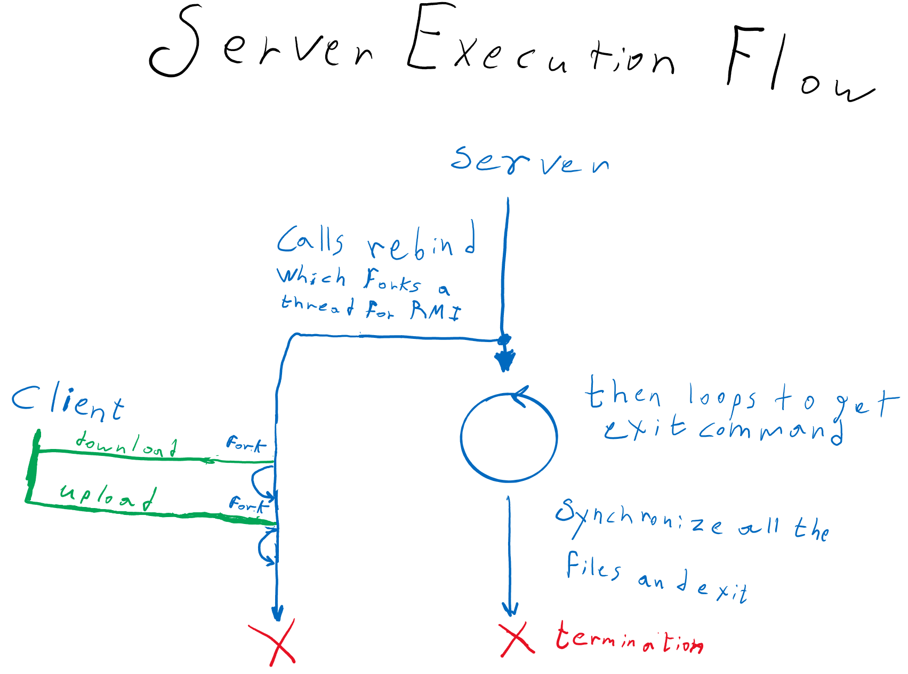

The file server contains two data members: a vector of files and a map that maps client names to files. The vector stores all the files. The map offers a way to validate that a client is uploading only to the file that it owns. The map is also used to remove the FileClient Object from the old file when a client is switching its file.

In My implementation, each File has a map that maps its clients' names to their actual remote FileClient object.  I think this is the most logical way to store both the client names and references. I thought of not storing remote object references and make new ones every time I use a **RMI**, but I wanted to avoid the overhead of binding for every **RMI**.

Because the server is multi-threaded, I used ConcurrentHashMap for my maps. Every time I modified the vector of files or the map of clients' names to files in the FileServer, I locked the thread on the FileServer. I did the same for the File.

When the server exits, it writes the contents of the files onto the disk but doesn't request the owners of files to writeback. I did that because writeback is blocking. I didn't want the user to wait indefinitely (assuming multiple people are editing)

## Discussion

### Possible Functional Improvements

I would like to add the ability for a client to cache multiple files and be the owner of multiple files as well. It will be more convenient for a user if they want to view multiple files.

Instead of simply invalidating a reader's copy, I want to automatically download the new version of a modified file and display it.

I want to change the system so the client downloads the file for viewing and editing inside a directory but doesn't force the user to use a specific editor. Instead, I want  the client to have a thread wait for any file to change (I don't know how to do that) and upload it automatically. So any file can be used with any application. For example, a Matlab Script could be opened with Matlab and executed with it instead of simple viewing with Vim.

Lastly, I want the server to allow multiple writers on the condition that only one writer will be active at any point in time. I want to retain the exclusive access, but simply allow automatic transfer of ownership if a client tries to change a file (with an external application like Matlab as explained above). In other words, I want the ownership to be exclusive, but I want to make its logic hidden so all the clients can directly edits as long as they don't edit concurrently.

### Possible Performance Improvements

Instead of re-sending all the contents of a file for every small edit, the program would be much more efficient if it is able to send only the differences that a client added. I'm thinking of something like Github's diff files. This will allow the system to remain efficient even as the files become large.

If the clients cache multiple files, the clients will be able to switch between files without redownloading again.

Since for most networks, the uploading bandwidth is much smaller than the downloading bandwidth, allowing peer-to-peer communication will be a good improvement for downloading files. This will require multi-threaded downloads and I have no idea how it would be implemented using **RMI**, but it can increase the download speed of large files.

## Code

### FileServer.java

```java
// A server for a distributed file system.
// Author: Youssef Beltagy

import java.io.*;
import java.util.*; // Vector
import java.util.concurrent.ConcurrentHashMap;
import java.rmi.*; // Naming
import java.rmi.server.*; // UnicastRemoteObject
import java.rmi.registry.*; // rmiregistry

// A remote server that allows RMI of two methods: download and upload.
public class FileServer extends UnicastRemoteObject implements ServerInterface {

    private static final long serialVersionUID = -4726879233302349177L;

    // To keep track of the file the client is accessing
    private static Map<String, File> clientnames2files = null;
    // The File Cache
    private static Vector<File> files = null;
    // The server port. Assume that it is the same port for the clients as well.
    private static int port = -1;

    // Initially, there are no files or clients in the server
    public FileServer() throws RemoteException {

        clientnames2files = new ConcurrentHashMap<String, File>();
        files = new Vector<File>();

    }

    // Start an RMI registery and bind a fileserver object to allow
    // remote invocation of the server's download and upload methods.
    public static void main(String[] args) {

        // validate the number of inputs.
        if (args.length != 1) {
            System.out.println("Incorrect usage. Usage: java FileServer <port>");
            System.exit(-1);
        }

        // Initialize a FileServer object and bind it.
        // This implicitly forks threads, so the main thread will
        // wait for the user's exit command.
        try {

            FileServer fileserver = new FileServer();

            // Assume a valid port
            port = Integer.parseInt(args[0]);

            startRegistry(port);

            Naming.rebind("rmi://localhost:" + args[0] + "/fileserver", fileserver);

        } catch (Exception e) {
            e.printStackTrace();
        }

        // If the user requests exiting the program, write all the files to the disk and
        // terminate.
        try {
            BufferedReader input = new BufferedReader(new InputStreamReader(System.in));

            while (true) {
                System.out.println("Type \"exit\" or \"quit\" to terminate.");
                String line = input.readLine();

                if (line.equals("exit") || line.equals("quit")) {
                    // Read user input. If user requests exit. Synchronize all files and call
                    // system.exit(0);

                    Naming.unbind("rmi://localhost:" + args[0] + "/fileserver");

                    for (File f : files) {

                        f.writeFile();

                    }

                    System.exit(0);
                }

            }

        } catch (Exception e) {

            e.printStackTrace();
            System.exit(-1);

        }

    }

    // A remotely accessible method. Allows a client to download a file.
    // If a file is not in the cache, it reads it from the disk. If the file is not
    // in the disk
    // it is created if mode is "w" or the method returns null if the mode is "r".
    // This method adds the client to a vector of readers of the file.
    public FileContents download(String clientname,
            String filename, String mode) throws RemoteException {

        System.out.println("Clientname: " + clientname + " filename: " + filename + " Mode: " + mode);

        // Check if the file exists or not.
        // If it doesn't exist and the mode is r return null. No need to bind the client
        File curFile = null;

        synchronized (this) {

            for (File f : files) {
                if (f.fileName.equals(filename)) {
                    curFile = f;
                    break;
                }
            }

        }

        // the file is not in the cache
        if (curFile == null) {
            curFile = getFile(filename, mode);
            if (curFile == null)
                return null;
        }

        // Get the client
        ClientInterface client = getClient(clientname, curFile);

        // Only one thread can modify a file at any point in time.
        curFile.updateState(clientname, mode, client);

        return curFile.fileContents;
    }

    // A remotely accessible method.
    // Allows a client to upload her/his modified file back to the server.
    // Invalidates all readers, then notifies all threads waiting to write,
    // so one of them can take ownership.
    public boolean upload(String client,
            String filename, FileContents contents) throws RemoteException {

        if (client == null)
            return false;

        File curFile = clientnames2files.get(client);

        if (curFile == null)
            return false;

        synchronized (this) {
            synchronized (curFile) {
                if (curFile.writer == null || !client.equals(curFile.writer))
                    return false;

                if (curFile.state != File.WRITE_SHARED
                        && curFile.state != File.OWNERSHIP_Change)
                    return false;

                curFile.fileContents = contents;

                // Because the content changed, the readers no longer have a valid copy
                curFile.invalidateClients();

                if (curFile.state == File.WRITE_SHARED) {
                    curFile.state = File.NOT_SHARED;
                    curFile.writer = null;
                } else if (curFile.state == File.OWNERSHIP_Change) {

                    curFile.state = File.WRITE_SHARED;
                    curFile.writer = null;

                }

                // notify all thread waiting to write so one of them takes ownership
                curFile.notifyAll();
            }
        }

        return true;
    }

    // Starts an RMI registry in background, which relieves a user from
    // manually starting the registry and thus prevents her/him from
    // forgetting its termination upon a logout.
    private static void startRegistry(int port) throws RemoteException {
        try {
            Registry registry = LocateRegistry.getRegistry(port);
            registry.list();
        } catch (RemoteException e) {
            Registry registry = LocateRegistry.createRegistry(port);
        }
    }

    // A helper method for download. Handles the logic of finding or
    // adding a file.
    private File getFile(String filename, String mode) {

        File curFile = null;
        byte[] bytes = null;
        try {
            FileInputStream fileInStream = new FileInputStream(filename);
            bytes = new byte[fileInStream.available()];
            fileInStream.read(bytes);
            fileInStream.close();
        } catch (FileNotFoundException fileException) {
            System.err.println("File " + filename + " does not exist");
        } catch (IOException ioException) {
            System.err.println("IO Exception for file: "
                    + filename + " in download method.");
            ioException.printStackTrace();
        } catch (SecurityException securityException) {
            System.err.println("Security Exception for file: "
                    + filename + " in download method.");
            securityException.printStackTrace();
        }

        // the file is not in the disk and not in the cache
        if (bytes == null) {
            if (mode.equals("r"))
                return null;
            else
                bytes = new byte[0];// else assume mode is "w"
        }

        // Make a new file with the new name and contents
        FileContents contents = new FileContents(bytes);
        curFile = new File(filename, contents);

        // Check again that a similar file wasn't added while
        // this thread was reading the file.
        // This is to ensure there will only be one copy of
        // the file in the cache.
        synchronized (this) {
            File tempFile = null;
            for (File f : files) {
                if (f.fileName.equals(filename)) {
                    tempFile = f;
                    break;
                }
            }

            if (tempFile == null) {
                files.add(curFile);
            } else {
                curFile = tempFile;
            }
        }

        return curFile;
    }

    // A helper method for download.
    // makes a new client for a file and removes the client from other files
    private synchronized ClientInterface getClient(String clientname, File curFile) {

        // If the client is already in the cache, update the file it belongs to
        File oldFile = clientnames2files.get(clientname);

        if (oldFile != null) {

            oldFile.removeReader(clientname);

        }

        ClientInterface client = null;

        try {
            client = (ClientInterface) Naming.lookup("rmi://" + clientname +
                    ":" + port +
                    "/fileclient");
        } catch (Exception e) {
            System.err.println("Could not initialize client: " + clientname + " in download");
            e.printStackTrace();
        }

        clientnames2files.put(clientname, curFile);

        return client;
    }

    // A File class contains the contens of a file and stores references to
    // the readers and the writer.
    private class File {
        // Possible File States
        public static final int NOT_SHARED = 0;
        public static final int READ_SHARED = 1;
        public static final int WRITE_SHARED = 2;
        public static final int OWNERSHIP_Change = 3;

        // File information
        public final String fileName;
        public FileContents fileContents;

        // Accessors information
        private Map<String, ClientInterface> readername2client;
        public String writer;
        // A writer is a reader too; so the ClientInterface for the writer is in readers

        // current state of the file
        public int state;

        // A file is initialized in the NOT_SHARED state
        File(String name, FileContents contents) {
            this.fileName = name;
            this.fileContents = contents;
            state = NOT_SHARED;
            readername2client = new ConcurrentHashMap<String, ClientInterface>();
            writer = null;
        }

        // Adds a reader
        public synchronized void addReader(String clientName, ClientInterface client) {
            readername2client.put(clientName, client);
        }

        // Removes a reader
        public synchronized void removeReader(String clientName) {
            readername2client.remove(clientName);
        }

        // calls invalidate for all the readers that are no longer in synch with the
        // server
        public synchronized void invalidateClients() {
            for (String clientname : readername2client.keySet()) {
                if (!clientname.equals(writer)) {

                    // invalidate all the readers
                    try {
                        getClient(clientname).invalidate();
                    } catch (Exception e) {
                        // Do nothing. The client could have terminated.
                        // System.err.println("Exception in File.callInvalidate");
                        // e.printStackTrace();
                    }

                    readername2client.remove(clientname);
                    FileServer.clientnames2files.remove(clientname);
                } else {

                    if (state == WRITE_SHARED) {
                        // Invalidate the writer as well since it no longer will share the file.

                        try {
                            getClient(clientname).invalidate();
                        } catch (Exception e) {
                            System.err.println("Exception in File.callInvalidate");
                            e.printStackTrace();
                        }
                        readername2client.remove(clientname);
                        FileServer.clientnames2files.remove(clientname);
                    } // else then it is in ownership_change, so leave it as a writer.

                }
            }
        }

        // Writes the file to the disk.
        public synchronized void writeFile() {
            try {
                FileOutputStream outFile = new FileOutputStream(fileName);
                outFile.write(fileContents.get());
                outFile.close();
            } catch (Exception e) {
                System.err.println("Error in writefile for: " + fileName);
                e.printStackTrace();
            }
        }

        // returns a reference to a client given its name.
        public ClientInterface getClient(String name) {
            return readername2client.get(name);
        }

        // updates the state of thie file and handles the logic for multiple writers
        public synchronized void updateState(String clientname,
                String mode, ClientInterface client) throws RemoteException {

            if (mode.equals("w")) {

                // If the file is currently in use, request release.
                if (this.state == File.WRITE_SHARED) {

                    this.getClient(this.writer).writeback();

                    this.state = File.OWNERSHIP_Change;

                }

                if (this.state == File.OWNERSHIP_Change) {

                    try {
                        while (this.state == File.OWNERSHIP_Change) {
                            this.wait();

                            // If you were notified but the file currently has a writer,
                            // request the writer to release the file and wait again.

                            if (this.state == File.WRITE_SHARED && this.writer != null) {
                                this.getClient(this.writer).writeback();
                                this.state = File.OWNERSHIP_Change;
                            }
                        }

                    } catch (Exception e) {
                        System.err.println("Error related to wait() in File.UpdateState");
                        e.printStackTrace();
                    }

                }

                this.state = File.WRITE_SHARED;
                this.writer = clientname;

            } else {// mode is "r"

                if (this.state == File.NOT_SHARED)
                    this.state = File.READ_SHARED;

            }

            this.addReader(clientname, client);
        }// end of add state

    } // end of File class

} // end of FileServer class
```

## Output

### 1-4

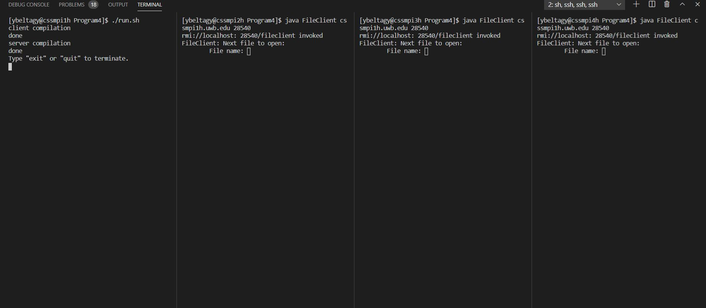

### 3

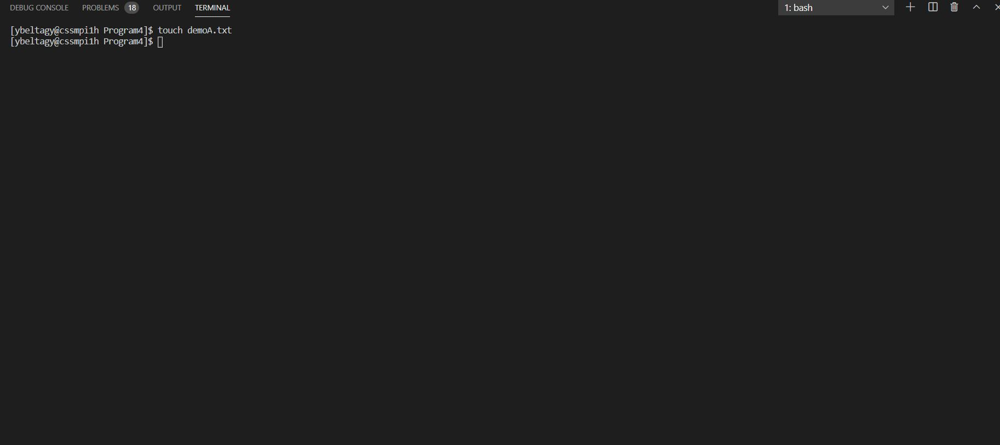

### 5a

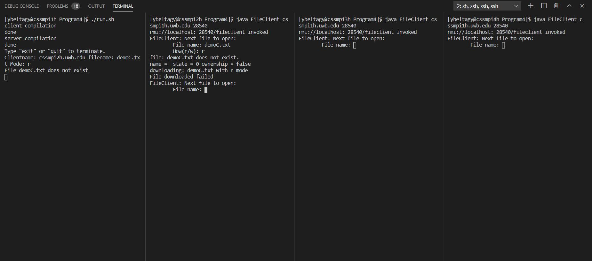

### 5b

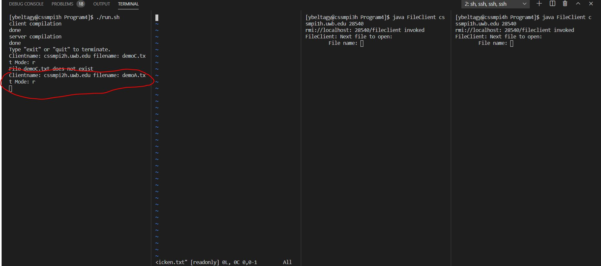

### 6

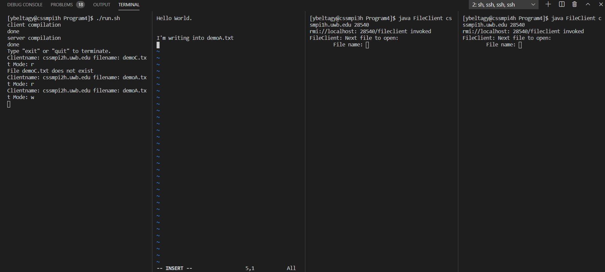

### 7

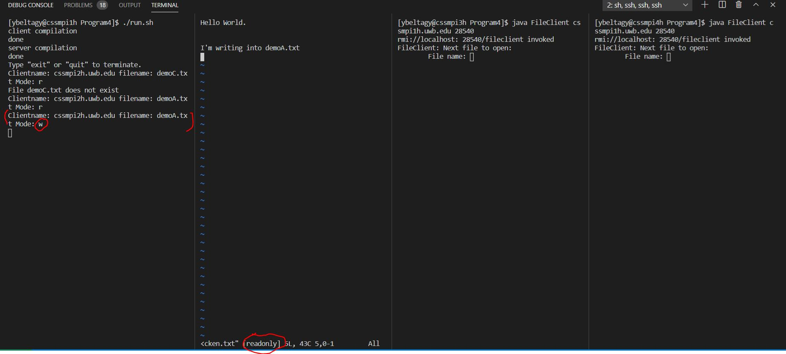

### 8 

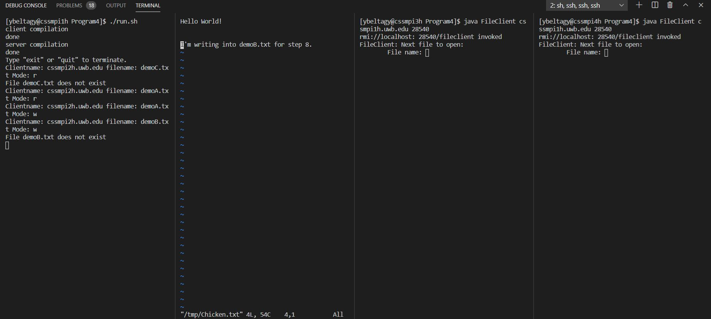

### 9 - 10

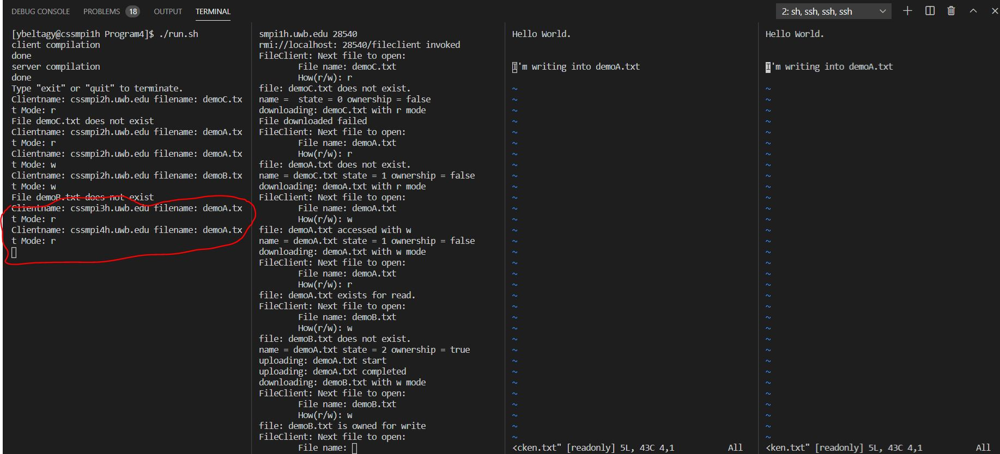

### 11 - 12

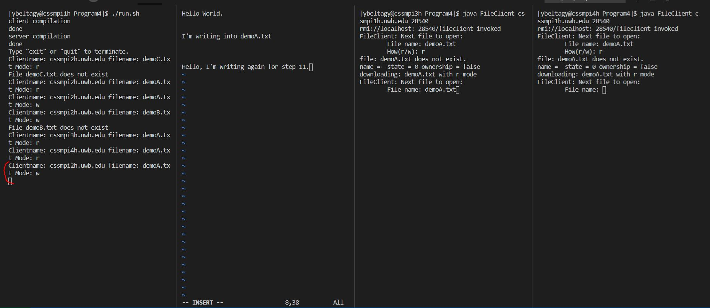

### 13

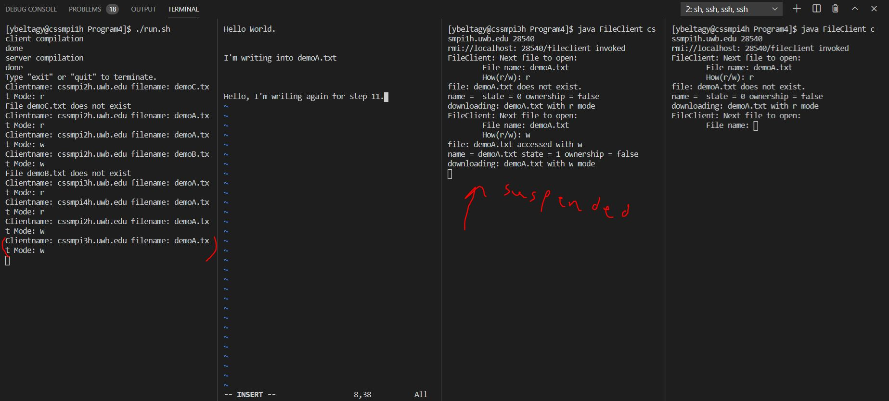

### 14 -15

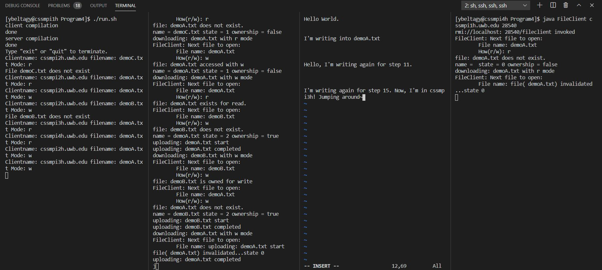

### 16 - 17

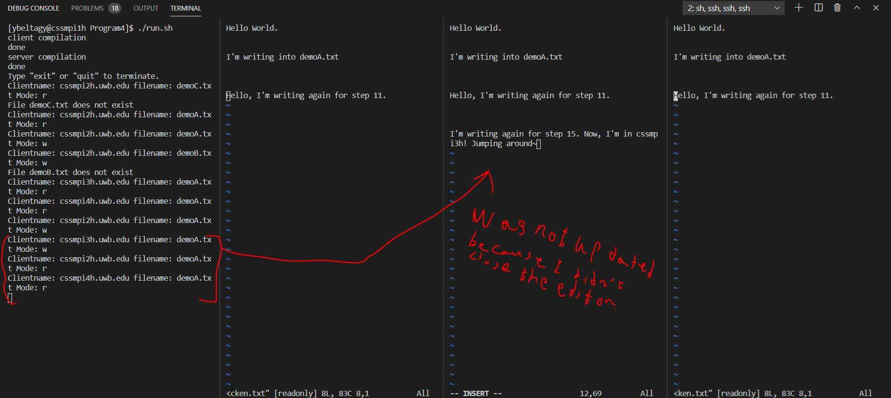

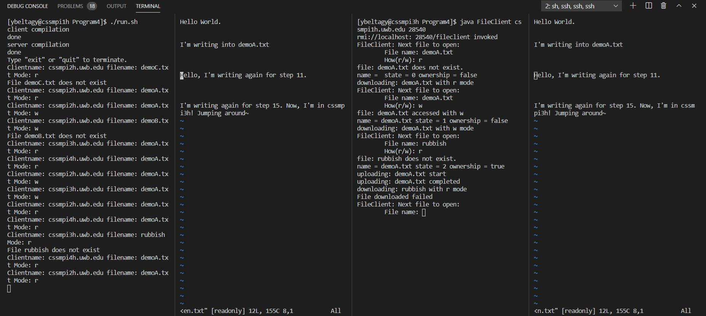

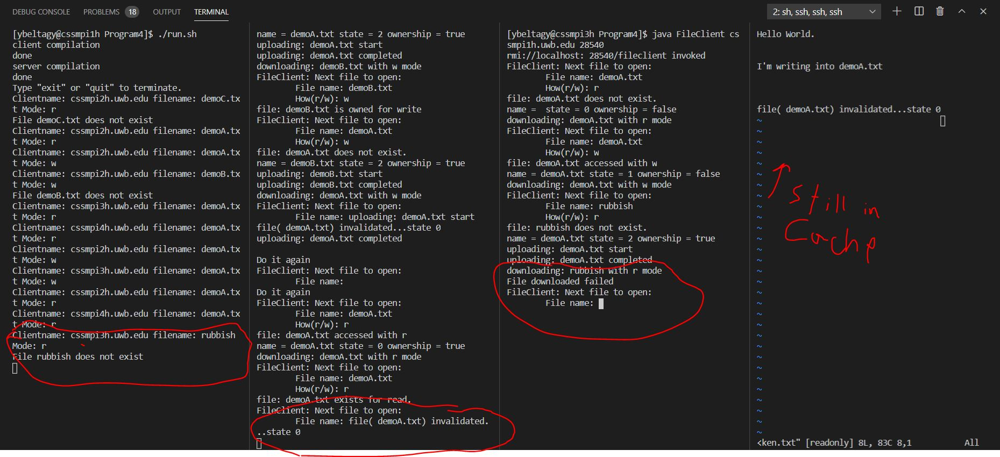

### 18 -21

I restarted testing at the 18th step because I needed to fix a bug. This is the reason the screenshots will look different from the previous screenshots.

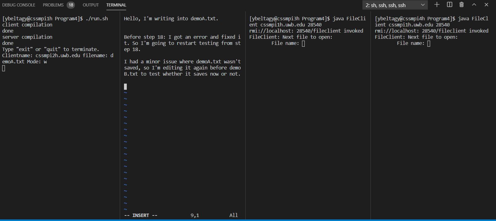

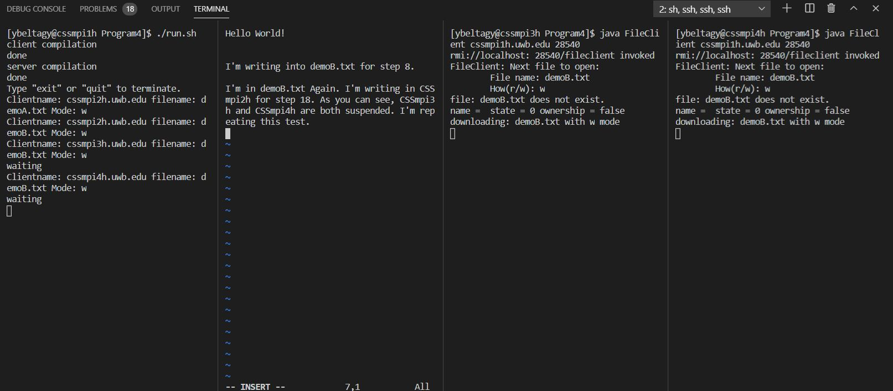

### 22

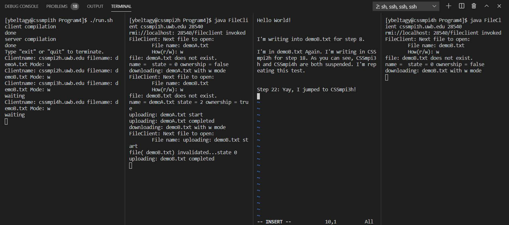

### 23

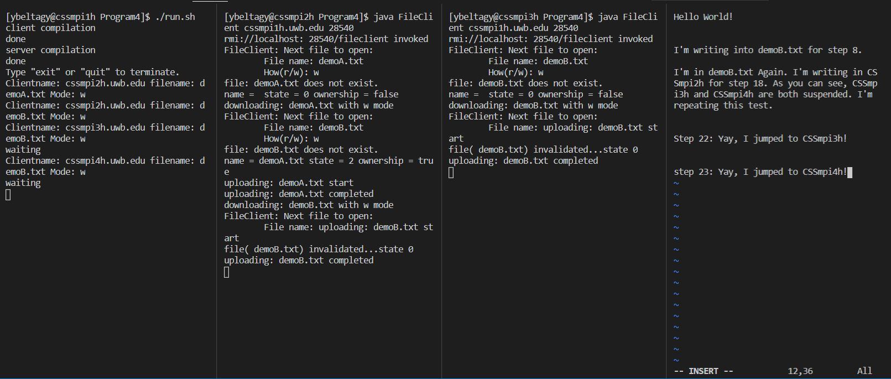

### 24 - 25


### 26

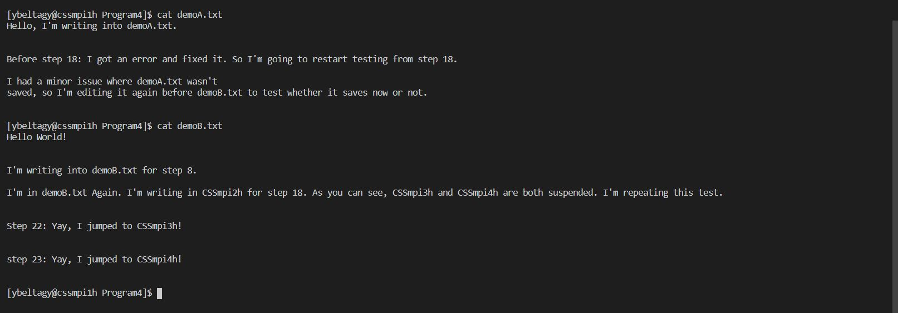